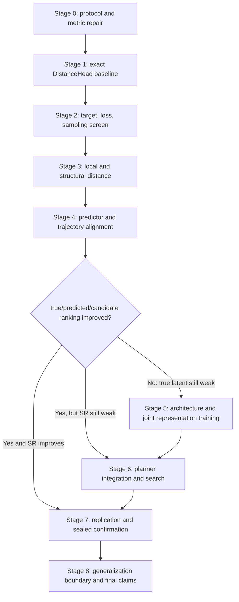

# Procgen Maze DistanceHead 主线研究与分阶段实验计划

版本：`v1.4-implemented`

日期：`2026-07-17`

文档状态：**方法空间总纲已映射到 `distance_head_study` 代码；正式运行前仍须通过完整审计并生成 protocol lock**

规范性执行协议：[EFFICIENT_EXECUTION_PROTOCOL.zh.md](EFFICIENT_EXECUTION_PROTOCOL.zh.md)

> 本文继续作为完整方法空间、机制假设和评价指标的总纲。实际运行顺序、
> validation 分层、快速正结果通道、负结论闭环、作业复用和 4 x H800 调度，
> 以效率优化执行协议为准。若两份文档出现执行层面的差异，以效率优化执行协议
> 为准；方法定义、泄漏边界、最终确认标准和可声明结论不得低于本文要求。

适用仓库：`zixuangui-rgb/LeWM_for_Maze`

主任务：Set B Procgen Maze，训练尺寸 `9-21`，测试尺寸 `9-25`，其中 `23/25` 为 size OOD。

---

## 0. 执行摘要

本阶段不再把 DistanceHead 理解成“从两个 latent 回归一个看起来像距离的数”，而是把它升级为一个真正服务于规划的 **goal-conditioned cost-to-go operator**：

1. 它应当能估计当前状态到目标的 BFS 距离；
2. 更重要的是，它应当能正确比较候选动作、候选 rollout 和候选轨迹；
3. 它应当满足 Maze 的局部动态结构，例如 Bellman consistency；
4. 它应当在 predictor 产生的 latent 上仍然可靠，而不仅是在 encoder 产生的真实状态 latent 上可靠；
5. 它应当在未见 topology、未见尺寸和更长路径上保持排序与校准能力；
6. 如果 frozen latent 本身不足，应允许 DistanceHead 的规划目标反向塑造 projector、predictor，最后才是 encoder，但必须保留原 JEPA/SIGReg 目标和严格的 matched control。

计划采用“**先修协议 -> 再定位距离问题 -> 再做单因素方法筛选 -> 再做 predictor/trajectory 对齐 -> 再决定是否联合训练 -> 最后进入 planner 与盲测确认**”的顺序。所有方法族都会进入方法空间，但不会把所有 loss、architecture 和 planner 一次性叠加。每个阶段只回答一个问题，只有通过预定义 gate 的方法才能进入下一阶段。

最优先验证的四条路线是：

1. **全局统一的 BFS 距离标尺 + 距离分层采样**；
2. **tie-aware local listwise ranking**；
3. **Bellman/Eikonal/multistep consistency**；
4. **与实际 CEM candidate distribution 和 planning horizon 对齐的 trajectory-ranking DistanceHead**。

联合训练、distributional distance、multi-budget reachability、quasimetric、uncertainty、A*/Beam/MCTS、latent graph 和 hierarchical distance 均被纳入计划，但只有在前一阶段的诊断结果满足相应触发条件时才执行。

---

## 1. 研究范围与方法定义

### 1.1 本阶段的核心科学问题

本阶段不是简单问“DistanceHead 能否降低 validation loss”，而是问：

> 在保持 Procgen Maze 数据、LeWM 主干、topology hold-out、action protocol 和 planner budget 可比的前提下，怎样学习一个能够在真实 latent、predicted latent 和 CEM trajectory candidate 上正确表达 goal-reaching distance 的 DistanceHead，并把这种能力稳定转化为 SR、SPL 和 OOD 提升？

### 1.2 本项目中的 DistanceHead

给定当前状态观测 `o_s`、目标观测 `o_g`，LeWM 得到向量 latent：

```text
z_s = Projector(Encoder(o_s))
z_g = Projector(Encoder(o_g))
```

DistanceHead 输出：

```text
D_theta(z_s, z_g) >= 0
```

其中 `D_theta` 可以是：

- 单一标量 distance；
- 有向 quasimetric；
- distance distribution；
- ordinal distance；
- budget-conditioned reachability CDF；
- 同时输出 distance、reachability 和 uncertainty 的多头模型。

只要最终 planner 仍然通过 JEPA encoder/projector、action-conditioned predictor、learned head 和 search 做出决策，就属于本阶段的 Vector-JEPA DistanceHead 路线。

### 1.3 Corrected/assisted 的处理

本计划允许使用 `corrected_v1`，因为当前研究目标允许 Corrected/assisted Vector-JEPA。但是必须同时报告：

- `corrected_v1`：允许真实当前状态上的 action-validity mask、immediate-backtrack handling 和既定 fallback；
- `unmasked`：不使用这些辅助的自主执行诊断；
- `assistance_rate`：有多少决策实际使用了 correction/validity assistance；
- `corrected - unmasked` 的 paired 差值。

因此，`corrected_v1` 提升可以支持“assisted Vector-JEPA planning 变强”，不能被写成“模型完全自主理解了墙体”。

### 1.4 BFS 监督的边界

BFS 可以用于：

- 训练 DistanceHead；
- 生成 local action-ranking label；
- 生成 reachability、Bellman、trajectory-ranking label；
- 训练阶段的 hard-negative mining；
- 诊断与 oracle attribution。

BFS 不可以在正式 test-time：

- 直接读取地图并选择动作；
- 直接给 CEM candidate 打分；
- 生成 test topology 上的 subgoal；
- 作为隐藏 fallback 决策器。

### 1.5 “覆盖所有可能方法”的操作定义

不可能枚举未来尚未提出的每一种算法。本计划所谓“覆盖完整”，指覆盖当前证据和相关文献能支持的全部主要设计轴：

1. target/scale；
2. sampling/curriculum；
3. pairwise/listwise/local ranking；
4. Bellman/Eikonal/multistep structure；
5. reachability/temporal distance/quasimetric；
6. predictor 与 planner-distribution alignment；
7. head architecture、distribution 和 uncertainty；
8. joint representation/dynamics/head training；
9. terminal/path-integrated/hybrid cost；
10. CEM、Beam、Best-first、A*、MCTS、graph、hierarchical search；
11. topology、size、path-length、appearance 和 multi-task generalization。

计划覆盖这些方法族，但不会执行它们的笛卡尔积。组合实验必须由单因素结果触发。

---

## 2. 当前证据起点

### 2.1 已有结果

下表中的结果来自不同阶段和不同 protocol，只能用于形成机制假设，不能把每一行直接当作同一张排行榜。

| 方法/诊断 | 已观察结果 | 能说明什么 | 不能说明什么 |
|---|---:|---|---|
| Simple DistanceHead，model-free greedy | SR/SPL `0.648/0.564` | 在真实 next-state latent 和 assisted action filtering 下，head 有一定导航能力 | 不能证明 predictor rollout 或 CEM 已解决 |
| Simple DistanceHead，predictor greedy | SR/SPL `0.636/0.535` | one-step predicted latent 上仍可工作 | 不是 receding CEM h12 的 DistanceHead 基线 |
| Latent-L2，receding CEM h12 | SR/SPL `0.640/0.485` | corrected planner 的历史强 Vector-JEPA anchor | scorer 不是 DistanceHead |
| P1 `p1_info_aux` + L2 CEM | SR `0.636` | valid-action 等可解码信息上升未自动提高 planning | 不能推出 information auxiliary 完全无用 |
| P1 `aux_bfs` CEM | SR `0.558` | 简单 BFS auxiliary scalar 没超过 L2 | 不是对所有 distance formulation 的否证 |
| Strict unmasked pooled Vector-JEPA CEM | SR `0.218 +/- 0.020` | correction assistance 掩盖了大量 invalid/loop failure | 与单次 corrected `0.64` 不是同一 endpoint |
| DistanceHead Local top-1 | overall 约 `0.598`，seen 约 `0.613`，OOD 约 `0.543` | global regression 尚未形成可靠局部动作排序 | 不能仅凭 regression loss 判断规划能力 |
| L2/DH/QRL Local top-1 | 约 `0.588-0.598` | 简单 scalar scorer swap 已接近同一局部排序平台 | 不能推出更强的结构化 distance 也会失败 |
| DistanceHead local margin | 约 `0.025` | 很小的 score 误差即可翻转动作 | margin 大也不必然保证 long-horizon SR |
| P1 embedding valid-action | `0.338 -> 0.850` | projector 可被辅助目标显著塑造 | 信息可解码不等于被 planner 使用 |
| P1 closed-loop h10 drift | `9.706 -> 7.738` | joint auxiliary 可减轻部分 rollout drift | drift 改善仍不足以保证 scorer 排序 |

### 2.2 当前最重要的结论

现有证据不支持“DistanceHead 已经没有空间”，也不支持“只把 BFS 回归得更准就会成功”。更准确的结论是：

> 当前 DistanceHead 学到了粗粒度的全局距离相关性，但没有稳定学会 planner 真正需要的局部动作次序、长时域 candidate 次序和 predictor-induced off-manifold 校准。

### 2.3 当前实现审计发现

正式新实验前必须处理以下问题：

1. `scripts/train/train_distance_head_simple_setb.py` 的默认设置是 `raw + MSE`，而最终报告记录的实际 Simple DistanceHead 是 `log_norm + SmoothL1`。基线必须从原 checkpoint metadata、原命令或原日志恢复，不能直接依赖脚本默认值。
2. `scripts/train/train_distance_head_v2.py` 默认把 `data/splits/unisize_eval_manifest.jsonl` 的 seen 部分当 validation。这个 manifest 已经承担历史 full-900 evaluation，不能继续用于新方法的 checkpoint selection。
3. `scripts/eval/diagnose_metric_action_order.py` 当前把 head 的 transformed score 与 raw BFS steps 直接计算 `abs_error`。当 target 是 `norm/log/log_norm` 时，两者单位不同，现有 `mean_abs_error` 不可解释。
4. v2 已有 pairwise ranking、tie-aware listwise action CE、predictor-action CE 和部分 unfreeze 支持，但默认关闭 action/predictor CE；默认训练并不是 planning-aligned DistanceHead。
5. v2 的随机 triangle regularization 未区分 shortest-path waypoint、arbitrary waypoint 和 transformed/raw units，可能大量采到容易满足但没有规划价值的约束。
6. 当前尚缺一个与历史 `latent-L2 + receding CEM h12` 完全同 protocol 的 `DistanceHead + receding CEM h12` 基线。

7. 新实现进一步修复了 goal/label 语义：每个训练 topology 使用 manifest goal，
   所有 source observation、goal latent 与 raw BFS target 指向同一目标。历史
   arbitrary-cell pair 只保留为 provenance 事实，不作为新方法的训练数据。

这些不是次要工程细节，而是 Stage 0 的硬前置条件。

### 2.4 仓库内证据与实现入口

- 历史 Set B 结果：[results/FINAL_REPORT.md](../../results/FINAL_REPORT.md)
- 三堵墙与 local metric 诊断：[diagnostics/DESIGN.md](../../diagnostics/DESIGN.md)
- P0/P1/P2 planning repair 设计：[planning_repair/DESIGN.md](../../planning_repair/DESIGN.md)
- 现有 strict Vector-JEPA protocol：[vector_jepa_planner_frontier/EXPERIMENT_PROTOCOL.md](../../vector_jepa_planner_frontier/EXPERIMENT_PROTOCOL.md)
- Simple DistanceHead trainer：[scripts/train/train_distance_head_simple_setb.py](../../scripts/train/train_distance_head_simple_setb.py)
- DistanceHead v2 trainer：[scripts/train/train_distance_head_v2.py](../../scripts/train/train_distance_head_v2.py)
- Local action-order diagnostic：[scripts/eval/diagnose_metric_action_order.py](../../scripts/eval/diagnose_metric_action_order.py)
- Corrected DistanceHead evaluator：[scripts/eval/eval_setb_distance_head_fixed.py](../../scripts/eval/eval_setb_distance_head_fixed.py)

本计划中的历史数字和代码审计结论应从这些文件继续追溯；服务器 checkpoint 和原始运行命令仍需在 Stage 0 重新做 provenance audit。

---

## 3. 文献证据与可迁移机制

### 3.1 最近且最直接的工作

| 工作 | 核心机制 | 对本项目的直接启发 | 证据边界 |
|---|---|---|---|
| [TRM](https://arxiv.org/abs/2605.22164) | fixed world model 上训练 horizon-matched pairwise trajectory metric；用 SCSA 审计 candidate ordering | 不要只采短距离 pair；直接匹配 terminal candidate 的 horizon 和分布 | 2026 预印本；TwoRoom/PushT 不是 Procgen Maze |
| [RC-aux](https://arxiv.org/abs/2605.07278) | multi-horizon open-loop prediction、budget-conditioned reachability、temporal hard negatives | DistanceHead 应同时考虑预算内可达性和 rollout horizon；可先 stop-gradient 校准 head，再决定是否塑造 backbone | 2026 预印本；报告的是 LeWM-style 任务，不是当前 split |
| [Value-guided JEPA](https://arxiv.org/abs/2601.00844) | 让 distance/quasidistance 近似 goal-conditioned value | 支持联合塑造 representation，但其 Maze 中 separate `VF_quasi=0.63`、joint `VF_quasi_pred=0.43`，说明 naive joint loss 会互相干扰 | 使用 MuJoCo PointMaze，不是离散 Procgen Maze |
| [MQE](https://openreview.net/forum?id=UElh7vzgKX) | multistep quasimetric backup | long-range distance 应通过 multistep stitching 学习，不只靠随机全局回归 | ICLR 2026 GCRL；需要改造成 offline latent head |
| [Eik-QRL](https://openreview.net/forum?id=5WhsCB0Vty) | Eikonal/local consistency + hierarchical quasimetric | 局部 unit-cost 结构和 hierarchical distance 可能增强 OOD | 原方法面向 GCRL，不能直接等同 JEPA planner |

TRM 的关键机制与本项目目前的现象高度一致：latent 中可能含有位置信息，但 raw latent geometry 或普通 DistanceHead 没有把这些信息按 planner candidate quality 排列。RC-aux 则提示，短时 prediction 与长时规划之间存在时间尺度错配。

### 3.2 支持 distance structure 的工作

| 工作 | 可迁移部分 |
|---|---|
| [QRL](https://proceedings.mlr.press/v202/wang23al.html) | optimal goal-reaching value 具有 quasimetric 结构，适合有向 cost-to-go |
| [Contrastive successor features for temporal distance](https://proceedings.mlr.press/v235/myers24a.html) | temporal distance、triangle structure 和 combinatorial stitching 可由 successor-like contrastive learning获得 |
| [HILP](https://proceedings.mlr.press/v235/park24g.html) | representation 应保留环境的 temporal structure，而不只是视觉相似性 |
| [TD-MPC](https://arxiv.org/abs/2203.04955) | short-horizon latent dynamics 与 terminal value 联合学习，但必须把 model loss 与 task/value loss都保留 |

### 3.3 支持 search 与 temporal abstraction 的工作

| 工作 | 可迁移部分 |
|---|---|
| [SoRB](https://arxiv.org/abs/1906.05253) | 将长距离目标分解为 replay/latent graph 上的短距离 subgoal |
| [World Model as a Graph / L3P](https://proceedings.mlr.press/v139/zhang21x.html) | 用 latent landmarks 和 reachability edge 避免长 closed-loop rollout |
| [Learning Admissible Heuristics for A*](https://openreview.net/forum?id=WAQIxi7ifb) | 如果 DistanceHead 用作 A* heuristic，应单独考虑 overestimation/admissibility，而不是只优化 MAE |
| [DINO-WM](https://proceedings.mlr.press/v267/zhou25t.html) | planning loss 必须读取适合规划的 representation；spatial representation 是重要对照，但本阶段不立即改 encoder/projector 结构 |

### 3.4 文献对本项目给出的共同判断

这些工作并不证明某个 loss 在本项目中一定成功，但共同支持以下研究顺序：

1. 先证明 head 是否真的会判断 raw BFS distance；
2. 再证明它是否会判断局部 action order；
3. 再证明它是否会排序 predictor/CEM candidates；
4. 只有当前三步成立后，才把 SR 变化归因于 DistanceHead；
5. 如果 true-latent 排序仍低，再让 distance objective 进入 projector/encoder；
6. 如果 true-latent 排序高而 predicted-latent 排序低，优先改 predictor alignment；
7. 如果 candidate 排序高但 SR 仍低，问题才主要转向 search/execution。

---

## 4. 形式化问题定义

### 4.1 符号

- `s`：当前真实 Maze state；
- `g`：goal state；
- `z_s, z_g`：encoder/projector 得到的向量 latent；
- `a`：动作；正式 moving action 为 `1..4`，`0` 为 STAY/no-op；
- `T(s,a)`：真实环境 transition；
- `P_phi(z_s,a)`：JEPA predictor 的 predicted next latent；
- `d(s,g)`：真实 occupancy graph 上的 BFS shortest-path steps；
- `A_valid(s)`：会产生真实移动的动作集合；
- `H`：planner horizon；
- `D_theta(z_s,z_g)`：learned DistanceHead；
- `R_theta(z_s,z_g,h)`：预算 `h` 内到达 goal 的概率。

### 4.2 理想距离关系

对于确定性、unit-cost Maze：

```text
d(g, g) = 0
d(s, g) = 1 + min_{a in A_valid(s)} d(T(s,a), g),  s != g
```

因此，一个 planning-aligned DistanceHead 至少应近似：

```text
D(z_g, z_g) = 0
D(z_s, z_g) ~= 1 + min_a D(z_next(a), z_g)
```

但需要分别检查：

```text
z_next_true(a) = Encode(T(s,a))
z_next_pred(a) = Predictor(z_s,a)
```

在 `z_next_true` 上表现好，只能说明 representation/head 接口可用；在 `z_next_pred` 上表现好，才说明该 head 能直接服务 world-model planning。

### 4.3 训练目标族

#### Absolute distance

```text
L_abs = Huber(D(z_s,z_g), target(d(s,g)))
```

候选 target：

```text
raw:       d
norm:      d / M_maze
log:       log(1+d)
log_norm:  log(1+d) / log(1+M_maze)
```

其中 `M_maze` 是当前 maze 的最大 BFS distance。`log_norm` 在单个 maze 内保持排序，但会压缩一步差异，而且相同 raw distance 在不同 maze 上有不同 target；这对 cross-size calibration、hybrid cost 和 horizon-conditioned planning 不利。

#### Goal anchor

```text
L_anchor = |D(z_g,z_g)|
```

#### Pairwise ranking

若 `d(s_i,g) < d(s_j,g)`：

```text
L_pair = max(0, margin + D(z_i,z_g) - D(z_j,z_g))
```

#### Tie-aware local listwise ranking

对当前状态的所有候选动作同时打分：

```text
p_theta(a|s,g) = softmax(-D(z_next(a),z_g) / tau)
```

target 在所有 BFS-optimal action 上均匀分配，避免把同样最优的多个动作错误地当成互斥 label：

```text
L_list = CE(p_target, p_theta)
```

#### One-step delta

```text
L_delta = Huber(
    D(z_next,z_g) - D(z_s,z_g),
    d(T(s,a),g) - d(s,g)
)
```

#### Bellman consistency

```text
L_bellman = Huber(
    D(z_s,z_g),
    1 + softmin_a D_target(z_next(a),z_g)
)
```

`D_target` 使用 EMA/stop-gradient target head，避免在线 head 同时移动造成自举坍缩。`softmin` temperature 必须在 validation 上锁定，并报告 hard-min 对照。

`L_bellman` 中的常数 `1` 表示一个真实环境步。因此，只要 head 训练在 `log/norm/log_norm` space，计算 `L_bellman` 前都必须 inverse-transform 到 raw-step space；不能把 transformed score 直接与 `1 + transformed score` 相加。

#### Discrete Eikonal/local Lipschitz

任意有效邻居不应造成大于一步的距离变化，并且至少存在一个动作使距离下降约一步：

```text
L_lipschitz = mean_a relu(|D(s,g)-D(next_a,g)|-1)^2
L_descent   = |D(s,g) - (1 + min_a D(next_a,g))|
```

#### Multistep shortest-path decomposition

若 waypoint `w` 在 `s -> g` 的一条 shortest path 上：

```text
d(s,g) = d(s,w) + d(w,g)
```

若 `w` 是任意状态：

```text
d(s,g) <= d(s,w) + d(w,g)
```

结构性加法约束必须在 raw-step space 中计算；如果 head 输出 `log1p(d)`，应先做稳定 inverse transform，再计算该 loss。

同理，`L_lipschitz`、`L_descent` 和所有带“每步代价为 1”的约束也必须在 raw-step space 中计算。pairwise/listwise ranking 可以在任意严格单调 transform 后的空间计算，但其 margin/temperature 必须明确单位并在所有方法间锁定。

#### Multi-budget reachability

对预算集合：

```text
H_budget = {1,2,3,5,8,12,16,24,32,48,64,96,128}
```

学习：

```text
R_h(s,g) = P(d(s,g) <= h)
```

并施加 monotonicity：

```text
R_h(s,g) <= R_{h+1}(s,g)
```

#### CEM candidate ranking

对同一个起点、goal、horizon 和同一组 candidate action sequences：

```text
q_i = d(T^H(s, a_i[1:H]), g)
score_i = D(z_hat_i^H, z_g, H)
```

训练 head 使 `score_i` 按 `q_i` 排序。target 可采用 tie-aware listwise CE：

```text
p_target(i) = softmax(-q_i / tau_label)
L_candidate = CE(p_target, softmax(-score_i/tau_model))
```

#### Predictor consistency

```text
L_pred_consistency = |
    D(z_hat_next,z_g) - D(stopgrad(z_next_true),z_g)
|
```

该 loss 只能作为校准项，不能替代真实 BFS label，否则 head 只会复制自己在真实 latent 上的错误。

### 4.4 最终 objective 的原则

最终候选 objective 可以写成：

```text
L = L_abs
  + lambda_anchor * L_anchor
  + lambda_rank * L_list
  + lambda_bellman * L_bellman
  + lambda_multi * L_multistep
  + lambda_candidate * L_candidate
  + lambda_reach * L_reach
```

但这只是方法空间，不是第一轮就同时打开的配置。每个新增项必须先单独对照 `L_abs`，只有独立有效的项才允许组合。

### 4.5 预先声明的可证伪假设

| 假设 | 机制预测 | 支持证据必须是什么 | 否证条件 |
|---|---|---|---|
| `H1 Scale` | per-maze `log_norm` 压缩了一步差异并破坏 cross-size calibration | global raw/log target 提高 raw calibration、margin 或 Local top-1 | 只改变数值 loss，所有 planner-facing指标不动 |
| `H2 Coverage` | uniform random pairs 欠采样 long-distance 与 decision states | distance/full-horizon balanced sampling 提高 long-bin 和 large-seen 指标 | train loss下降但 long-bin/large-seen无改善 |
| `H3 Local` | global regression 没有直接约束 action set ordering | tie-aware listwise 提高 true-next Local top-1、regret 和 margin | global MAE变化但 local ordering不变 |
| `H4 Structure` | 距离缺乏 Bellman/multistep compositionality | Bellman/Eikonal/multistep 同时改善 long-range 与 topology generalization | 只在训练 topology 满足约束，hold-out 不改善 |
| `H5 Predictor` | head 只适配 encoder manifold，未适配 predicted latent | predicted/candidate-aligned训练缩小 true-vs-pred gap | true-next提高，predicted/candidate仍不动 |
| `H6 Horizon` | one-step label 与 h12 terminal ranking 时间尺度错配 | TRM-full 超过 TRM-short，shuffle control 无效，SCSA改善 | short/full/shuffle效果相同 |
| `H7 Reach` | scalar distance 不表达“剩余预算内可达” | multi-budget reachability改善 calibration、budget decision 和 SR | Brier/ECE改善但 candidate/action选择不变 |
| `H8 Joint` | frozen embedding 是 true-next ordering ceiling | distance gradient进入 representation 后相对 matched continuation control 提升 | 只因额外训练提升，或伴随 collapse/OOD退化 |
| `H9 Search` | ranking 已足够，但 candidate coverage/搜索过程不足 | oracle candidate coverage低且换 search 后提升 | candidate已有好解但新 search仍选错，说明 scorer未解决 |

所有最终机制结论都必须同时满足其预测指标和负对照。仅 SR 上升不能自动验证某个中间机制。

---

## 5. 数据、split 与防泄漏协议

### 5.1 Split 角色

| Split | 内容 | 用途 | 是否允许调参 |
|---|---|---|---|
| `D_train` | 原 Set B train 2800，sizes `9-21` | LeWM/DistanceHead 训练、BFS label、candidate bank | 是 |
| `D_cal` | 从 `D_train` 内按 topology 划出的训练校准子集，或新生成 train-size topology | loss scale、numerical sanity、gradient calibration | 仅数值校准，不按 SR 选方法 |
| `D_screen` | 新生成 topology-disjoint sizes `9-21`，每 size 20，共 140 | 方法开发、诊断、hyperparameter screen | 是 |
| `D_select` | 与 `D_screen` topology-disjoint，sizes `9-21`，每 size 30，共 210 | 一次性 shortlist replication 与 finalist selection | 候选锁定后一次性使用 |
| `D_dev_legacy` | 已观察的历史 full-900，sizes `9-25`，每 size 100 | 历史 parity 与描述性上下文 | 不得调参或选择新方法 |
| `D_confirm` | 新生成、hash sealed 的 full-900，sizes `9-25`，每 size 100 | 最终一次性确认 | 否 |
| `D_stress` | sizes `27/29/31`、更长路径、appearance shift | 外推边界和失败分析 | 不用于选 final model |

如果仓库已有某个“fresh confirmatory” manifest，但已经被当前研究团队打开过结果，则它对本阶段不再是盲测，必须降级为 development 或重新生成。

### 5.2 Disjointness

所有 split 两两检查：

- `(maze_size, topology_seed)` 不重合；
- `layout_hash` 不重合；
- `task_hash` 不重合；
- start/goal pair 不作为 topology disjointness 的替代；
- candidate bank 不跨 split；
- test failure episode 不得回流到训练。

### 5.3 Validation 不包含 size OOD

`D_screen/D_select` 都只使用 sizes `9-21`。两者合计仍为原计划的 350 个
validation tasks，但开发层和选择层物理隔离。本文后续方法学段落中的旧称
`D_val` 均应按执行协议解释为：开发与调参只用 `D_screen`，finalist selection
只用一次性 `D_select`。size `23/25` 不用于：

- 选择 target mode；
- 选择 loss weight；
- early stopping；
- 选择 planner horizon；
- 选择 candidate budget；
- 选择 finalist。

可在 `D_screen/D_select` 内把 size `19/21` 作为 large-seen proxy，但必须明确它不是 OOD。

### 5.4 Head 训练样本单位

必须区分以下样本：

- random state pair；
- local decision state；
- shortest-path waypoint triplet；
- arbitrary triangle triplet；
- predictor rollout endpoint；
- CEM candidate set；
- whole maze topology。

一个 maze 中采出的几千个 pair 不是几千个独立 topology replicate。统计与 batch sampling 都要对 topology 做 blocking，避免大 maze 因状态更多而主导训练和置信区间。

### 5.5 距离分布平衡

训练时分别对以下因素分层：

- maze size；
- raw BFS distance bin：`1-2, 3-4, 5-8, 9-12, 13-20, 21-32, 33-48, 49+`；
- state type：corridor、junction、dead-end、near-goal；
- action relation：optimal tie、improving、neutral/less-good、invalid/no-move；
- executed-action horizon：`1,3,5,8,11`；在锁定的 `legacy_warmup_v1` 语义下，
  分别对应 rollout state slot `2,4,6,9,12`；
- true latent、one-step predicted latent、closed-loop predicted latent。

每个 batch 先均匀抽 size，再均匀抽 distance/state/horizon bin，最后在 bin 内抽 topology 和样本。

---

## 6. 公共实验锁

### 6.1 必须冻结的项目

所有正式对照必须共享：

- `D_train/D_screen/D_select/D_dev_legacy/D_confirm` manifest hash；
- backbone architecture 和 checkpoint hash；
- encoder/projector/predictor 初始化；
- observation normalization；
- action mapping；
- STAY/no-op 处理；
- history size；
- `max_steps=128`；
- CEM `num_candidates=64, cem_iters=1`；
- receding replanning；
- planner horizon，主 anchor 为 `h=12`；
- candidate action sequence 与 random seed；
- `corrected_v1` 与 `unmasked` 的准确实现；
- success、SPL、loop、invalid 的定义；
- hardware、PyTorch/CUDA、commit、config hash。

### 6.2 Common random numbers

Scorer-only 对比时，不允许每个 head 自己重新采 CEM candidate。必须：

1. 按 `(task_hash, step, search_seed)` 生成并保存 candidate action sequences；
2. 所有 scorer 对完全相同的 candidates 离线重打分；
3. 若 scorer 改变后续 trajectory，正式 closed-loop 再使用同一个 search seed 配对运行；
4. 保存 first-action、candidate scores、oracle candidate quality 和 selected candidate。

这样可以把“candidate coverage 变化”和“scorer selection 变化”分开。

### 6.3 Baseline parity

Stage 0 必须同时重建：

- historical Simple DistanceHead model-free greedy；
- historical Simple DistanceHead predictor greedy；
- historical latent-L2 receding CEM h12；
- 新的 Simple DistanceHead receding CEM h12；
- 每个方法的 `corrected_v1` 与 `unmasked`。

Parity 检查至少包括：

- checkpoint/config hash；
- 900 个 task hash；
- episode-level success；
- action trace；
- SR/SPL；
- assistance/invalid/loop。

---

## 7. 评价指标

### 7.1 原始 BFS 距离能力

所有 transformed output 必须 inverse-transform 回 raw BFS steps 后再计算：

- MAE；
- RMSE；
- median absolute error；
- exact rounded accuracy；
- `within +/-1, +/-3, +/-5`；
- Pearson；
- Spearman；
- calibration curve；
- 按 size、distance bin、state type 分解。

`mean_abs_error` 不允许继续比较 transformed score 与 raw BFS。

对于 per-maze `norm/log_norm`，可以使用真实 `M_maze` inverse-transform 得到 **oracle-calibrated diagnostic MAE**，但 test-time planner 并不知道真实 maze diameter。报告中必须把该诊断与 deployable head score 分开，不能据此宣称模型能够跨 maze 输出可直接比较的 raw BFS steps。

### 7.2 局部动作排序

分别在 `true-next` 和 `predicted-next` 上报告：

- tie-aware Local top-1；
- pairwise ordering accuracy；
- BFS-decrease rate；
- mean rank regret；
- worst-action selection rate；
- optimal-vs-best-nonoptimal score margin；
- margin calibration：margin 越大时 top-1 是否更可靠；
- valid-only 与 all-four-actions 两套结果。

### 7.3 Multi-step 与 candidate ranking

对 executed-action horizon `1/3/5/8/11`（对应 rollout slot `2/4/6/9/12`）报告：

- predicted endpoint raw BFS MAE；
- candidate Spearman/Kendall；
- oracle-best candidate rank；
- selected endpoint BFS；
- top-k coverage；
- candidate quality gap；
- SCSA：candidate 中有好解但没选中，还是 candidate 本身没有好解；
- rollout uncertainty 与 ranking error 的关系。

### 7.4 Closed-loop planning

- SR；
- SPL；
- path length / optimal BFS ratio；
- invalid-action rate；
- stuck rate；
- immediate-backtrack rate；
- revisit rate；
- loop/cycle rate；
- assistance rate；
- final BFS distance；
- compute：predictor calls、head calls、wall time、peak memory。

### 7.5 Representation 与 dynamics safety

联合训练阶段必须继续报告：

- embedding variance/covariance；
- effective rank；
- off-diagonal covariance；
- action sensitivity；
- position/goal/valid-action probes；
- one-step prediction error；
- teacher-forced horizon curve；
- closed-loop h1/h3/h5/h10 drift；
- nearest-neighbor future offset；
- SIGReg 各项。

### 7.6 泛化分解

- seen topology：sizes `9-21`；
- size OOD：`23/25`；
- extrapolation：`27/29/31`；
- short/medium/long BFS path bins；
- junction/dead-end failure；
- appearance shift：颜色、纹理、背景，必须保持 transition graph 不变；
- 未来 multi-task transfer 单独成实验，不能和 size OOD 合并成一个“泛化分数”。

---

## 8. 分阶段实验路线



### Stage 0：协议与测量修复

#### 目标

保证后续每个数字具有同一单位、同一 split 语义和同一 planner 语义。

#### 必做项

1. 从原 checkpoint/config/log 恢复 Simple DistanceHead 的真实训练配置。
2. 新建 topology-disjoint 的 `D_screen/D_select`，禁止 v2 默认读取历史 eval manifest 做 model selection。
3. 修正 transformed/raw distance inverse 与 `mean_abs_error`。
4. 为 `raw/norm/log/log_norm` 增加 round-trip unit tests。
5. 统一 tie-aware Local top-1。
6. 增加 true-next、predicted-next、closed-loop candidate 三套诊断。
7. 锁定 corrected/unmasked action semantics。
8. 建立 candidate replay bank 和 episode-level result schema。
9. 输出所有 split/checkpoint/config/code hash。
10. 检查任何 test BFS label 都不会进入训练。

#### 通过条件

- 原 checkpoint 在旧 evaluator 与新 evaluator 上的 episode-level结果一致，或所有差异都有可审计原因；
- target transform round-trip 最大误差小于 `1e-5`；
- 同一 candidate bank 被不同 scorer 读取时 hash 完全一致；
- train/screen/select/dev/confirm overlap 为零；
- Stage 0 audit 全部 fail-closed。

未通过 Stage 0，不允许训练新 head。

### Stage 1：建立精确 DistanceHead 基线

#### 目标

得到以下问题的唯一基线答案：

> 在完全复现原 Simple DistanceHead 的情况下，DistanceHead + receding CEM h12 在 corrected 和 unmasked 下到底是多少？

#### Baseline arms

| ID | Backbone | Head | Planner | 作用 |
|---|---|---|---|---|
| `B-L2` | exact seqlen2 | latent L2 | receding CEM h12 | 历史主 anchor |
| `B-DH-MF` | same | exact Simple DH | true-next greedy | representation/head ceiling诊断 |
| `B-DH-PG` | same | exact Simple DH | predictor greedy | one-step predictor接口诊断 |
| `B-DH-CEM` | same | exact Simple DH | receding CEM h12 | 本研究主基线 |
| `B-ORACLE-D` | same | true BFS scorer | same candidate bank | scorer oracle，诊断用 |
| `B-ORACLE-T` | same | exact DH | true rollout endpoint | dynamics oracle，诊断用 |

`B-ORACLE-*` 不进入方法排行榜，只用于因果定位。

#### 输出

- `D_screen` 诊断全套；
- `D_dev_legacy` full-900 parity；
- corrected/unmasked paired result；
- SCSA decomposition。

### Stage 2：target、loss 与 sampling 的单因素筛选

这一阶段只在 frozen backbone 上进行。encoder、projector、predictor 参数完全不更新。

#### Stage 2A：target transform

以 Stage 1 的 exact loss 和 exact sampler 为基准，每次只改变 target：

| ID | 唯一变化 |
|---|---|
| `T0` | exact historical target |
| `T-RAW` | raw BFS steps；若与 T0 相同则不重复运行 |
| `T-GNORM` | global fixed-scale normalization，不使用 per-maze `M_maze` |
| `T-LOG` | `log1p(raw BFS)`，不做 per-maze normalization |
| `T-LOGNORM` | per-maze `log_norm`，若与 T0 相同则作为已有 baseline |

global fixed-scale 可以使用预注册常数 `D_scale=128`，超出部分不截断，只用于数值缩放。禁止用 test maze 的最大距离决定 scale。

#### Stage 2B：regression loss

在 Stage 2A 的胜出 target 上，每次只改变 regression loss：

| ID | Loss |
|---|---|
| `L-MSE` | MSE |
| `L-MAE` | MAE |
| `L-HUBER` | SmoothL1/Huber |
| `L-ASYM` | 对 underestimation 和 overestimation 使用不同权重 |

`L-ASYM` 仅在计划把 head 用作 A*/risk-aware heuristic 时晋级；普通 terminal ranking 不默认偏好 under/overestimation。

#### Stage 2C：sampling

在胜出 target/loss 上，每次只改变 sampler：

| ID | Sampler |
|---|---|
| `S-UNIFORM` | 原 size-balanced random pairs |
| `S-DIST` | raw BFS distance-bin balanced |
| `S-DECISION` | junction/dead-end/near-goal decision-state balanced |
| `S-FULLH` | broad temporal separation/full-horizon balanced |
| `S-HARD` | 当前 head 最易错的 local/candidate hard negatives，使用 train-only cross-fitting |

Hard-negative mining 必须使用 `K`-fold train topology cross-fitting：一个 topology 的 hard labels 由未在该 fold 上拟合的 head 产生，避免把训练残差当成独立证据。

#### Stage 2D：output representation

仅当 scalar regression 在 global MAE 上继续改善但 calibration 仍差时执行：

| ID | Output |
|---|---|
| `O-SCALAR` | non-negative scalar |
| `O-ORDINAL` | cumulative distance thresholds |
| `O-DIST` | distance-bin distribution + expected raw distance |
| `O-QUANTILE` | lower/median/upper distance quantiles |

#### Stage 2E：post-hoc calibration 与非参数对照

这些方法不作为第一优先级，但用于区分“head 表达不足”和“输出校准不足”：

| ID | 方法 | 方法学角色 |
|---|---|---|
| `K-LINEAR` | 在 `D_screen` 上拟合全局 affine calibration | 检查是否只是 scale/offset 错误 |
| `K-ISO` | topology-blocked cross-fit isotonic calibration | 检查 monotone nonlinear calibration；不会改变严格单调排序 |
| `K-TEMP` | listwise temperature scaling | 校准 action/candidate confidence，不改变 argmin |
| `K-KNN` | train-latent kNN temporal/BFS distance | 非参数容量对照；若使用 replay memory，单独标为 memory-assisted |
| `K-COORD` | frozen latent coordinate probe + symbolic distance | oracle-style information ceiling，不进入正式方法榜 |

任何 calibration 参数都只能在 `D_screen` 拟合并在之后冻结。`K-ISO/K-TEMP` 如果只改善 calibration 而不改变 ordering，本来就不应期待它们单独提高 greedy argmin SR；它们的价值主要在 hybrid cost、uncertainty threshold 和 A* heuristic 中。

#### Stage 2 promotion gate

进入 Stage 3 的 core head 必须满足：

1. `D_screen` raw BFS MAE 相对 `T0` 改善至少 `10%`，或 long-distance MAE 改善至少 `15%`，或 Local top-1 提高至少 `+0.03` 且 raw calibration 不退化超过 `5%`；
2. exact/within-1 不下降超过 `2` 个百分点；
3. size `19/21` large-seen 不出现明显 calibration collapse；
4. 三个 head seeds 方向一致；
5. 不能只凭 train loss 晋级。

最多保留两个 core：一个 overall distance 最优，一个 long-range/large-seen 最优。

### Stage 3：局部排序与结构化距离

Stage 3 以 Stage 2 胜出的 core 为父方法。下列每个 arm 相对父方法只新增一个 objective family，不累计添加。

#### Stage 3A：local decision objectives

| ID | 唯一新增项 | 主要回答的问题 |
|---|---|---|
| `R-PAIR` | pairwise improving-vs-worse hinge | 简单局部相对次序是否足够 |
| `R-LIST` | all-valid-action tie-aware listwise CE | 同时比较四方向是否更匹配决策 |
| `R-DELTA` | one-step BFS delta regression | 是否应学习“走一步后距离变化”而非只学绝对值 |
| `R-ALLACT` | listwise 包含 invalid/no-move hard negatives | 是否能减少 unmasked invalid action |

主候选是 `R-LIST`，因为现有 Local top-1 是最直接瓶颈，且 pairwise sampling 会遗漏 action ties 与整组排序。

#### Stage 3B：dynamic/metric structure

| ID | 唯一新增项 | 主要回答的问题 |
|---|---|---|
| `C-ANCHOR` | `D(g,g)=0` | goal calibration 是否缺失 |
| `C-BELL` | one-step Bellman consistency | head 是否学会 cost-to-go recursion |
| `C-EIK` | local Lipschitz + descent | unit-cost 局部结构能否增强 OOD |
| `C-MSTEP` | shortest-path decomposition + arbitrary triangle | long-range 能否由短段 stitching 得到 |
| `C-QMETRIC` | asymmetric quasimetric parameterization/objective | 有向 reachability 是否优于普通 MLP |
| `C-CSF` | contrastive successor/temporal-distance objective | temporal metric 是否优于直接 BFS regression |

`C-MSTEP` 与 MQE 类似，但必须适配离线 Maze BFS 与 fixed JEPA latent；不直接照搬 policy-learning 部分。

#### Loss weight 规则

筛选阶段不为每个方法大规模扫权重：

1. 在 `D_cal` 上估计新增 loss 与 `L_abs` 的初始 gradient norm；
2. 设置固定 `lambda` 使新增 loss 的初始 gradient norm 为 `L_abs` 的 `0.5` 倍；
3. `lambda` clip 到 `[0.1, 10]`；
4. 训练期间不按 validation SR 调整；
5. 只有胜出 family 才在 `D_screen` 上做 `{0.25,0.5,1,2} x lambda_base` 的有限 refinement。

#### Stage 3 gate

相对父方法，满足以下任一项才可晋级：

- true-next Local top-1 提高至少 `+0.05`，三个 head seeds 方向一致，且 `D_screen` task-paired CI 不跨零；该 CI 只用于筛选，不冒充跨 backbone 的最终不确定性；
- mean rank regret 降低至少 `20%`，同时 Local top-1 提高；
- large-seen proxy `19/21` Local top-1 提高至少 `+0.04`，overall 不退化；
- all-action invalid selection 降低至少 `30%`，且 valid-only top-1 不降。

仅 global MAE 变好但 Local top-1、regret 和 margin 不变，不晋级。

#### Stage 3 combination

只有独立 arm 晋级后，才允许组合：

```text
COMB-1 = best local objective + best structural objective
```

必须同时运行 matched controls：

```text
parent
local-only
structural-only
local+structural
```

这样可以判断组合是相加、冗余还是负交互。

### Stage 4：predictor 与 trajectory distribution alignment

Stage 4 保持 backbone frozen，先只训练 head。所有 predicted latent 默认 `stop-gradient`，使“head 学会校准 predictor”与“predictor 被 distance loss 改变”分开。

#### Stage 4A：one-step predicted action ordering

| ID | 唯一变化 |
|---|---|
| `P-TRUE` | 仅 true-next listwise，父方法 |
| `P-PRED1` | 仅在 predictor one-step candidate 上增加 listwise label |
| `P-MIX1` | true-next 与 predicted-next 各 50%，head 共享 |
| `P-DUALCAL` | shared distance trunk + true/predicted calibration adapter |

`P-DUALCAL` 只有在 true-next 与 predicted-next 出现系统性 calibration shift 时执行。

#### Stage 4B：multi-horizon rollout alignment

| ID | 唯一变化 |
|---|---|
| `P-HMIX` | executed-action horizons `1/3/5/8/11` 均衡采样 predicted endpoint；对应 rollout slots `2/4/6/9/12` |
| `P-HCOND` | head 显式接收 normalized horizon/budget |
| `P-CONS` | predicted score 与 true endpoint score consistency |
| `P-UNC` | ensemble/quantile uncertainty，对长 rollout 采用 pessimistic score |

若同一个 `(z_s,z_g)` 在不同 horizon 下应表达不同“预算内可达性”，必须使用 `P-HCOND` 或 reachability head，不能把相互矛盾的 label 强塞进一个 horizon-agnostic scalar。

#### Stage 4C：TRM/SCSA candidate alignment

训练 candidate bank 只来自 `D_train`，并固定：

- candidate generator；
- CEM budget；
- horizon；
- search seeds；
- corrected/unmasked mode；
- true endpoint label；
- predicted endpoint latent。

候选方法：

| ID | 方法 |
|---|---|
| `TRM-SHORT` | 仅 temporal separation `1-3`，负对照/短时域对照 |
| `TRM-FULL` | 与 h12 terminal ranking 对齐的 broad/full-horizon pairs |
| `TRM-SHUFFLE` | shuffle trajectory/distance labels，必须不提升 |
| `TRM-HYBRID` | `alpha * DH + beta * latent-L2`，权重仅在 `D_screen` 锁定 |
| `SCSA-LIST` | 对完整 CEM candidate set 做 listwise ranking |

如果 `TRM-FULL` 有效而 `TRM-SHORT` 和 `TRM-SHUFFLE` 无效，才支持“horizon-matched trajectory metric”机制。

#### Stage 4D：multi-budget reachability

候选方法：

- cumulative reachability `R_h`；
- distance + reachability multi-task head；
- temporal hard negatives；
- reachable eventually 但 not within current budget 的专门 negative；
- remaining-budget-conditioned score；
- reachability-aware terminal cost。

评价除 Local top-1 外还必须包括 Brier、ECE、monotonicity violations 和 horizon-wise AUROC。

#### Stage 4 gate

Stage 4 finalist 必须：

1. predicted-next Local top-1 相对父方法提高至少 `+0.05`；
2. h12 candidate Spearman 和 selected endpoint BFS 同时改善；
3. improvement 不能只出现在 true-next；
4. shuffled-label control 不得有同方向提升；
5. `D_screen` 的 corrected SR 提高 `>= +0.04` 可晋级候选池；`D_dev_legacy` 只做 canonical parity，不参与配置选择；
6. `+0.02` 到 `+0.04` 只有在 SPL、loop、large-seen proxy 和 paired CI 同时支持时保留；
7. `< +0.02` 且关键诊断无明显改善则停止该 family。

最多保留两个 Stage 4 finalists。

### Stage 5：head architecture 与 joint training

该阶段不是默认必跑。只有以下情况触发：

- true-next Local top-1 仍低于约 `0.68`：representation/head expressivity ceiling；
- true-next 提升、predicted-next 仍低：predictor mismatch；
- scalar calibration 随 size/horizon 系统漂移：需要 conditioned/distributional head；
- frozen head 已改善 candidate ranking，但增益被 latent information bottleneck 限制。

#### Stage 5A：head architecture 方法池

| ID | Architecture | 触发条件 |
|---|---|---|
| `A-MLP` | 现有 concat MLP | baseline |
| `A-DIFF` | concat + signed/absolute difference | pair geometry 表达不足 |
| `A-ASYM` | source/goal twin towers + asymmetric interaction | directed cost 明显 |
| `A-BILIN` | low-rank bilinear interaction | MLP 对 pair relation 学习低效 |
| `A-ENERGY` | unnormalized pair energy + calibrated readout | 绝对回归限制了相对排序 |
| `A-FILM-H` | horizon/budget FiLM conditioning | horizon calibration shift |
| `A-ORDINAL` | monotone cumulative thresholds | scalar long-distance calibration差 |
| `A-HETERO` | mean + heteroscedastic variance | predicted rollout error随状态/horizon变化 |
| `A-ENSEMBLE` | 3-5 heads/bootstraps | predicted rollout uncertainty重要 |
| `A-HIER` | short/medium/long 三尺度 distance heads | long-range stitching 失败 |
| `A-RECURRENT` | fixed-weight recurrent Bellman refinement | 需要可迭代推理但仍保持 vector input |
| `A-QDIST` | action-conditioned `Q_D(z_s,a,z_g)` | successor distance接口被 predictor one-step error主导 |

architecture 实验不得与新 loss、新 sampler 和新 planner 同时首次改变。

`A-QDIST` 是重要的边界对照：如果它直接从 `(z_s,a,z_g)` 输出 cost 而 test-time 不经过 action-conditioned predictor rollout，就不属于本文主定义下的 strict predictor-based Vector-JEPA finalist；若它通过 predictor 生成 `z_next` 后再计算 `D(z_next,z_g)`，则仍属于主路线。两种实现必须分开命名和报告。

#### Stage 5B：matched continuation controls

任何 joint training 都必须有相同数据、更新步数、optimizer、batch、seed 和可训练参数组的 continuation control：

| ID | Trainable parameters | Objective |
|---|---|---|
| `J0-HEAD` | head only | Stage 4 winner，所有 latent stop-gradient |
| `J0-CONT-DYN` | predictor + head | original JEPA；head 同步训练，但 distance gradient 在 predictor input/output 处 detach |
| `J0-DIST-DYN` | predictor + head | 与 J0-CONT-DYN 相同，但 distance gradient 进入 predictor |
| `J1-CONT-P` | projector + predictor + head | original JEPA/SIGReg；head 同步训练，但 distance gradient 在 latent 处 detach |
| `J1-DIST-P` | projector + predictor + head | 与 J1-CONT-P 相同，但 distance gradient 进入 projector/predictor |
| `J2-CONT-E` | encoder + projector + predictor + head | original JEPA/SIGReg；head 同步训练，但 distance gradient 在 latent 处 detach |
| `J2-DIST-E` | encoder + projector + predictor + head | 与 J2-CONT-E 相同，但 distance gradient 进入整个 backbone |
| `J3-MH` | 与 J2-DIST-E 相同 | J2-DIST-E + multi-horizon prediction only |
| `J3-REACH` | 与 J2-DIST-E 相同 | J2-DIST-E + reachability/temporal negatives only |
| `J3-RCAUX` | 与 J2-DIST-E 相同 | J2-DIST-E + multi-horizon prediction + reachability |

不设置“projector 改了但 predictor 永久冻结”的主方法，因为 projector space 改变会让旧 predictor 的输入/输出语义失配。该设置只可作为短期诊断，不是 deployable finalist。

`J0-CONT-DYN/J0-DIST-DYN`、`J1-CONT-P/J1-DIST-P` 与 `J2-CONT-E/J2-DIST-E` 中，head 都接收相同 batch、执行相同 forward/backward、使用相同 optimizer steps。control 与 treatment 的唯一区别是 distance gradient 是否穿过 latent 进入对应 backbone 参数组。这样才能排除“多训练了一个 head”或“训练计算量不同”造成的混淆。

`J3-MH/J3-REACH/J3-RCAUX` 构成一个 `2 x 2` matched factorial，用来判断 multi-horizon prediction 与 reachability 是独立增益、相加增益还是负交互。不得只运行完整 `J3-RCAUX` 后把结果归因于其中任一部分。

#### Gradient routing 顺序

1. `G0`：predicted latent stop-gradient，只训练 head；
2. `G1`：distance gradient 进入 predictor，encoder/projector frozen；
3. `G2`：进入 projector + predictor，encoder frozen；
4. `G3`：最后才进入 encoder + projector + predictor。

每一步都与相同参数组的 continuation control 比较。

#### 推荐学习率比例

初始设置：

```text
head       1e-3
predictor  1e-4
projector  1e-4
encoder    1e-5
```

实际绝对值应与原 LeWM optimizer 对齐；这里锁定的是约 `100:10:10:1` 的量级比例。所有组使用 gradient clipping `1.0`。

#### 防止 joint objective 破坏 JEPA

必须保留：

- 原 multi-horizon/one-step JEPA prediction objective；
- 原 SIGReg/variance/covariance 约束；
- target/EMA 或 stop-gradient 路径；
- rollout drift 监控；
- representation collapse 监控；
- Pareto checkpoint selection：不能只按 SR 选择已明显破坏 predictor 的 checkpoint。

如果 planning loss 与 JEPA loss 的 gradient cosine 在超过 `30%` 的更新中低于 `-0.2`，才触发 PCGrad/GradNorm 作为一个新的、单独对照的 optimization arm；不能悄悄加入主方法。

#### Joint stage gate

联合训练只有同时满足下列条件才算成功：

- 相对 matched continuation control，predicted/candidate ranking 提升；
- corrected SR 提高至少 `+0.04`，或 `+0.02~+0.04` 且 CI、SPL、loop 支持；
- `D_screen` large-seen proxy（size `19/21`）不下降超过 `0.03`；历史 `23/25` OOD 只作描述，不参与 joint configuration selection；
- h10 drift 不恶化超过 `10%`；
- embedding effective rank、variance/covariance 无 collapse；
- unmasked 不出现大幅退化；
- 增益不能只来自更长训练或更多参数。

### Stage 6：DistanceHead 与 planner 的结合

只有 Stage 3/4/5 已证明 distance/candidate ranking 改善后，才进入 planner 优化。否则 planner 会把 head 的错误放大，无法判断 search 是否真正有效。

#### Stage 6A：同 candidate set 的 cost ablation

| ID | Cost |
|---|---|
| `PC-L2` | terminal latent L2 |
| `PC-DH` | terminal DistanceHead |
| `PC-HYBRID` | calibrated L2 + DH |
| `PC-PATH` | terminal DH + path-wise distance descent |
| `PC-REACH` | DH + remaining-budget reachability |
| `PC-RISK` | expected DH + uncertainty penalty |
| `PC-LOOP` | DH + latent revisit/loop penalty |

第一轮全部离线重打分同一 candidate bank；只有胜出 cost 才运行 fresh closed-loop。

#### Stage 6B：search methods

如果 SCSA 显示 candidate coverage 不足，按以下顺序测试：

1. categorical CEM baseline；
2. iCEM：warm-start、elite reuse、temporally correlated samples；
3. Beam Search；
4. Best-first Search；
5. weighted A*，DistanceHead 作为 heuristic；
6. Vector MCTS；
7. latent landmark graph / transposition memory；
8. hierarchical short/medium/long distance search；
9. adaptive compute：低 margin/高 uncertainty 时增加 search budget。

同一比较必须匹配：

- predictor transition budget；
- head evaluation budget；
- wall-clock 或额外报告 normalized compute frontier；
- action validity protocol；
- random seeds；
- max depth/horizon。

#### A* 专门要求

如果用 DistanceHead 作 A* heuristic，需额外报告：

- overestimation rate；
- underestimation rate；
- consistency violations；
- node expansions；
- path suboptimality；
- admissible calibration 或 conservative lower-bound head。

不满足 admissibility 时只能称 weighted/learned heuristic search，不能声称最优 A* guarantee。

#### Graph/hierarchy 的边界

latent graph、landmark 或 memory 可以使用训练/在线访问过的 latent 与 learned reachability edge；正式 test 时不得读取真实 occupancy map 或 BFS edge。使用真实 transition validity 的版本必须标为 corrected/assisted。

### Stage 7：多 seed replication 与 sealed confirmation

#### Progressive seed release

backbone/head seeds 必须按 `1 dev -> 3 dev -> 10 fresh confirm` 逐级释放，而不是
在实验开始时一次性训练全部 confirmation backbones：

| Tier | Backbone seeds | Head seeds | 作用 |
|---|---|---|---|
| `Seed-1` | `42` | 每方法 `0/1/2` | `D_screen` 机制初筛 |
| `Seed-3` | `42/43/44` | 固定为每 backbone `0/1` | `D_select` 跨 backbone 初步复现 |
| `Seed-10` | 10 个 fresh seeds；默认 `1001-1010`，与历史 `42-61` 不重合；或 power analysis 锁定的更多 | 每 backbone 一个事前指定的配对 seed | full-900 正式确认 |

`Seed-10` 不是把前三个 development seeds 补足到 10，而是另起至少 10 个 fresh
confirmation backbones。`D_select` 前必须封存从 `1001` 起的 ordered seed list；若
baseline-only power rule 要求更多，只能按该列表取前缀，不能择优挑 seed。

只有上一 tier 的候选集合和 gate 完全锁定后，scheduler 才能启动下一 tier。小规模
阶段只产生 development 结论，不能替代 `Seed-10`。若 `Seed-3` 失败但仍要形成广泛负结论，
必须先完成 negative-claim closure，再对两个机制不同的最强候选释放 `Seed-10`。若初始
shortlist 是正/边界路线，closure 必须写入单独的 `negative_shortlist_lock.json`，同时绑定
失败的原 finalist 和原 shortlist；不得覆盖原选择历史。
每次 tier 转换都必须保存包含 source hashes、逐条 gate 值、pass/fail 和下一 tier
seed list 的 immutable `seed_release.json`；scheduler 不得接受人工口头放行。
`Seed-3` 的 `0/1` 映射必须在任何 `Seed-1` 方法结果产生前写入 protocol；
`Seed-10` 的 ordered backbone list、head-seed 映射和 baseline-only sample-size rule
必须在 `D_select` 打开前锁定。
`Seed-1/Seed-3` 用过的 development backbones 不得进入 confirm 主统计。
所谓 fresh 还要求 checkpoint 未进入任何历史/当前的方法开发、筛选或结果查看；
provenance 无法证明时必须重新训练，不能仅因 seed 数字不同就视为 fresh。

#### Screening replication

- canonical backbone seed `42`；
- head seeds `0/1/2`；
- 所有方法共享 train sample schedule 和 candidate bank；
- 只用于机制筛选，不作为最终泛化结论。

#### Shortlist replication

- backbone seeds `42/43/44`；
- 每个 backbone 固定使用 head seeds `0/1`，不得从 `0/1/2` 中择优；
- 一次性 `D_select=210`，corrected/unmasked；
- 最多两个 finalists + `B-L2` + `B-DH-CEM`。

`D_dev_legacy` 只在 canonical backbone/head 上对 locked finalist 与两个 baseline
运行 full-900 parity，不能参与 shortlist selection。

若两个 finalists 需要缩减为一个 final method，选择顺序预先锁定为：

1. `D_select` corrected overall SR；
2. 若 paired difference 小于 `0.01`，比较 `D_select` h12 candidate rank regret；
3. 若仍无法区分，比较 `D_select` unmasked SR 与 SPL；
4. 若仍无法区分，选择 predictor calls/episode 更少者；
5. size `23/25` 的任何结果不得用于选择。

正结果路径从 `Seed-3` 扩大到 `Seed-10` 还必须满足：

- 每个 backbone 内先平均两个 head seeds；
- 三个 backbone 的 corrected mean `Delta SR >= +0.04`；
- 至少两个 backbone 的 paired `Delta SR > 0`；
- 任一 backbone 均不得 `Delta SR < -0.02`；
- predicted/candidate ranking、unmasked、SPL、negative control 和 safety gates 通过；
- final method、head-seed mapping、planner 与 analysis spec 已冻结。

不满足时只能得出“初步改善未跨 backbone 稳定复现”。不得逐个增加 seed 并反复
查看显著性。若追求严格负结论，则按执行协议完成 closure 和负结果矩阵。

#### Final confirmation

- `10` 个与全仓库历史 seed registry 不重合、从未用于方法选择的独立 backbone seeds，或
  baseline-only power analysis 事前锁定的更多 fresh seeds；
- 每个 backbone 一个预注册 head seed，方法间配对；
- 同一 sealed `D_confirm` 900 tasks；
- corrected/unmasked 同时执行；
- candidate/search seed 方法间配对；
- 一次性打开结果；
- 不根据 `D_confirm` 重选 checkpoint、权重或方法。
- `Seed-1/Seed-3` development 结果只作补充材料，不进入 primary endpoint、CI 或 p-value。

如果希望额外量化 head initialization variance，可在 confirmation 前固定其中三个 backbone 各增加一个 head seed；这些结果是 variance analysis，不进入主 endpoint 的独立样本数计算。

### Stage 8：泛化边界

Finalist 锁定后，依次测试：

1. topology hold-out；
2. size `23/25`；
3. size `27/29/31`；
4. matched path-length：在 seen/OOD 中匹配 BFS distance，分离 size 与 path length；
5. controlled appearance shift；
6. dynamics noise/action stochasticity；
7. 最后才考虑跨任务/multi-task mixed training。

每个泛化维度单独报告。不能把“颜色稳健”与“尺寸外推”混成一个 OOD 指标。

如果 locked finalist 在某一泛化维度明确失败，才启动对应的单因素修复：

| 失败维度 | 可测试修复 | 必须保持的对照 |
|---|---|---|
| appearance | color/texture domain randomization | 相同 topology、trajectory 和更新数的无增强 control |
| appearance | 同一 state 的多视图 latent/distance consistency | 只加增强但无 consistency 的 control |
| long path | distance/horizon curriculum | 相同 pair 数的 uniform-horizon control |
| size | global scale、relative coordinate/budget condition | 相同 architecture 的无 size/budget condition control |
| topology composition | shortest-path segment stitching、landmark augmentation | 相同数据量的 random-pair control |
| multi-task | task-conditioned head、shared head + task adapter、mixture-of-experts | 单任务模型总参数/数据/更新量匹配 |

appearance augmentation 只进入 encoder/projector joint-training arm；在 frozen backbone 上仅重新训练 DistanceHead，无法修复 encoder 已经产生的 appearance-dependent latent shift。multi-task 修复属于下一研究主题，不与本阶段的 size-OOD primary claim 合并。

---

## 9. 完整方法空间与执行优先级

| 方法族 | 具体方法 | 优先级 | 执行阶段 | 是否默认必跑 |
|---|---|---:|---|---|
| target scale | raw、global norm、log1p、log_norm | P0 | Stage 2 | 是 |
| regression | MSE、MAE、Huber、asymmetric | P1 | Stage 2 | 前三项是 |
| sampling | distance bins、decision states、full horizon、hard negatives | P0 | Stage 2 | 是 |
| local ranking | pairwise、tie-aware listwise、delta、invalid negatives | P0 | Stage 3 | 是 |
| metric structure | anchor、Bellman、Eikonal、triangle、multistep | P0/P1 | Stage 3 | Bellman/multistep 是 |
| temporal metric | QRL、MQE-style、contrastive successor | P1 | Stage 3 | 条件执行 |
| predictor alignment | one-step、mixed true/pred、multi-horizon | P0 | Stage 4 | 是 |
| trajectory alignment | TRM、SCSA listwise、shuffled control | P0 | Stage 4 | 是 |
| reachability | multi-budget CDF、hard negatives、budget condition | P0 | Stage 4 | 是 |
| output | scalar、ordinal、distributional、quantile | P1 | Stage 2/5 | 条件执行 |
| calibration/control | affine、isotonic、temperature、kNN、coordinate oracle | P1/P2 | Stage 2 | 条件执行 |
| architecture | asymmetric、bilinear、FiLM、hierarchical、recurrent | P1/P2 | Stage 5 | 条件执行 |
| uncertainty | ensemble、quantile、pessimistic cost | P1 | Stage 5/6 | 条件执行 |
| joint training | predictor、projector+predictor、full backbone | P0/P1 | Stage 5 | 由诊断触发 |
| optimization | continuation control、PCGrad、GradNorm | P1 | Stage 5 | control 必跑，其余条件执行 |
| planner cost | terminal、path-integrated、hybrid、reach、risk、loop | P0 | Stage 6 | 是 |
| search | CEM、iCEM、Beam、Best-first、A*、MCTS | P1 | Stage 6 | 由 coverage 触发 |
| long-horizon | graph、landmarks、subgoal、hierarchical distance | P2 | Stage 6 | 由 rollout/scale 触发 |
| generalization | topology、size、path、appearance、noise、multi-task | P0-P2 | Stage 8 | 前四项必跑 |

该表的目的不是要求一次跑完所有组合，而是保证每个有科学依据的方法族都有明确入口、触发条件和否证条件。

---

## 10. 统计分析计划

### 10.1 独立重复单位

- 最终模型重复单位是 fresh confirmation backbone training seed；
- head seed 是 backbone 内的嵌套初始化来源，不得冒充独立 backbone 重复；
- task 是 paired measurement unit，不是模型训练的独立 seed；
- 同一 topology 内的多个 state pair 是嵌套样本；
- candidate sequences 是同一 decision state 的重复测量。

不得把数百万 pair 当作数百万独立实验来获得虚假的窄置信区间。

### 10.2 Primary endpoints

最终确认的共同主要终点：

1. `corrected_v1 overall SR`；
2. `corrected_v1 size-23/25 OOD SR`。

关键 secondary endpoints：

- unmasked overall/OOD SR；
- SPL；
- predicted candidate ranking；
- Local top-1/regret/margin；
- invalid/loop/assistance rate。

### 10.3 Effect estimate

每个 method 与 baseline 在相同 task、model seed、search seed 下配对：

```text
Delta SR = mean(success_method - success_baseline)
```

报告：

- point estimate；
- 95% confidence interval；
- per-seed distribution；
- per-size risk difference；
- path-bin risk difference。

### 10.4 Bootstrap

使用 crossed paired bootstrap：

1. 外层重采样 model seeds；
2. 按 maze size 对共享 task/topology IDs 产生一次 stratified resampling，并把同一 draw
   应用于所有被抽中的 model seeds；
3. 方法与跨 seed 的 task identity 全程保持 paired；
4. 至少 `10,000` bootstrap replicates；
5. 固定每个 replicate 的 seed schedule 并保存 schedule hash。

Bootstrap 用于 effect interval。Primary superiority 的 p-value 另以 backbone seed 为独立
单位做单侧 sign-flip test；`n<=16` 精确枚举全部符号，更大 n 用同一锁定 seed schedule
做 Monte Carlo。不能把“bootstrap replicate 小于零的比例”冒充正式 p-value。

### 10.5 A priori power 与样本量锁定

当前 proposed minimum confirmation size 是 `10 fresh backbones x 900 tasks`，其中 OOD
为每个 backbone `200` tasks。P0 前必须锁定 baseline-only hierarchical simulation
power rule；最终 `n` 在 `D_select` 后、任何 `Seed-10` training/evaluation job 前一次性写入
`confirmation_n_lock.json`：

1. 只从 `B-DH-CEM` 的 historical-backbone legacy full-900 rows 估计 overall/OOD
   model-seed SR variance；不能读取 `D_select` candidate effect；
2. overall minimum effect of interest 固定为 `+0.04 SR`；
3. OOD minimum effect of interest 固定为 `+0.05 SR`；
4. 对正路线 4 个、负路线 8 个 primary contrast 使用 Bonferroni familywise alpha 的
   conservative normal approximation；candidate-baseline covariance 未知时用
   `sqrt(2) * baseline seed SD`；
5. overall 和 OOD 两个 primary endpoints 的 power 均应达到至少 `80%`；
6. 如果不足，只能在打开 `D_confirm` 前按预先封存的 ordered fresh-seed list 增加 backbone seeds，或按预注册规则 seal 更大的 confirm manifest；
7. 不得使用 finalist effect 决定 `n`；一旦 `confirmation_n_lock.json` 和 confirm hash 生成，禁止根据 observed effect post-hoc 扩样。

不得把同一 model seed 下的 900 个 episode 当作 900 个独立模型重复来做乐观 power calculation。

### 10.6 Multiple comparisons

- Stage 2-4 是 exploratory screening，主要依据预注册 effect-size gate，同时完整报告所有 arms；
- 若对筛选 p-value 作解释，使用 Benjamini-Hochberg FDR；
- Stage 7 最多两个 finalists，与 baseline 的 overall/OOD 四个主 contrasts 使用 Holm correction；
- 不允许只报告胜出 arm。

### 10.7 实际重要性阈值

```text
Delta SR >= +0.04: 直接晋级
+0.02 <= Delta SR < +0.04: 筛选时需要 CI、SPL、loop 和 large-seen proxy 同时支持
Delta SR < +0.02: 默认停止，除非关键机制诊断有大幅改善并明确进入下一接口实验
sealed confirmation 中 OOD drop > 0.03: 不支持 OOD 泛化 claim，且不得在看过结果后改选备用模型
```

这些阈值定义“值得继续投入”的实际意义，不等于统计学真理。真正的 size `23/25` OOD 在筛选阶段不用于晋级；只有 locked model 在 sealed confirmation 上接受或否定 OOD claim。

---

## 11. 结果解释决策树

| 观察结果 | 最合理解释 | 下一步 | 不应得出的结论 |
|---|---|---|---|
| raw BFS MAE 降，Local top-1 不动 | 学到全局标尺，未学局部决策 | listwise/Bellman | DistanceHead 已修复规划 |
| true-next top-1 高，predicted-next 低 | predictor/off-manifold mismatch | predictor/candidate alignment | representation 一定坏 |
| predicted-next 高，h12 candidate rank 低 | multi-step drift/horizon mismatch | TRM/multi-horizon/reachability | one-step head 已足够 |
| candidate coverage 高、selection 差 | scorer 问题 | candidate listwise/calibration | 增加 CEM candidates |
| candidate coverage 低、selection 已接近 oracle | search/proposal 问题 | Beam/MCTS/iCEM/graph | 继续只训 head |
| candidate rank 提升、SR 不动 | execution、replanning 或 loop 问题 | path cost/memory/search | ranking 无意义 |
| valid-action probe 大涨、DH/L2 rank 不动 | 可解码信息未进入 planning geometry | joint ranking objective | 信息辅助已经解决问题 |
| seen 提升、23/25 下降 | scale/topology memorization | global scale、multistep、hard split | 泛化提升 |
| joint SR 提升、SIGReg/effective rank 崩 | representation shortcut/collapse | 拒绝 finalist | 端到端训练成功 |
| TRM-full 提升、TRM-short/shuffle 不提升 | horizon-matched trajectory supervision 有因果支持 | confirmation | 额外参数导致提升 |
| reachability calibration 好、SR 不动 | planner 未使用或 candidate coverage不足 | reach-aware cost/SCSA | reachability 无用 |

---

## 12. 资源与运行顺序

### 12.1 为什么不一开始全部 full-900

完整方法空间很大。把每个 target、loss、sampler、head、joint-training 和 planner 都跑 full-900，不仅耗时，还会反复观察同一 test set 并制造大量多重比较。更严谨的顺序是：

1. cached latent 上做 raw-distance/local-ranking screen；
2. fixed candidate bank 上做 SCSA/candidate-ranking screen；
3. `D_screen=140` 上做 short closed-loop；
4. 最多两个候选进入一次性 `D_select=210` 的三 backbone replication；
5. `D_dev_legacy` 只做 canonical parity；
6. 最后一次打开 `D_confirm`。

### 12.2 计算层级

| 层级 | 主要计算 | 方法数量上限 |
|---|---|---:|
| `R0` | unit/integrity tests | 全部代码路径 |
| `R1` | cached-latent distance/local metrics | 每个单因素 arm |
| `R2` | fixed candidate-bank SCSA | Stage 3/4 晋级者，最多 6 |
| `R3` | `D_screen=140` closed-loop | 最多 4 |
| `R4` | `D_select=210` × 3 backbones × 2 head seeds | 最多 2 finalists + 2 baselines |
| `R5` | sealed full-900 × 10 backbones | 1 final method + 2 baselines；最多再加 1 control |

### 12.3 推荐的实际执行顺序

```text
0. protocol repair
1. exact B-DH-CEM baseline
2. T-LOG vs exact target
3. S-DIST and S-FULLH independently
4. R-LIST
5. C-BELL
6. C-MSTEP
7. best local + best structural combination
8. P-PRED1
9. TRM-FULL + TRM-SHORT + TRM-SHUFFLE
10. multi-budget reachability
11. Seed-1 fast gate on seed42 x three head seeds
12. if strong gate fails: matched joint/cost/search reserve as triggered
13. lock at most two D_screen candidates
14. release seeds43/44 and run D_select on three backbones x two head seeds
15. apply Seed-3 expansion gate and lock final method
16. release ten fresh confirmation backbones only after the gate
17. sealed fresh-10-backbone full-900 confirmation
18. generalization boundary
```

这条主线最快回答当前最关键的问题，同时保留其他方法族的条件入口。

### 12.4 Seed 金字塔的资源含义

- `Seed-1` 失败时停止对应 arm，不训练 seeds `43/44` 或任何 confirmation seed；
- `Seed-3` 失败时不启动正结果 confirmation；
- `Seed-3` 通过时才承担 10 个 fresh confirmation backbone trainings 的计算；
- 若要形成严格负结论，`Seed-3` 失败不能直接收尾，仍需 closure + 两 finalist `Seed-10`；
  后置 closure 使用独立 immutable fallback lock，不回写原 shortlist；
- 这种设计减少的是失败路线 GPU-hours，不减少最终成功路线的证据规模。

为避免 seed cherry-picking，`Seed-3` 在每个 backbone 上固定使用 head seeds `0/1`；
该选择必须早于 `Seed-1` 结果。`Seed-10` 的 paired head-seed 映射必须在
`D_select` 打开前锁定，同一 backbone 上所有方法使用相同映射。正式确认默认使用
fresh backbone seeds `1001-1010`，与所有已登记历史 seeds `42-61` 完全不重合；若
power analysis 要求更多，只能按事前登记的 ordered list 增加新的 seed。

三级结果的证据标签固定为：

| Tier | `evidence_status` | 结论边界 |
|---|---|---|
| `Seed-1` | `exploratory_single_backbone` | 单 backbone 机制信号，不作泛化结论 |
| `Seed-3` | `replicated_development` | 跨三个 development backbones 的初步复现 |
| `Seed-10` | `confirmatory` | 唯一可支持正式正/负结论的层级 |

小规模阶段可以决定是否值得扩大，但不能替代最终证据。

---

## 13. 工程产物与可复现要求

每次 formal run 必须保存：

```text
run_id/
  config.resolved.json
  protocol_lock.json
  environment.json
  git_state.json
  split_hashes.json
  checkpoint_hashes.json
  candidate_bank_hash.json
  train_metrics.jsonl
  validation_metrics.jsonl
  per_episode.jsonl
  per_decision.jsonl
  summary.json
  statistical_report.json
  audit.log
  DONE
```

study 级别还必须保存不可变的 seed 释放链：

```text
study_id/
  seed_schedule.json
  confirmation_n_lock.json
  seed_release/
    release_seed_1.json
    release_seed_3.json
    release_seed_10.json
```

每个 release artifact 必须包含 source result hashes、逐条 gate 值、pass/fail、
next-tier seed list、decision-code version 和签名时间。每个 run 的 resolved config
必须记录 `seed_tier`、`seed_release_artifact_sha256` 与 `evidence_status`；scheduler
不得启动未被 release artifact 放行的 job。

### 13.1 Checkpoint metadata

DistanceHead checkpoint 必须包含：

- full `TrainConfig`；
- target transform 与 inverse transform；
- raw distance scale；
- loss weights；
- sampler specification；
- model/head seed；
- backbone hash；
- train/val manifest hash；
- best-checkpoint selection metric；
- code commit；
- optimizer/scheduler state；
- 若 joint training，保存完整 model state 和 trainable parameter list。

### 13.2 防止覆盖

输出路径必须包含：

```text
method_id / backbone_seed / head_seed / search_seed / action_protocol / split_role
```

不得像早期 QRL eval 一样让多个运行写入同一个默认 JSON。

### 13.3 Fail-closed

出现以下任一情况，formal run 必须拒绝启动或标记不可比较：

- worktree dirty；
- manifest hash 不匹配；
- checkpoint hash 不匹配；
- action protocol 未声明；
- target inverse 未通过 unit test；
- candidate bank 不一致；
- test split 被配置为 validation；
- missing per-episode records；
- oracle flag 在非 oracle run 中开启；
- run 中途改变 config；
- output path 已存在但未显式 resume。

---

## 14. 预期可以形成的科学结论

### 结局 A：global distance 改善，但 planning 不改善

可以得出：普通 BFS distance regression 不是 Procgen Maze Vector-JEPA planning 的充分条件；规划需要 local/candidate ordering，而不是只需要全局 correlation。

### 结局 B：listwise/Bellman 改善 true-next，但 predicted-next 不改善

可以得出：representation 中存在足够的局部 goal-reaching 信息，主要瓶颈转移到 predictor-induced distribution shift。

### 结局 C：TRM/candidate alignment 提高 candidate rank 和 SR

可以得出：当前核心瓶颈是 scorer 与 planner horizon/candidate distribution 的错配；post-hoc planning-aligned DistanceHead 可以在不改 backbone 的情况下提高 assisted Vector-JEPA。

### 结局 D：frozen head 到顶，joint training 显著提高 SR/OOD

可以得出：BFS/temporal structure 必须参与 shaping representation/dynamics；单独在冻结 embedding 上拟合 scalar head 不足。

### 结局 E：ranking 已高但 SR 仍低，search 改进有效

可以得出：DistanceHead 已不再是主要瓶颈，candidate coverage、trajectory search、loop handling 或 temporal abstraction 才是后续限制。

### 结局 F：seen 提升但 OOD 始终不提升

可以得出：方法主要学习了训练尺寸上的 distance calibration 或 topology regularities，没有获得真正的 size/path compositional generalization。

### 结局 G：所有 frozen 与 joint DistanceHead 方法都不超过约 `0.64`

在协议完整、diagnostics 覆盖且多 seed 支持时，可以形成一个有价值的负结论：pooled single-vector LeWM 上的 scalar/conditioned distance-head planning 存在明显能力边界，继续只修改 distance objective 的边际收益很低，应转向 spatial/iterative/hierarchical representation-planner class。

---

## 15. 风险与缓解

| 风险 | 表现 | 缓解 |
|---|---|---|
| test overfitting | 每轮都看 full-900/OOD | `D_screen/D_select` 分层，旧 900 仅 parity，sealed confirm |
| transformed-unit bug | MAE 看似很小但不是 BFS steps | inverse-transform unit tests |
| per-maze normalization shortcut | seen 好、cross-size calibration 差 | global raw/log scale |
| pair pseudoreplication | 极窄 CI | topology/model seed 分层统计 |
| loss stacking 无法归因 | 最终有效但不知道为何 | one-change-at-a-time + matched factorial |
| joint training collapse | SR 短暂提高、OOD/predictor 崩 | SIGReg、drift、effective-rank gate |
| predictor exploitation | planner偏好 off-manifold latent | true/pred consistency、uncertainty、SCSA |
| label leakage | test BFS 进入 hard-negative mining | split-role audit、candidate bank isolation |
| corrected assistance 掩盖自主失败 | corrected 高、unmasked 低 | 双 protocol + assistance rate |
| search budget 不公平 | 新方法靠更多 predictor calls | matched budget + compute frontier |
| method multiplicity | 从大量 arms 中挑偶然赢家 | gate、FDR、sealed confirmation |
| architecture confounding | 同时换 head/loss/planner | 分阶段单因素 |
| OOD 定义混乱 | size/texture/multi-task 合并 | 每个维度单独 split 和结论 |

---

## 16. 开跑前检查清单

### 协议

- [ ] Simple DistanceHead 原始运行配置已从 checkpoint/log 恢复。
- [ ] `D_screen/D_select` 已生成且与所有其他 split disjoint。
- [ ] `D_dev_legacy` 已标记为 observed development。
- [ ] `D_confirm` 已生成、hash sealed、未查看结果。
- [ ] corrected/unmasked 定义已锁定。
- [ ] CEM budget/horizon/maxsteps 已锁定。

### 测量

- [ ] target transform 与 inverse unit tests 通过。
- [ ] raw BFS MAE 使用同一单位。
- [ ] Local top-1 正确处理 ties。
- [ ] true-next/predicted-next/candidate 三套诊断可运行。
- [ ] SCSA 可以区分 coverage 与 selection。

### 对照

- [ ] `B-L2/B-DH-MF/B-DH-PG/B-DH-CEM` parity 通过。
- [ ] 每个新 arm 只有一个首次改变的因素。
- [ ] joint run 有 exact matched continuation control。
- [ ] oracle controls 与正式方法隔离。
- [ ] shuffled-label negative control 已定义。

### 统计与产物

- [ ] model/head/search seeds 已预先登记。
- [ ] `Seed-1/Seed-3/Seed-10` 的 seed 列表、head-seed 映射和扩大门槛已预先登记。
- [ ] `Seed-3` 固定使用 head seeds `0/1`，不存在从三个 seed 中事后择优。
- [ ] `Seed-10` backbone list 与全仓库历史 seed registry 完全不重合，development runs 不进入主统计。
- [ ] power 代码对 finalist/treatment rows fail-closed；`confirmation_n_lock.json` 在任何 `Seed-10` job 前生成并绑定输入 hashes。
- [ ] `seed_release.json` schema、gate 重算和 hash 验证测试通过。
- [ ] scheduler 无法启动未释放 tier，所有结果含合法 `evidence_status`。
- [ ] baseline-only hierarchical power analysis 已完成，confirmation 样本量已在开盲前锁定。
- [ ] paired bootstrap 代码已用 synthetic data 验证。
- [ ] multiple-comparison policy 已锁定。
- [ ] output schema 不会覆盖。
- [ ] 所有 hash、config、per-episode、per-decision 记录完整。
- [ ] fail-closed audit 通过。

---

## 17. 最终建议

第一轮不要直接做“大一统 DistanceHead”。应先完成以下最小但完整的因果链：

```text
Exact DH baseline
  -> global log1p/raw calibration
  -> distance/full-horizon balanced sampling
  -> tie-aware local listwise ranking
  -> Bellman or multistep consistency
  -> predictor/CEM candidate-aligned TRM
  -> full-900 corrected + unmasked
```

这条链每一步都对应当前已经观察到的一个失败接口，并且每一步都有独立诊断、负对照和停止条件。若这条链成功，下一步才是 joint training；若它在 true-next 就失败，则应让 distance objective 进入 representation；若它在 candidate ranking 成功但 SR 失败，则应停止继续堆 DistanceHead loss，转向 planner/search。

真正希望得到的不是一个“loss 更低”的 head，而是完整证据链：

```text
raw BFS distance 更准
-> local action ordering 更准
-> predicted/candidate ordering 更准
-> selected trajectory 更好
-> SR/SPL 提升
-> topology/size OOD 仍成立
```

只有这条链闭合，才能说 DistanceHead 对 JEPA Maze planning 产生了可解释、可泛化的实质提升。

---

## 参考文献

1. Yann LeCun. [A Path Towards Autonomous Machine Intelligence](https://openreview.net/pdf?id=BZ5a1r-kVsf), 2022.
2. Sobal et al. [Learning from Reward-Free Offline Data: A Case for Planning with Latent Dynamics Models](https://arxiv.org/abs/2502.14819), 2025.
3. Li et al. [Beyond Euclidean Proximity: Repairing Latent World Models with Horizon-Matched Trajectory Reachability Metrics](https://arxiv.org/abs/2605.22164), 2026.
4. Li et al. [Predictive but Not Plannable: RC-aux for Latent World Models](https://arxiv.org/abs/2605.07278), 2026.
5. Destrade et al. [Value-guided action planning with JEPA world models](https://arxiv.org/abs/2601.00844), 2026.
6. Wang et al. [Optimal Goal-Reaching Reinforcement Learning via Quasimetric Learning](https://proceedings.mlr.press/v202/wang23al.html), ICML 2023.
7. Myers et al. [Learning Temporal Distances: Contrastive Successor Features Can Provide a Metric Structure for Decision-Making](https://proceedings.mlr.press/v235/myers24a.html), ICML 2024.
8. Park et al. [Foundation Policies with Hilbert Representations](https://proceedings.mlr.press/v235/park24g.html), ICML 2024.
9. Zheng et al. [Scaling Goal-conditioned Reinforcement Learning with Multistep Quasimetric Distances](https://openreview.net/forum?id=UElh7vzgKX), ICLR 2026.
10. Giammarino and Qureshi. [Goal Reaching with Eikonal-Constrained Hierarchical Quasimetric Reinforcement Learning](https://openreview.net/forum?id=5WhsCB0Vty), ICLR 2026.
11. Hansen et al. [Temporal Difference Learning for Model Predictive Control](https://arxiv.org/abs/2203.04955), 2022.
12. Eysenbach et al. [Search on the Replay Buffer: Bridging Planning and Reinforcement Learning](https://arxiv.org/abs/1906.05253), 2019.
13. Zhang et al. [World Model as a Graph: Learning Latent Landmarks for Planning](https://proceedings.mlr.press/v139/zhang21x.html), ICML 2021.
14. Futuhi and Sturtevant. [Learning Admissible Heuristics for A*: Theory and Practice](https://openreview.net/forum?id=WAQIxi7ifb), ICLR 2026.
15. Zhou et al. [DINO-WM: World Models on Pre-trained Visual Features enable Zero-shot Planning](https://proceedings.mlr.press/v267/zhou25t.html), ICML 2025.
