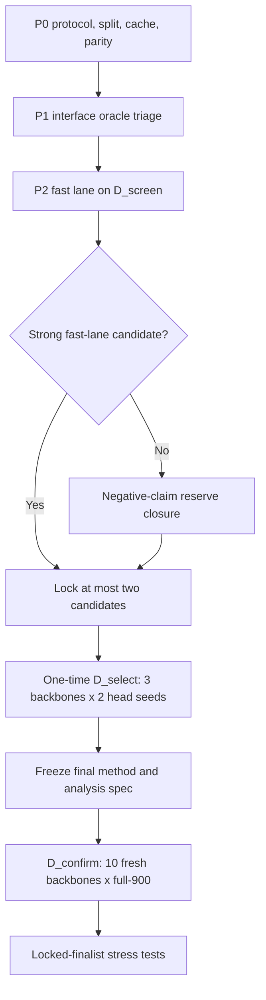

# Procgen Maze DistanceHead 高效率严谨执行协议

版本：`v1.3-implemented`

日期：`2026-07-17`

状态：**代码已实现；本地静态与合成审计完成后生成 protocol lock；服务器正式运行尚未开始**

上位方法总纲：[DISTANCE_HEAD_RESEARCH_PLAN.zh.md](DISTANCE_HEAD_RESEARCH_PLAN.zh.md)

适用仓库：`zixuangui-rgb/LeWM_for_Maze`

目标硬件：`4 x NVIDIA H800`，四张卡必须属于同一 runtime block。

---

## 0. 协议定位

本文只优化实验的执行设计，不降低实验的证据标准。优化目标是：

1. 尽快获得 DistanceHead 是否能带来稳定 SR/OOD 提升的主要结果；
2. 减少重复训练、重复 full-900、无信息方法分支和 GPU 空等；
3. 保留原计划能够支持的严格正结论；
4. 只有在完成规定的负结论闭环后，才允许形成广泛负结论；
5. 任何节省都不能来自减少最终独立 seed、查看 OOD 后选模型、删掉负对照、
   减少正式任务或改变 baseline budget。

本文采用一个**不对称顺序设计**：

- 如果主线出现满足强门槛的候选，直接进入独立 shortlist 和最终确认，不等待
  所有 reserve 方法跑完；这足以支持一个严格的正结论。
- 如果主线没有候选通过，不能立即声称 DistanceHead 到达上限。必须先完成
  negative-claim closure set，再确认两个机制上不同的最强失败候选；这才足以
  支持范围受限但严格的负结论。

这种不对称性不是偏袒正结果。正结论只需要证明一个锁定方法有效；广泛负结论
需要排除多个合理方法族，因此本来就需要更多证据。

---

## 1. 不允许改变的科学合同

以下项目与原计划完全一致，效率优化不得修改：

- topology hold-out；
- `D_train` 只包含 sizes `9-21`；
- size `23/25` 不参与训练、调参、checkpoint selection 或 finalist selection；
- `max_steps=128`；
- anchor planner 为 `num_candidates=64, cem_iters=1, horizon=12` 的 receding CEM；
- `corrected_v1` 与 `unmasked` 同时执行并分开报告；
- `B-L2` 与 `B-DH-CEM` 两条 baseline；
- 正式比较共享 action mapping、candidate/search seed、预算与 evaluator；
- final confirmation 使用 full-900；
- final confirmation 使用与 `Seed-1/Seed-3` development 完全不重合的独立
  backbone seeds，不能把 episode 当模型重复；
- final confirmation 默认 `10` 个 backbone seeds；若事前 power analysis 要求更多，
  只能增加，不能减少；
- `D_confirm` 一次性打开，打开后不得重选模型、权重、planner 或 checkpoint；
- BFS 仅可用于训练标签、诊断和 oracle attribution，不能用于正式 test-time 决策；
- corrected assistance 必须记录 assistance rate，不能冒充自主能力；
- transformed score 必须 inverse-transform 后再与 raw BFS steps 比较；
- 所有 formal artifacts 必须绑定 commit、config、checkpoint、manifest 和 code hash。

本协议明确不采用以下表面上的“加速”方式：

- 不减少 final seed；
- 不把 full-900 改为 180-task 后仍声称同等级结论；
- 不对好看的方法延长训练、对差的方法提前停止后直接比较；
- 不用同一 backbone 的多个 head seed 伪装成独立 backbone seed；
- 不用 fractional factorial 取代关键机制的完整对照；
- 不在看过 `D_select` 或 `D_confirm` 后新增同一轮候选；
- 不跨方法改变 CEM/search budget；
- 不删除 shuffled-label、continuation control 或 oracle attribution。

---

## 2. 主要结论与证据路径

### 2.1 正结果路径

正结果的核心主张是：

> 一个在 `D_confirm` 打开前完全锁定的 DistanceHead 方法，在相同 Vector-JEPA
> backbone、predictor、planner budget 和 action protocol 下，相对
> `B-DH-CEM` 获得具有实际意义且具有统计支持的 overall/OOD SR 提升。

要支持该主张，必须具备：

1. `10` 个从未用于方法开发/选择的独立 backbone seeds，或 power analysis 锁定的更大样本；
2. full-900 sealed `D_confirm`；
3. paired task、backbone seed 和 search seed；
4. corrected overall 与 size-23/25 OOD 两个 primary endpoints；
5. `B-L2` 作为历史强 anchor 同时报告；
6. unmasked、SPL、loop、invalid、assistance 和 compute 作为关键 secondary；
7. Holm familywise correction 与 crossed paired bootstrap；
8. 结果同时满足统计显著性和预注册的实际重要性阈值。

主线是否还跑过所有备选 loss，不影响这个正结论，因为结论只针对最终锁定方法，
不声称它是所有可能方法中的数学最优解。

### 2.2 负结果路径

若要声称：

> 在本协议覆盖的 pooled Vector-JEPA DistanceHead 方法族中，没有方法获得至少
> `+0.04` overall SR 或 `+0.05` OOD SR 的实际改进，继续只修改 DistanceHead
> 的预期收益有限。

则必须额外满足：

1. 完成第 9 节的 negative-claim closure set；
2. 不能只跑最快主线后就停止；
3. `D_select` 上保留两个机制不同的最强候选；
4. 两个候选都进入 sealed confirmation；
5. 对 superiority margin 报告 multiplicity-adjusted one-sided upper confidence bound；
6. 只有上界排除预注册的 minimum effect of interest，才能说“没有实际意义的提升”；
7. 结论必须限定为“本协议测试的方法族”，不能写成所有未来 DistanceHead
   都不可能成功。

因此，负结论路径会比正结论路径更慢。这部分计算不能科学地删掉。

---

## 3. 数据分层：同样 350 个 validation tasks，改成两层

原计划的 `D_val=350` 同时承担开发和选择，容易反复适配。本文不减少 validation
总量，而是预先拆成两个 topology-disjoint 层：

| Split | 组成 | 角色 | 是否可反复查看 |
|---|---:|---|---|
| `D_train` | 2800，sizes `9-21` | 训练与 train-only mining | 是 |
| `D_cal` | train-role topology | 数值、梯度尺度和单元测试 | 是，但不得按 SR 选方法 |
| `D_screen` | 140，sizes `9-21`，每 size 20 | 方法开发、诊断、快速 closed-loop | 是 |
| `D_select` | 210，sizes `9-21`，每 size 30 | 一次性 shortlist replication 和 finalist selection | 否，开封后不得新增候选 |
| `D_dev_legacy` | 历史 full-900 | 旧结果 parity 与描述性上下文 | 不得用于新方法选择 |
| `D_confirm` | 新 full-900，sizes `9-25` | 一次性最终确认 | 否 |
| `D_stress` | sizes `27/29/31`，每 size 50 | finalist 锁定后的 size 边界测试 | 否，不回流选模型 |

### 3.1 Split 生成规则

- `D_screen` 与 `D_select` 必须在开始训练前同时生成；
- `D_screen/D_select` 使用互不重叠的确定性 topology-seed namespace，各 size 分别生成
  `20/30` 个任务；生成规则、manifest hash 与逐字节再生结果写入 protocol lock；
- 两层的 `(maze_size, topology_seed)`、`layout_hash`、`task_hash` 均不得重合；
- `D_select` manifest 在候选集合锁定前只允许 hash，不允许运行 evaluator；
- `D_confirm` 与 `D_stress` 在 finalist 锁定前只允许生成、审计、hash 和封存；
- size `23/25` 不出现在 `D_screen` 或 `D_select`；
- `D_dev_legacy` 的 size `23/25` 结果不能进入任何选择规则。

这种拆分把多数探索性 closed-loop 从 350 tasks 降到 140 tasks，同时给 finalist
保留一个从未用于开发的 210-task 独立选择层。最终结论仍由完整 `D_confirm`
产生，因此没有降低确认性证据。

---

## 4. 关键路径概览



并行于主路径、但受 seed-release gate 约束的后台任务：

```text
prepare future backbone jobs, but train only the released seed tier
build canonical latent/BFS/local caches
build train-only and D_screen candidate banks
compile and test evaluators
prepare immutable result schemas and analysis indices
```

缓存、测试和 job spec 不依赖方法选择，应尽早完成。backbone/head 的实际训练则按
第 5.2 节逐级释放，避免在主线失败时浪费剩余 seeds。

---

## 5. P0：一次性基础设施与 parity

### 5.1 必做项

1. 恢复 exact Simple DistanceHead 配置与 checkpoint provenance；
2. 生成并审计 `D_screen/D_select/D_confirm/D_stress`；
3. 修复 transformed/raw distance 单位；
4. 锁定 tie-aware Local top-1；
5. 锁定 corrected/unmasked semantics；
6. 建立 content-addressed latent、BFS、local tuple 和 candidate caches；
7. 建立 stateless candidate seed：`hash(task, step, search_seed, budget)`；
8. 重建 `B-L2/B-DH-MF/B-DH-PG/B-DH-CEM`；
9. canonical seed 上做一次 `D_dev_legacy` parity；
10. 运行 protocol、leakage、determinism、metric 和 schema tests。

实现补充：cache 中每个 source observation、goal latent 与 BFS label 都使用同一个
manifest goal。历史脚本中“图像仍标记 manifest goal、标签却指向随机 cell”的
不一致采样不进入新方法排名；旧 checkpoint 只用于 parity 与 provenance。

### 5.2 逐级释放 backbone/head seeds

为优先节省总 GPU-hours，不在 P0 一次性训练全部 confirmation backbones。seed
释放顺序必须在 protocol lock 中固定为：

| Tier | Backbone seeds | Head seeds | 触发条件 | 角色 |
|---|---|---|---|---|
| `Seed-1` | `42` | 每方法 `0/1/2` | P0 audit 通过 | 机制初筛 |
| `Seed-3` | `42/43/44` | 固定为每 backbone `0/1` | 候选集合在 `D_screen` 锁定 | 跨 backbone 初步复现 |
| `Seed-10` | 10 个 fresh seeds；默认 `1001-1010`，与历史 `42-61` 不重合 | 每 backbone 一个事前指定的配对 seed | `D_select` 扩大门槛通过，或启动严格负结论闭环 | 正式确认 |

`Seed-10` 不是把 `Seed-3` 补足到 10，而是另起 10 个 fresh confirmation
backbones。protocol 必须在 `D_select` 前封存一个更长的有序候选列表，默认从
`1001` 起递增；若 baseline-only power rule 要求 `n>10`，只能取该列表的前 `n`
个，不能按训练表现挑 seed。

执行规则：

- P0 只保证 seed `42` backbone 和 exact baseline 可用；
- `Seed-1` 未完成前，不训练 seeds `43/44`；
- 候选在 `D_screen` 上锁定后，才训练或释放 seeds `43/44` 及其 paired baseline heads；
- `D_select` 完成前，不训练任何 confirmation seed；
- 正结果路径只有通过第 10.4 节扩大门槛后，才训练 10 个 fresh confirmation
  backbones；`42/43/44` 不得进入 confirm 主统计；
- 若 `Seed-3` 未通过但研究目标仍要形成广泛负结论，必须先完成 negative-claim
  closure，再对两个最强候选释放 `Seed-10`；若原 shortlist 没有 closure，必须另写
  绑定原 shortlist/finalist 的 immutable negative fallback lock，不得覆盖原文件；
- 若已有 checkpoint，只有 architecture、data hash、optimizer、steps、seed、commit
  和 training spec 全部一致时才允许复用；
- confirmation checkpoint 还必须证明未进入任何历史/当前的方法开发、筛选或结果查看；
  provenance 不完整时不得把它标为 fresh，必须重新训练；
- exact `B-DH-CEM` baseline head 和 train-role latent cache 也只生成到当前已释放 tier；
- `Seed-3` 使用的 head seeds 必须在 `Seed-1` 结果产生前固定为 `0/1`，不得从
  `0/1/2` 中事后挑选表现最好的两个；
- `Seed-10` 的 ordered backbone list、head-seed 映射和 baseline-only sample-size
  rule 必须在 `D_select` 打开前锁定，
  所有 paired methods
  在同一 backbone 上使用相同映射；
- 不得根据某个 seed 的表现挑选“更好 seed”或跳过困难 seed；
- power analysis 若要求超过 10 seeds，只能在 `D_confirm` 打开前按预注册顺序继续释放。

每次 tier 转换必须生成不可修改的 `seed_release.json`，包含 source result hashes、
逐条 gate 值、pass/fail、下一 tier seed list、decision code version 和签名时间。
scheduler 只能读取该 artifact 放行下一 tier。

所有结果文件还必须写入以下 `evidence_status`，并限制报告措辞：

| Tier | `evidence_status` | 允许的结论 |
|---|---|---|
| `Seed-1` | `exploratory_single_backbone` | “在单 backbone 机制筛选中有信号” |
| `Seed-3` | `replicated_development` | “在三个 development backbones 上初步复现” |
| `Seed-10` | `confirmatory` | 仅此级可报告正式正/负结论 |

任何 `Seed-1/Seed-3` 结果都不得使用“最终提升”“性能上限”或“已证明无效”等措辞。

该设计优先减少失败路线的计算浪费，同时保持 model-seed 维度的真正独立确认。
成功路径总共会训练 3 个 development backbones 加 10 个 fresh confirmation
backbones，因此比复用 development seeds 更贵；失败路径则可避免全部 10 个
confirmation backbone trainings 及其 dependent heads/caches。这里不能为了省三次
backbone training 把筛选 seeds 混入正式确认。

### 5.3 P0 通过条件

- 所有 split overlap 为零；
- parity 的 episode-level mismatch 有完整解释或为零；
- cache key 包含 source checkpoint hash、manifest hash、transform 与 code fingerprint；
- 相同 config 重跑 action trace 一致，允许的浮点差异已定义；
- `D_select/D_confirm` 尚未产生方法结果；
- protocol audit fail-closed。

---

## 6. P1：用 oracle attribution 决定优先顺序

在 `D_screen` 上先运行以下低成本 attribution，不把 oracle 放入正式排行榜：

| ID | 定义 | 主要定位 |
|---|---|---|
| `O-DYN` | true rollout endpoint + learned DistanceHead | predictor/dynamics headroom |
| `O-SCORE` | true rollout endpoint + true BFS endpoint score，在原 candidate set 中选择 | scorer + fixed-candidate ceiling |
| `O-BFS1` | 每步在全部真实 one-step actions 中按 BFS 距离选择 | fixed-candidate/search 接口之外的行动上界 |
| `O-ACT` | true one-step next states + learned head | true-latent local ceiling |

定义 paired headroom：

```text
H_dyn    = SR(O-DYN)   - SR(B-DH-CEM)
H_score  = SR(O-SCORE) - SR(O-DYN)
H_search = SR(O-BFS1)  - SR(O-SCORE)
```

它们只用于路由，不作为 learned-method 结果：

- `H_score >= 0.04`：优先 target/local/trajectory scorer；
- `H_dyn >= 0.04`：必须执行 predicted-latent/TRM，frozen true-latent 结果不能直接晋级；
- `H_search >= 0.04`：把 planner/search reserve 标记为必触发；
- 三者均 `<0.02`：固定 candidate、terminal-scorer 接口缺少达到 MEI 的经验 headroom，
  可跳过纯 scale/calibration reserve，但不能据此跳过 path/reachability 或 joint class；
- 任一值位于 `[0.02,0.04)`：不得据此删掉对应主线，只能降低其 reserve 优先级。

这些差值不是数学上对所有未来方法的上界。它们只约束相同 candidate budget 和
相同接口的经验 headroom，因此结论必须保持该范围。

---

## 7. P2：快速主线，所有关键对照仍完整

P2 只使用 canonical backbone seed `42`，但每个 trainable head 使用固定
head seeds `0/1/2`。每个 arm 都训练到相同完整预算，不使用不对称 early stopping。

### 7.1 Block A：标尺与采样

按顺序执行：

1. `A0-EXACT`：恢复后的 exact target/loss/sampler；
2. `A1-LOG`：只把 target 改为 global `log1p(raw BFS)`；
3. 依据 raw-unit MAE、long-distance MAE 和 Local top-1 的预注册规则选定 parent；
4. `A2-DIST`：只改 distance-bin balanced sampler；
5. `A3-FULLH`：只改 full-horizon balanced sampler。

`A2/A3` 相互独立，不累计。若 `A0` 与某个已有 arm 的完整 config hash 相同，
直接复用，不重复训练。

### 7.2 Block B：局部与结构目标

先并行运行：

- `B1-LIST`：tie-aware all-valid-action listwise；
- `B2-BELL`：raw-step Bellman consistency；
- `B3-MSTEP`：shortest-path multistep decomposition。

在 `B2/B3` 中按预注册 gate 选一个 structural winner，然后形成完整 `2 x 2`：

| Cell | Local | Structural |
|---|---:|---:|
| `B0-PARENT` | off | off |
| `B1-LOCAL` | on | off |
| `B4-STRUCT` | off | on |
| `B5-COMB` | on | on |

已存在且 config/hash 完全一致的 parent、local-only、structural-only checkpoint
必须复用，只新增缺失 cell。该设计同时估计 local 主效应、structural 主效应和
二者交互，不需要重复训练 matched controls。

### 7.3 Block C：predicted-latent alignment

以 Block B 胜出 parent 为基础：

- `C0-TRUE`：true-next objective；
- `C1-PRED1`：新增 one-step predicted-action listwise；
- `C1-PRED` 与 `C2-DUALCAL` 都必须执行，固定 eligible set 完整后才能签名选择
  `c_parent`；true/pred calibration shift 只用于解释，不用于事后决定是否补跑 C2。

`C1` 必须同时改善 predicted-next 指标；只改善 true-next 不晋级。

### 7.4 Block D：trajectory 与 reachability

以下四个机制在同一批次并行运行：

- `D1-TRM-SHORT`：horizon `1-3` 负/短时域对照；
- `D2-TRM-FULL`：与 CEM h12 对齐的 trajectory ranking；
- `D3-TRM-SHUFFLE`：打乱 trajectory/distance label 的负对照；
- `D4-REACH`：multi-budget reachability + remaining-budget condition。

只有 `D2` 相对 `D1/D3` 显著改善 candidate ranking，才能把增益归因于
horizon-matched trajectory supervision。`D4` 必须报告 Brier、ECE、AUROC 和
monotonicity，不能仅凭 SR 命名为 reachability 改进。

### 7.5 P2 的训练数量上限

快速主线最多包含：

| 类别 | arm 数 | head seeds | 最大 head runs |
|---|---:|---:|---:|
| exact/target | 2 | 3 | 6 |
| sampling | 2 | 3 | 6 |
| local/structure/factorial 新 cell | 最多 4 | 3 | 12 |
| predicted alignment | 最多 2 | 3 | 6 |
| TRM/reachability | 4 | 3 | 12 |
| 合计 | 最多 14 | 3 | **42** |

由于 config-identical parent 会复用，正常实际数量应为 `36-39`，不能为了凑满
上限而重复训练。

---

## 8. `D_screen` 晋级、快速通道与候选锁

### 8.1 低成本指标顺序

每个 arm 按以下层级评估，只有上一层通过才进入下一层：

1. `R1`：cached raw-distance/local metrics；
2. `R2`：fixed candidate-bank SCSA/candidate ranking；
3. `R3`：`D_screen=140` short closed-loop，corrected/unmasked 都运行；
4. 最多四个方法进入 `R3`。

这里的“short”指 task 数为 140；episode 仍使用正式 `max_steps=128`，不能缩短
episode 后与正式 SR 混写。

### 8.2 普通晋级门槛

一个方法进入候选池必须满足：

- 三个 head seeds 方向一致；
- predicted-next Local top-1 相对 parent 提高至少 `+0.05`，或 h12 candidate
  rank regret 下降至少 `20%`；
- corrected `D_screen` SR 相对 `B-DH-CEM` 提高至少 `+0.04`；若增益为
  `[+0.02,+0.04)`，必须同时有 SPL、loop、candidate rank 和 paired interval 支持；
- unmasked SR 不下降超过 `0.02`；
- SPL 不下降超过 `0.02`；
- shuffled control 不得出现同方向、同量级提升；
- compute、assistance rate 和 predictor calls 完整记录。

### 8.3 快速正结果通道的强门槛

若至少一个方法满足：

1. 三个 head seeds 的 corrected `D_screen` SR 均优于配对 baseline；
2. 平均 `Delta SR >= +0.06`；
3. predicted/candidate ranking 至少一项达到普通晋级门槛；
4. unmasked、SPL、loop 和 collapse safety 全部通过；
5. 对应机制负对照通过；

则最多锁定两个候选并直接进入 `D_select`，无需等待第 9 节 reserve 方法。

强门槛只决定是否跳过 reserve，不构成最终科学结论。最终结论仍由 `D_confirm`
决定。

### 8.4 未达到强门槛时

- 有候选达到普通门槛但未达到强门槛：候选保留，同时先执行与诊断对应的 reserve；
- 所有候选 `<+0.02`：执行完整 negative-claim closure set；
- ranking 明显提高但 SR 不提高：优先 planner cost/search reserve；
- true-next 提高但 predicted-next 不提高：优先 joint/predictor reserve；
- 不允许先打开 `D_select` 再决定是否补 reserve。

---

## 9. Negative-claim closure set

只有快速通道未触发，或研究目标明确要求形成广泛负结论时，才执行本节。每个
新增 family 仍使用三个 head seeds、完整训练预算和相同 `D_screen` gate。

### 9.1 必须覆盖的方法族

| Family | 最少必须运行的代表 | 目的 |
|---|---|---|
| regression robustness | `L-MAE`, `L-HUBER` | 排除只因 MSE/scale 不稳 |
| non-scalar output | `O-ORDINAL`, `O-DIST` | 排除 scalar bottleneck |
| local alternatives | `R-PAIR` 或 `R-DELTA` | 排除 listwise 特例失败 |
| metric structure | `C-EIK`, `C-QMETRIC` | 排除 unit-cost/asymmetry 未建模 |
| temporal metric | `C-CSF` 或等价 successor metric | 排除直接 BFS regression 范式 |
| head architecture | asymmetric + hierarchical/budget-conditioned 各一项 | 排除简单 concat MLP 容量限制 |
| joint predictor | `J0-CONT-DYN` vs `J0-DIST-DYN` | distance gradient 是否应进入 dynamics |
| joint projector | `J1-CONT-P` vs `J1-DIST-P` | projector 是否为主要瓶颈 |
| joint full backbone | `J2-CONT-E` vs `J2-DIST-E` | representation 是否必须共同塑形 |
| joint mechanism | `J3-MH/J3-REACH/J3-RCAUX` | multi-horizon 与 reachability factorial |
| planner cost | terminal/path/reach/loop fixed-bank ablation | 排除 scorer 已好但使用方式错误 |
| search | 由 `H_search` 触发的 iCEM + Beam/Best-first 中至少一项 | 排除 candidate/search 接口限制 |

planner-only reserve 复用 `c_parent` decision 指向的已训练 head，而不是尚未存在的
finalist；它们不得重新训练 head。hybrid cost 在每个 candidate population 内分别
标准化 DistanceHead 与 latent-L2，再按锁定权重组合，禁止直接相加不同比例单位。

### 9.2 可按 oracle 合法跳过的范围

- 若 `H_score <0.02`，可不运行额外 affine/isotonic/temperature calibration；
- 若 `H_search <0.02`，可不运行更大 candidate budget，但 path/revisit cost 仍需独立判断；
- 若 joint predictor treatment 不优于 matched control，才可停止更深的同类
  learning-rate sweep；
- 若 gradient conflict gate 未触发，不运行 PCGrad/GradNorm；
- graph/landmark/hierarchy 只有在 fixed-budget coverage 或 long-path 诊断触发时执行。

任何跳过都必须在 protocol artifact 中记录触发指标、阈值、代码版本和决定，不得
由研究者自由裁量。

### 9.3 负结论的 finalist 数

若 closure set 后仍无方法达到普通晋级门槛：

- 仍选出 `2` 个机制不同且在 `D_screen` 上最强的候选；
- 一个优先代表 frozen scorer/trajectory class；
- 一个优先代表 joint/architecture/search class；
- 两者都必须进入 `D_select` 和 `D_confirm`；
- 不能只确认最差或最便宜的方法来制造负结论。

---

## 10. 一次性 `D_select` shortlist replication

### 10.1 何时允许打开

只有以下内容全部锁定后才允许运行 `D_select`：

- 候选集合，最多两个；
- `B-L2/B-DH-CEM` config；
- backbone seeds `42/43/44`；
- 每个 backbone 固定的 head seeds `0/1`；
- checkpoint selection 规则；
- action protocols；
- candidate/search seeds；
- finalist selection 的字典序规则；
- analysis code/hash。

打开后不得新增候选、调 loss weight、改 horizon 或改 planner。
每个 backbone block 内的方法顺序必须按预注册 schedule 随机化，并保证各方法在
GPU、时间波次和重试状态上尽量平衡。

### 10.2 运行矩阵

| 方法 | Backbone seeds | Head seeds/backbone | Protocols | Tasks |
|---|---:|---:|---:|---:|
| `B-L2` | 3 | 无 | 2 | 210 |
| `B-DH-CEM` | 3 | 2 | 2 | 210 |
| finalist 1 | 3 | 2 | 2 | 210 |
| finalist 2，可选 | 3 | 2 | 2 | 210 |

最多 `42` 个 result files，但每个只有 `210` tasks，相当于约 `9.8` 次 full-900，
而不是原设计的 `42` 次 full-900。独立 backbone/head replication 保持不变。

### 10.3 Finalist selection

在每个 backbone 内先平均两个 head seeds，再跨 backbone 比较，禁止把六个 head
当六个独立 backbone。size `23/25` 不存在于该 split。

候选按以下锁定顺序选择：

1. corrected overall SR 相对 `B-DH-CEM` 的 paired improvement；
2. 若候选间差值 `<0.01`，比较 h12 candidate rank regret；
3. 仍无法区分时比较 unmasked SR；
4. 再比较 SPL；
5. 再比较 predictor transitions 和 wall-clock；
6. 仍相同则选择结构更简单、参数更少者。

正结果路径选择一个 final method。负结论路径保留两个机制不同的 methods。

### 10.4 从 `Seed-3` 扩大到 `Seed-10` 的门槛

正结果路径只有同时满足下列条件，才释放 fresh confirmation backbone seeds：

1. 在每个 backbone 内先平均两个 head seeds；
2. 三个 backbone 的 corrected mean `Delta SR >= +0.04`；
3. 至少 `2/3` 个 backbone 的 paired `Delta SR > 0`；
4. 任一 backbone 的 paired `Delta SR` 均不得 `< -0.02`；
5. predicted-next 或 h12 candidate-ranking 机制指标达到预注册晋级门槛；
6. unmasked SR 和 SPL 均不得下降超过 `0.02`；
7. shuffled/control 与 collapse-safety 检查通过；
8. final method、head seed mapping、checkpoint rule、planner 和 analysis 已冻结。

若不满足：

- 只能形成“初步改善未能跨 backbone 稳定复现”的 development 结论；
- 不得为了获得显著结果逐个增加 seed 并反复查看；
- 不启动正结果 confirmation；
- 若决定追求严格负结论，先完成第 9 节 closure，再按负结果矩阵释放 `Seed-10`。
- 后置 closure 的两个候选必须来自完整 closure ranking，并通过独立 fallback lock 绑定
  已失败的 Seed-3 finalist；不能用 D_screen 重新挑一个更好看的正路线。

这里的扩大决定可以使用 `D_select` 的方法效应，因为它只决定是否投入独立的
sealed confirmation。final sample size 本身仍固定为 10 或 baseline-only power
analysis 预先要求的更大值，不能按 observed finalist effect 动态挑选最终 n。

### 10.5 Legacy parity 的降级使用

`D_dev_legacy` 不再承担三 backbone shortlist。只运行：

- canonical backbone/head；
- locked finalist；
- `B-L2/B-DH-CEM`；
- corrected/unmasked；
- full-900。

这些结果只用于连接历史报告，不参与 finalist selection、p-value 或 OOD claim。

---

## 11. 最终确认：不压缩

### 11.1 正结果矩阵

- `10` 个与全仓库历史 seed registry 不重合、从未用于方法选择的独立 backbone seeds，或
  power analysis 预先锁定的更多 fresh seeds；
- 每个 backbone 一个预注册 head seed，方法间配对；
- `1` 个 final method；
- `B-DH-CEM` 与 `B-L2`；
- corrected/unmasked；
- full-900 sealed `D_confirm`；
- 默认 `n=10` 时共 `60` 个 full-900 result files（10 x 3 methods x 2 protocols）；
  若 power rule 得到 `n>10`，文件数为 `6n`。

### 11.2 负结果矩阵

- 同样的独立 backbone seeds 与 full-900；
- `2` 个机制不同的 strongest finalists；
- `B-DH-CEM` 与 `B-L2`；
- corrected/unmasked；
- 默认 `n=10` 时共 `80` 个 full-900 result files（10 x 4 methods x 2 protocols）；
  若 power rule 得到 `n>10`，文件数为 `8n`。

### 11.3 统计

- 独立重复单位：fresh confirmation backbone training seed；
- head seed 在 shortlist 阶段是嵌套方差来源，不替代 backbone seed；
- `Seed-1/Seed-3` development backbones 不进入 primary endpoint、CI 或 p-value；
- task、state、candidate 都是 seed 内 paired/repeated measurements；
- overall 与 size-23/25 OOD corrected SR 为 primary endpoints；
- final vs `B-DH-CEM` 为 primary method contrast；
- final vs `B-L2` 为预注册关键 anchor contrast；
- 对所有 primary contrasts 使用 Holm familywise correction；
- CI 使用 crossed paired bootstrap：先重采样 model seed，再按 maze size 产生一套共享的
  topology/task draw 并应用到所有入选 seeds；task 不是各 seed 内彼此独立的嵌套样本；
- 至少 10,000 bootstrap replicates，replicate seed schedule/hash 预先保存；
- superiority p-value 使用 backbone-level 单侧 sign-flip；`n<=16` 精确枚举，否则使用
  锁定 seed 的 Monte Carlo；
- unmasked、SPL、loop、invalid、assistance、candidate rank 和 compute 为 secondary；
- 不允许用 secondary endpoint 挽救失败的 primary claim。

### 11.4 确认性判定

正结论至少要求：

- corrected overall `Delta SR >= +0.04`；
- corrected OOD `Delta SR >= +0.05`；
- multiplicity-adjusted CI 支持 superiority；
- unmasked、SPL、collapse 和 assistance diagnostics 没有预注册的严重退化；
- 结论准确标记 corrected/assisted 范围。

上述 `Delta` 的 primary reference 是 `B-DH-CEM`。若 final 只超过 `B-DH-CEM`
但没有超过 `B-L2`，只能声称“DistanceHead 路线相对原 DistanceHead 改进”，
不能声称“成为新的最佳 Vector-JEPA 方法”。后一个主张要求 final 对两条 baseline
都满足预注册的 superiority 标准。

负结论至少要求：

- closure set 已完成；
- 两个 strongest finalists 均已确认；
- multiplicity-adjusted one-sided upper CI 排除对应 MEI；
- 结论限定为本协议方法族；
- 不把“不显著”误写为“等价”或“不可能”。

初始最小值固定为 `n=10`。protocol 在 P0 前锁定 sample-size simulation、MEI、
alpha/power、允许的 baseline-only 输入和 ordered fresh-seed list；在 `D_select`
结束后、任何 `Seed-10` training/evaluation job 前生成一次不可变的
`confirmation_n_lock.json`。
样本量重估只能使用 baseline-only variance/discordance（OOD 方差只能来自未用于
新方法选择的历史 baseline 数据）和预先固定的 MEI，不能代入 `D_select` 上观察到的
finalist effect。若得到 `n>10`，只能按 ordered list 取前 `n` 个 fresh seeds；不能
为了速度降低 power 门槛，也不得在看到 `D_confirm` 后再次扩样。

---

## 12. 泛化边界：不阻塞主要结果，但不回流调参

`D_confirm` 关闭并锁定主结论后再执行：

1. topology 与 size `23/25` 已由 `D_confirm` 给出；
2. matched path-length 尽量直接复用 `D_confirm` episode，不增加模型运行；
3. size `27/29/31` 使用同一锁定模型和 paired topology protocol；
4. appearance shift 使用相同 transition graph 的 counterfactual rendering；
5. dynamics noise/action stochasticity单独报告；
6. multi-task 不进入本轮 primary claim。

这些测试只使用已经锁定的 checkpoints，不重新训练，不根据 stress 结果切换 final
method。若未来要针对失败维度训练修复，必须生成新的 validation/confirmation
split，作为下一项研究，不能回写本轮结论。

---

## 13. 计算复用与实现约束

### 13.1 Content-addressed DAG

每个训练/eval 节点的唯一键至少包含：

```text
code_fingerprint
data_manifest_sha256
source_backbone_sha256
parent_method_id
resolved_config_sha256
training_seed
seed_tier
seed_release_artifact_sha256
sample_schedule_sha256
candidate_bank_sha256
action_protocol
```

键完全一致时必须复用；任一字段不同则禁止复用。以下属于合法复用：

- `T0 = L-MSE = S-UNIFORM` 的 exact same run；
- factorial 中已训练的 parent/local/structural cell；
- 同一个 model checkpoint 的 corrected/unmasked evaluation；
- 同 backbone 的多 scorer共享 frozen latent cache；
- scorer-only ablation 共享 fixed candidate bank。

以下不属于合法复用：

- 不同 training seed；
- 不同 backbone seed；
- 改过 sample schedule 或 loss weight；
- 在旧 objective checkpoint 上继续训练后冒充 from-scratch matched arm；
- 用 `D_dev_legacy` 选择过的 checkpoint 冒充 fresh selection。

### 13.2 预计算

canonical backbone 上一次性生成：

- `D_train/D_cal/D_screen` state latents；
- raw BFS labels 和 inverse-transform metadata；
- local all-action tuples；
- shortest-path waypoints；
- true/predicted executed-action horizon `1/3/5/8/11` endpoints；在
  `legacy_warmup_v1` 下对应 rollout slots `2/4/6/9/12`；
- train-only TRM candidate bank；
- `D_screen` SCSA candidate bank。

推荐使用 mmap/分片 tensor，避免每个 head 重复运行 encoder 和 BFS。所有 cache
必须带 split role，test-role cache 不得被 trainer 打开。

### 13.3 训练与评估流水线

- head training、candidate generation 和 analysis 使用独立 job queue；
- 一个 job 失败只重跑同一 hash 的 job，禁止改变 config 后覆盖；
- evaluator 每完成一个 task 写 append-only row，支持安全 resume；
- resume 后 action trace 必须与 uninterrupted run 一致；
- full-900 结果先写 per-task rows，再由 summarizer 重算 aggregate；
- 不信任手填 SR/SPL；
- 所有结果先做 completeness/hash audit，再解盲 aggregate。

---

## 14. 4 x H800 调度

### 14.1 基本原则

- 不建议把小型 DistanceHead 用 DDP 切到四张卡；
- 使用四个独立单卡 job，提高 experiment-level throughput；
- 相同 comparison block 内，seed 到 GPU 的映射必须轮换，避免 seed 永久绑定 GPU；
- confirmation 以 backbone seed 为 block，同一 seed 的所有 methods 尽量在同一 GPU
  和同一 runtime window 完成，保留 paired design；
- GPU assignment、开始时间、重试和 worker host 都写入 metadata。

### 14.2 Screening 轮换示例

每个 arm 有 seeds `0/1/2`。四个连续 waves 使用：

| Wave | GPU0 | GPU1 | GPU2 | GPU3 |
|---|---|---|---|---|
| 0 | seed0 | seed1 | seed2 | cache/eval |
| 1 | cache/eval | seed0 | seed1 | seed2 |
| 2 | seed2 | cache/eval | seed0 | seed1 |
| 3 | seed1 | seed2 | cache/eval | seed0 |

具体 arm 顺序在 comparison block 内由预注册 seed 随机化。该表是分配模板，不是
固定方法顺序。

### 14.3 Seed tier 转换调度

- `Seed-1`：只使用 backbone seed `42`；三个 GPU 跑 head seeds，第四张卡做
  canonical cache、oracle attribution 或 parity；
- `Seed-1 -> Seed-3`：候选锁定后，用两张卡训练 seeds `43/44`，其余卡准备 paired
  baseline heads、候选 head 和 `D_select` caches；
- `Seed-3`：三个 backbone blocks 在三张卡并行，第四张卡执行 analysis/audit 或
  同 block 的第二 head seed；
- `Seed-3 -> Seed-10`：只有扩大门槛通过后，10 个 fresh confirmation backbone
  seeds 才按 `4 + 3 + 3` 三波训练；
- final head training、baseline head training 与已完成 backbone 的 cache 可流水化，
  但不得在对应 tier 释放前启动；
- 负结论路径的 `Seed-10` 必须等待 closure set 和两个 strongest finalists 锁定。

### 14.4 Confirmation 调度

- 默认 10 个 fresh backbone seeds 分三波 `4 + 3 + 3`；若 `n>10`，其余 seed
  继续按 ordered list 和最多四并发分波；
- 每个 seed block 内依次执行 final、`B-DH-CEM`、`B-L2`，方法顺序随机化；
- corrected/unmasked 的执行顺序也在 seed block 内平衡；
- 若某张卡故障，整个未完成 seed block 转移并记录，不只转移某个方法；
- 四张 H800 runtime 必须同构，否则 GPU 型号/节点作为 block 并在分析中记录。

### 14.5 CPU/I/O 前提

当前 Maze/BFS/receding-CEM 有明显 CPU 与 Python 开销。为接近四卡吞吐：

- 建议至少 `32` 个可用 CPU cores；
- cache 使用本地 NVMe，不使用高延迟共享盘做热数据；
- 四个 evaluator 不重复生成同一 BFS/cache；
- 监控 GPU utilization、CPU saturation、I/O wait 和 per-task wall-clock；
- 若四并发相对单任务吞吐低于 `3.2x`，先修 CPU/I/O，不盲目增加 GPU job。

---

## 15. 预计运行量与时间

以下只估算代码通过审计后的机器运行，不包含开发新方法代码的工程时间。

### 15.1 快速正结果路径

| 项目 | 数量/上限 | 备注 |
|---|---:|---|
| canonical frozen-head runs | `36-42` | 三个 head seeds，完整预算 |
| independent backbones | `1 dev -> 3 dev -> 10 fresh confirm` | confirm 与 development seeds 完全不重合；成功路径共训练 13 个 |
| `D_screen` closed-loop | 最多 4 methods | 140 tasks，双 protocol |
| `D_select` | 最多 42 files | 210 tasks，不是 full-900 |
| legacy parity | 最多 6 full-900 | canonical only，不选模型 |
| confirmation | `6n` full-900，默认 60 | 完全保留；这里是正结果矩阵 |

以下暂估假设 `confirmation n=10`、缓存和作业队列实现正确、四张 H800 全天可用：

- `Seed-1`，P0 + canonical screening：累计 `2-3` 天，得到机制方向；
- `Seed-3`，训练 seeds `43/44` + `D_select`：累计 `3-5` 天，得到跨 backbone
  development 复现结果；
- `Seed-10`，训练 10 个 fresh seeds + confirmation：累计暂估 **`7-12` 天**，得到主要确认结果；
- stress/generalization 再增加 `1-3` 天，但不阻塞主要结果。

相对直接训练 10 个 fresh confirmation backbones，本设计的成功路径还承担 3 个
development backbones，暂估增加 `1-3` 天墙钟关键路径；若 `Seed-1/Seed-3` 失败，
则可避免全部 10 个 confirmation backbone trainings 及其 heads/caches。最终排期仍
必须由第 15.3 节 benchmark 实测更新，不能通过复用 development seeds 压缩。

### 15.2 Reserve/负结论路径

若必须执行 joint、architecture、planner/search 和两 finalist confirmation：

- reserve screening：增加 `3-6` 天；
- 第二 finalist confirmation：增加约 `0.5-1` 天；
- **完整负结论闭环暂估 `11-18` 天**。

### 15.3 运行前校准

第一批四个 benchmark 必须同时启动：

1. exact frozen head full training；
2. structured/QRL-like head full training；
3. standard h12 CEM full-900；
4. joint continuation 的固定 `3000`-step throughput probe。

记录 warm-cache 和 cold-cache 时间，按下式更新排期：

```text
wall_time = max(total_single_gpu_hours / measured_effective_parallelism,
                sequential_critical_path)
            + 20% audit/retry reserve
```

更新只能改变资源排期，不能改变方法、seed、task 或 gate。

---

## 16. 为什么这些优化不降低结论强度

| 优化 | 节省来源 | 为什么不削弱严格结论 |
|---|---|---|
| `D_screen/D_select` 分层 | 多数方法只跑 140 tasks | final 仍为 sealed full-900；选择层反而更独立 |
| shortlist 不跑 42 次 full-900 | 210-task fresh selection | 三 backbone x 两 head seeds保留，最终 10-seed full-900保留 |
| 强候选跳过 reserve | 不运行与正主张无关的方法池 | 正结论只针对锁定 finalist，不声称穷举最优 |
| 负结论强制 closure | 仅在需要广泛负主张时付费 | 防止用有限失败夸大成普遍上限 |
| exact config 复用 | 删除重复 parent/control | 只复用逐字段相同节点，不改变任何对照 |
| cache encoder/BFS/candidates | 删除重复确定性计算 | 输入、标签、随机种子与结果完全相同 |
| `1 dev -> 3 dev -> 10 fresh confirm` seed 金字塔 | 失败时不训练 confirmation seeds | 小规模阶段只作筛选，final model seeds 与 full-900 都独立保留 |
| 4 卡独立 job | 提高实验级并行 | seed/GPU 轮换并记录 block，不改变统计单位 |
| oracle 路由 | 少跑经验上无 headroom 的同接口分支 | 只允许预注册、范围明确的跳过；不当作 learned 结果 |

真正不能压缩的是：final seed、full-900、blind confirm、paired baselines、双 protocol、
negative controls、joint continuation controls、OOD 隔离和 multiplicity correction。

---

## 17. 锁定前检查清单

### 数据与泄漏

- [ ] `D_screen=140`、`D_select=210` 已按 size 分层生成。
- [ ] 所有 split topology/layout/task hash 两两不重合。
- [ ] size `23/25` 未进入 screen/select。
- [ ] `D_select/D_confirm` 尚未产生任何 method aggregate。
- [ ] candidate/cache 具有 split-role enforcement。

### 对照与运行

- [ ] exact baseline provenance 已恢复。
- [ ] `B-L2/B-DH-CEM` parity 已通过。
- [ ] 每个 arm 三个 head seeds 和完整预算已锁定。
- [ ] `Seed-1/Seed-3/Seed-10` 列表、释放门槛和执行顺序已写入机器可读 protocol。
- [ ] `Seed-3` 的 head seeds 已事前固定为 `0/1`；`Seed-10` 的 paired head-seed 映射已锁定。
- [ ] `Seed-10` ordered backbone list 与全仓库历史 seed registry 完全不重合，默认前缀 `1001-1010` 已封存。
- [ ] `seed_release.json` schema、gate 重算测试与 artifact hash 校验已通过。
- [ ] 未释放 tier 的 backbone/head job 无法被 scheduler 启动。
- [ ] 每个结果都写入合法的 `evidence_status`，报告生成器拒绝越级结论措辞。
- [ ] comparison DAG 已去除 config-identical duplicates。
- [ ] shuffled、oracle、continuation controls 已实现。
- [ ] GPU block randomization schedule 已生成并 hash。

### 选择与统计

- [ ] 快速通道强门槛已写入机器可读 config。
- [ ] reserve 触发与合法跳过规则已写入 config。
- [ ] `D_select` candidate set 和 selection order 已冻结。
- [ ] positive/negative confirmation matrix 已定义。
- [ ] baseline-only power simulation 已完成。
- [ ] power 代码只读取允许的 baseline rows，并对 finalist/treatment input fail-closed。
- [ ] `confirmation_n_lock.json` 已在任何 `Seed-10` job 前生成并绑定 ordered seed prefix 与输入 hashes。
- [ ] Holm/Bonferroni contrasts、bootstrap/sign-flip seed schedule 和 MEI 已锁定。

### 工程与恢复

- [ ] cache key 覆盖全部 provenance 字段。
- [ ] interrupted/resumed action trace test 通过。
- [ ] full-900 per-task append-only 输出通过审计。
- [ ] aggregate 可从 rows 完全重算。
- [ ] failed job retry 不改变 config 或 seed。
- [ ] protocol audit fail-closed。

---

## 18. 最终执行建议

最短但仍然完整的正结果关键路径是：

```text
P0 parity + seed42 backbone + shared canonical caches
-> oracle interface triage
-> exact/log + distance/full-horizon sampling
-> local x structural full 2x2
-> predicted-one-step alignment
-> TRM-full/short/shuffle + reachability
-> strong-gate candidate lock
-> release seeds43/44
-> one-time D_select on 3 backbones x 2 head seeds
-> Seed-3 expansion gate + final lock
-> release 10 fresh confirmation backbones
-> fresh-10-backbone full-900 D_confirm
-> stress tests after main result
```

该路径预计在 `2-3` 天得到单-backbone机制方向、`3-5` 天得到三-backbone初步复现、
暂估 `7-12` 天得到主要确认结果。节省来自删除重复计算、缩短探索层和不提前训练未释放
seeds，而不是删除最终证据。若快速路径失败，实验自动转入 reserve closure；此时
接受暂估 `11-18` 天的总时长，是形成严格负结论所必须支付的证据成本。
