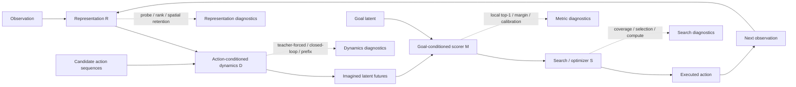

# 纯 JEPA 潜空间规划：性能上限与泛化边界的探索思路

日期：2026-07-13
文档性质：基于现有实验和定向文献调研形成的研究思路备忘录，不是预注册协议，也不是已经锁死的实施方案。

## 0. 这份文档想解决什么

我们现在采用的“纯 JEPA 规划方法”定义是：

> 观测必须先进入 JEPA latent world model；候选动作必须通过 action-conditioned predictor 产生 imagined latent future；未来结果由 latent-space scorer 评价；最终动作由 CEM、MPC、beam search 或其他通用搜索过程产生。BFS 可以训练 representation 或 scorer，但推理时不能直接调用 BFS、真实墙体规划、直接策略头或 corrected oracle assistance。

在这个定义下，最初的 `latent-L2 CEM`、`DistanceHead CEM`、`ReachabilityHead CEM` 和 `QRL CEM` 都属于纯 JEPA 方法。它们的共同点不是“没有监督”，而是**最终决策没有绕开 latent prediction、latent scoring 和 search**。

本文不尝试提前选定一个最终模型。更重要的问题是：

1. 现有结果究竟把失败定位到了哪些接口？
2. 哪些文献提供了可迁移的机制，而不只是一个新模块名称？
3. 面对新结果时，我们如何判断应该改 representation、dynamics、metric 还是 search？
4. 怎样探索性能上限，同时避免把测试集逐渐变成训练集？
5. 怎样把“泛化差”拆成可定位、可比较的能力边界？

## 1. 当前证据起点

### 1.1 最终绝对能力

当前唯一完成 `10 seeds + fresh confirmatory 900 + unmasked` 闭环的纯 JEPA 方法是 `seqlen2 vector LeWM + latent-L2 + receding CEM`：

| 指标 | 结果 |
|---|---:|
| SR | `0.218 +/- 0.020` |
| SPL | `0.083 +/- 0.011` |
| Seen SR | `0.260 +/- 0.024` |
| OOD size 23/25 SR | `0.073 +/- 0.009` |
| Invalid-action rate | `0.737 +/- 0.044` |
| Loop/cycle rate | `0.937 +/- 0.008` |

旧 `corrected` executor 对同类 LeWM 增加约 `0.401` SR，约 `71.7%` 的决策得到真实墙体有效性或防回退规则帮助。development corrected SR `0.639` 与历史 `0.644` 对齐，说明旧模型没有突然变差，而是最终协议揭开了执行器帮助。

因此，当前真正需要解释的不是“为什么只有 0.64”，而是：

> 为什么 JEPA predictor、scorer 和 CEM 在完全自主执行时产生了如此多的非法动作与循环？

### 1.2 三堵墙仍是最重要的机制证据

| 接口 | 关键结果 | 更直接的解释 |
|---|---:|---|
| Representation | embedding optimal-action probe `0.341` | latent 对局部动作差异不敏感 |
| Projector | valid-action `0.676 -> 0.406` | spatial 信息在 pooling/projector 后明显衰减 |
| Metric | L2/DH/QRL Local top-1 `0.588-0.598` | 换 scalar scorer 没解决局部排序 |
| Metric margin | DH `0.025`，QRL `0.011` | 很小的模型误差即可翻转动作顺序 |
| Dynamics | closed-loop h10 BFS error `9.71` | one-step predictor 递归后偏离真实 future |
| Behavior | metric_wrong `0.364`，loop `0.387` | 即使下一状态真实，scorer 也经常选错 |
| Generalization | seen `0.683`，OOD `0.365` | size shift 放大了所有已有弱点 |

### 1.3 已经被证伪或被限定的简单解释

1. **只缩短 CEM horizon 不够。** `h=3/5/8/12` 的 SR 为 `0.558/0.629/0.634/0.640`；太短会变得短视。
2. **只恢复可解码信息不够。** P1 把 valid-action 提到 `0.850`，但 L2 CEM 仍约 `0.636`。
3. **只回归 BFS distance 不够。** aux-BFS CEM 在 P1 h12 上为 `0.558`，低于 L2 的 `0.636`。
4. **只加 action ranking head 不等于修好 latent metric。** optimal-action probe 提高，但 L2 Local top-1 没有同步提高。
5. **只换成 spatial feedforward field 不够。** FCVP SR `0.629`，Local top-1 `0.690`。
6. **迭代传播确实能解决 Maze，但不属于当前纯 JEPA 决策链。** learned iterative raw/J1 达到 `0.949/0.936`，它们是机制上界和对照，不是目标方法本身。

这些结果提示：性能并不是由单个模块独立决定，而更像一个乘法系统。任何一个接口接近失效，整体就会被卡住。

## 2. 一个更有用的因果分解



可以把总体失败近似拆成五个问题：

```text
P(success)
  depends on
  representation sufficiency
  x rollout fidelity
  x candidate coverage
  x scorer ordering accuracy
  x execution stability
```

这个式子不是统计模型，而是一种分析纪律。它提醒我们：

- candidate 中根本没有好轨迹时，继续训练 metric 很可能无效；
- candidate 有好轨迹但没被选中时，扩大 candidate 数只会增加计算；
- scorer 在真实 future 上很好、在 predicted future 上变差时，问题是 distribution alignment；
- seen 和 OOD 的表示 probe 接近，但 OOD rollout 崩溃时，不能归因于 perception；
- invalid/loop 很高时，SR 只是最终症状，不足以定位原因。

## 3. 文献给出的主要启发

本节只提取能解释当前结果的机制。多数 2025-2026 工作仍是预印本，应当视为方向性证据，而不是已经被广泛重复验证的定论。

### 3.1 保留 spatial tokens，而不是过早压成单向量

[DINO-WM](https://arxiv.org/abs/2411.04983) 使用 DINOv2 spatial patch features 训练 action-conditioned latent world model，并通过 action sequence optimization 做 zero-shot planning。论文中的 encoder 对照显示，在更依赖精细空间信息的任务上，patch representation 明显优于单个全局向量；其 unseen-configuration 实验也支持局部 patch 表征对布局变化更稳健。

[V-JEPA 2.1](https://arxiv.org/abs/2603.14482) 进一步强调 dense predictive loss、intermediate-layer supervision 与 dense features。虽然任务与 Procgen Maze 不同，但它强化了一个与我们 projector 诊断一致的观点：全局语义与局部空间 grounding 不应被迫挤在同一个 pooled representation 中。

[Projection Head is Secretly an Information Bottleneck](https://arxiv.org/abs/2503.00507) 从信息瓶颈角度分析 projector：projector 会主动滤除与训练目标无关的信息。我们的 `spatial -> encoded -> embedding` 单调劣化与这个机制高度一致。

**对本项目的启发不是“照搬 DINO”**，而是保留一个开放问题：CEM 是否必须在单向量 embedding 中规划？可能的设计空间包括 full-resolution tokens、局部与全局双尺度 latent、residual projector、branched dynamics/metric projectors，或让不同 scorer 读取不同层级。

### 3.2 让 latent 对动作差异真正敏感

[Delta-JEPA](https://arxiv.org/abs/2606.31232) 用 latent displacement 解码动作，目标是避免 reconstruction-free JEPA 学到 action-insensitive dynamics。它的关键思想不是增加一个直接策略头，而是要求：不同动作必须在 latent displacement 中留下可区分的后果。

这与我们的 `optimal_action probe ~= 0.33` 和四个动作间 margin 很小直接对应。值得探索的问题包括：

- 相同状态下四种 counterfactual action 的 predicted delta 是否可分？
- action sensitivity 应作用于 encoder、predictor，还是 metric-facing projector？
- 动作可分是否真的改善 candidate ranking，还是只让 action ID 更容易解码？

最后一个问题尤其重要。action decoding accuracy 上升但 Local top-1 不变，就说明模型学会了“识别动作”，却仍没有学会“理解动作对到达目标的意义”。

### 3.3 从 one-step rollout 转向多时域预测

[Fast LeWorldModel](https://arxiv.org/abs/2606.26217) 用 action-prefix prediction 代替反复调用 one-step predictor，直接预测不同 prefix 对应的 future latent，目标是降低长 rollout 的误差积累和计算成本。

[RC-aux](https://arxiv.org/abs/2605.07278) 同时强调两个错配：训练时是局部预测，测试时却做长时域搜索；普通 Euclidean distance 也不表示有限预算内可达。它提出 multi-horizon open-loop prediction、budget-conditioned reachability 和 temporal hard negatives。

[Hierarchical Planning with Latent World Models](https://arxiv.org/abs/2604.03208) 则从时间抽象入手，学习多个 temporal scale，并在粗粒度与细粒度模型之间进行 hierarchical planning。

我们的 prefix-only 结果说明这个方向并非自动成功：seen h5 error 可以改善，但 OOD h5 error 仍高达 `17.425`，prefix planner 也没有超过 L2 CEM。因此更有价值的问题是：

- prefix model 是在学习真实长时动力学，还是记忆训练尺寸中的 action pattern？
- 不同 horizon 是否需要共享 predictor，还是使用 coarse-to-fine temporal abstraction？
- metric 的监督 horizon 是否和 predictor/search 的实际 horizon 匹配？
- prefix 预测应在 true latent、predicted latent，还是二者混合分布上训练？

### 3.4 Metric 的关键不是回归误差，而是 planner-facing ordering

[Value-guided action planning with JEPA world models](https://arxiv.org/abs/2601.00844) 尝试让 latent distance 或 quasi-distance 近似 goal-conditioned reaching cost。其结果支持 value/quasi-distance shaping 可以改善规划，但不同 loss 的组合并不总是叠加增益。

[Trajectory Reachability Metrics, TRM](https://arxiv.org/abs/2605.22164) 更直接地指出：XY 信息可以高度可解码，但在 raw latent MSE 中只占很小权重，因此 terminal candidate 会被错误排序。论文强调 horizon-matched trajectory supervision、balanced temporal separation，以及直接审计 candidate set 中“好 candidate 是否存在、是否被选中”。

这与我们的 `DH/QRL regression 尚可，但 Local top-1 约 0.60` 几乎是同一个问题。值得探索的不是更多同质 scalar heads，而是 metric 的接口设计：

- directed 还是 symmetric；
- horizon-conditioned 还是 horizon-agnostic；
- absolute distance、reachability probability、ranking energy 或混合 cost；
- 在真实 future 上训练，还是在 predictor 产生的 off-manifold future 上也训练；
- 只监督全局 pair，还是显式覆盖局部 action ties 和 hard negatives；
- scorer calibration 是否随 size、path length 和 rollout uncertainty 改变。

### 3.5 Search 本身可能是独立瓶颈

[iCEM](https://arxiv.org/abs/2008.06389) 通过 temporal correlation、warm-start 和 memory 等机制改善 CEM 的样本效率。更近的 JEPA-WM 分析工作 [What Drives Success in Physical Planning with Joint-Embedding Predictive World Models?](https://arxiv.org/abs/2512.24497) 也把 architecture、objective 和 planning algorithm 作为相互独立的设计维度，而不是默认世界模型好就会自动规划好。

我们的结果中，corrected executor 曾把 LeWM 从约 `0.22` 抬到约 `0.64`，说明 candidate/action handling 对最终结果影响巨大。但这不意味着应该继续使用 oracle correction，而是应该问：

- CEM 是否采到了可行且有进展的 sequence？
- elite 更新是否过早收缩到循环模式？
- categorical action distribution 是否表达了路径的时间相关性？
- warm-start 是否延续了有用计划，还是延续了错误循环？
- 增加 candidates 后是 coverage 改善，还是 scorer 暴露出更多 adversarial predicted latents？

搜索方法可以开放探索，例如 iCEM、beam/tree search、diversity-preserving elites、uncertainty-aware pruning、coarse-to-fine search、latent novelty 或 visit memory。约束只有一个：最终动作仍必须由 JEPA rollout、latent scorer 和 search 决定。

### 3.6 数据、模型规模和泛化之间不是单调关系

[A Generalization Theory for JEPA-Based World Models](https://arxiv.org/abs/2606.27014) 把 JEPA 解释为 action-conditioned co-occurrence structure 的低秩分解，并提出 latent dimension 上 approximation error 与 sample error 的权衡。这至少提醒我们：更大 latent 不一定无条件更好，过小会丢结构，过大又可能需要更多覆盖数据并使 metric 权重失衡。

[DINO-WM](https://arxiv.org/abs/2411.04983) 报告 planning 随数据量增加而改善；[V-JEPA 2](https://arxiv.org/abs/2506.09985) 和 [DINO-world](https://arxiv.org/abs/2507.19468) 则体现了“大规模通用表征预训练 + 较小 action-conditioned post-training”的路线。

对 Maze 来说，不一定要立即走到 foundation-model 规模。更基础的问题包括：

- 训练集是否覆盖每个状态下足够均衡的 counterfactual actions？
- 数据增加是在增加 topology diversity，还是重复相似局部 transition？
- OOD size 失败来自没有见过更长路径，还是没有见过相应局部结构组合？
- 视觉随机化是在学习真正 invariant geometry，还是使 predictor 更难训练？
- 多任务混训应共享 encoder、dynamics、metric 中的哪一部分？

## 4. 值得探索的方向族

下面不是互斥方法，也不是固定执行顺序。它们更像可组合的设计轴。每个方向都给出“为什么值得试”“怎样被证伪”和“可能与什么交互”。

### 4.1 Spatial 或 multi-resolution latent planning

**出发证据：** projector 信息丢失；DINO-WM patch features；旧 spatial probe 接近 oracle。

**开放设计空间：**

- predictor 在 full-resolution spatial latent 上运行；
- 保留 local tokens，同时加入一个 global context token；
- metric 对每个 token 计算后再聚合，而不是先 pool 再计算；
- dynamics projector 与 metric projector 分支；
- 让 CEM scorer 读取 encoder、projector 或多层 skip features；
- residual/identity-preserving projector，避免等维 projector 形成低秩瓶颈；
- spatial latent 的 coarse-to-fine 金字塔。

**证伪方式：** 如果 true-future Local top-1、candidate ranking 和 OOD ranking 都没有改善，即使 map probe 更好，也不能说 spatial representation 修复了纯 JEPA planning。

**主要风险：** latent 更大导致 CEM cost 被大量无关 token 支配；需要研究聚合方式，而不是默认全图 L2 就合理。

### 4.2 Action-sensitive transition geometry

**出发证据：** optimal-action probe 接近随机；动作 margin 小；Delta-JEPA 的 latent-delta 思路。

**开放设计空间：**

- 从 `z(s,a)-z(s)` 解码 action；
- 同一状态下不同动作的 counterfactual separation；
- action-conditioned covariance 或 directional subspace；
- 对有效但不同后果的动作使用 hard negatives；
- 在 predictor hidden state 而非最终 embedding 上施加 action sensitivity；
- 只训练 dynamics branch，避免把所有 action 语义压进通用 representation。

**证伪方式：** action decode 变好但 local goal ordering、predicted-future ranking 和 SR 不动，说明该辅助只编码动作身份，没有编码决策后果。

### 4.3 Multi-horizon、prefix 与 temporal abstraction

**出发证据：** one-step teacher-forced 稳定，closed-loop h10 明显漂移；Fast-LeWM、RC-aux、hierarchical planning。

**开放设计空间：**

- one-step + selected multi-step joint prediction；
- direct action-prefix prediction；
- chunked predictor，例如 1/2/4/8 步 temporal scales；
- coarse model 提议 subgoal，fine model 验证局部动作；
- teacher-forced、closed-loop 和 direct-prefix consistency；
- ensemble 或 uncertainty head 判断何时不应相信长 rollout；
- adaptive horizon，由 predicted uncertainty 或 reachability 决定。

**证伪方式：** 只看 latent MSE 不够。必须检查 predicted candidate ordering、off-manifold nearest-neighbor error、OOD horizon curve 和 planner success 是否同步改善。

**主要风险：** prefix model 在训练尺寸上记忆常见 action pattern，seen 变好而 OOD 更差；多 horizon loss 还可能发生与 `p2_full` 类似的梯度干扰。

### 4.4 Horizon-matched directed metric

**出发证据：** DH/QRL 全局相关性高于 L2，但 Local top-1 几乎相同；RC-aux、TRM、value-guided JEPA。

**开放设计空间：**

- `score(z, z_goal, remaining_budget)`；
- directed quasimetric，而非 symmetric distance；
- 预测“在预算内可达”的概率，而不是只回归全局最短距离；
- broad temporal separations 与 hard negatives；
- local tie-aware ranking 与 global calibration 联合；
- scorer 在 true latent、teacher-forced latent、closed-loop latent 三种分布上训练；
- L2、distance、reachability 和 uncertainty 的混合 cost，其权重由 horizon 或校准决定；
- 每个 size 共享 metric，但用 normalized budget，而不是 per-size head。

**证伪方式：** 使用 shuffled temporal/BFS labels、horizon-mismatched labels 和 random-head controls。只有正确 horizon 的监督改善 candidate selection，才支持 metric 机制，而不是额外参数或训练时间。

### 4.5 Coverage-aware search

**出发证据：** corrected assistance 很大；当前 CEM 只有有限 candidates/iterations；invalid 和 loop 极高。

**开放设计空间：**

- iCEM 的 correlated action noise、warm-start 和 elite reuse；
- categorical beam search 或 tree search；
- 保持多模态 elite，避免在岔路口过早单峰化；
- 分层搜索长 prefix，再局部细化；
- scorer uncertainty-aware pruning；
- 使用历史 latent visit count 作为通用 search penalty；
- learned proposal 只用于初始化 candidate distribution，同时保留固定比例的无偏候选，避免 proposal 变成事实上的直接策略；
- adaptive compute：在 margin 低或 candidate disagreement 高时增加搜索预算。

**证伪方式：** 记录每步 candidate oracle quality。若候选集中已有 BFS-optimal first action，而最终没有选中，问题是 scorer/selection；若候选集中根本没有好动作，才说明 coverage 需要修复。

### 4.6 Uncertainty 与 model exploitation

**出发证据：** closed-loop latent 离开真实流形；CEM 可能主动选择 predictor 最不可靠但 scorer 很乐观的区域。

**开放设计空间：**

- predictor ensemble；
- latent disagreement 或 epistemic uncertainty；
- cost 中加入 rollout uncertainty；
- 超过可信 horizon 后转为 receding/local search；
- candidate 必须同时满足低 goal cost 与低 model disagreement；
- 对 off-manifold predicted latent 进行密度或 nearest-manifold 约束。

**证伪方式：** 如果 uncertainty 能预测 rollout error，却不能预测被 CEM 选中的失败 candidate，则它不是 planner-facing uncertainty；如果只减少探索并降低 candidate coverage，也可能使 SR 更差。

### 4.7 数据覆盖与 curriculum

**出发证据：** OOD 放大三堵墙；generalization theory 与 DINO-WM 都指出数据覆盖和 latent dimension 的交互。

**开放设计空间：**

- topology 数量、每 topology transition 数量分别 scaling；
- 每个状态的 balanced action coverage；
- 随机轨迹、coverage policy、goal-conditioned trajectory 的混合；
- shortest-path length curriculum；
- 先训练局部 dynamics，再增加长 prefix；
- appearance randomization 与 geometry-preserving augmentation；
- 多尺寸训练分布连续化，而不是只用离散奇数尺寸；
- 多任务共享 encoder、任务特定 metric 或相反的组合。

**证伪方式：** 将“更多数据”拆成独立轴。若增加 frame 数但固定 topology diversity 无增益，而增加 topology 有增益，则瓶颈是结构组合覆盖，而不是样本总量。

### 4.8 Content/topology 分离与跨任务泛化

**出发证据：** 当前输入语义固定，尚未测试 texture/background；dense latent 可能同时携带几何与外观。

**开放设计空间：**

- geometry/topology stream 与 appearance/content stream；
- dynamics 主要作用于 controllable/topological latent；
- goal metric 对 appearance-invariant branch 计算；
- 通过 paired rendering 学习同 topology 不同纹理的一致性；
- task-specific scorer 读取 shared JEPA world model；
- 多任务中共享局部 transition primitive，保留任务条件化 metric。

**证伪方式：** 只在颜色变化上稳定不能证明跨任务；只在新 topology 上稳定也不能证明视觉不变性。两种泛化必须分开测量，再测试组合偏移。

## 5. 不要先猜方法，先定位瓶颈

### 5.1 Oracle ladder

每个候选方法都可以用四层诊断拆开：

| 层级 | Transition | Scorer | Search | 回答的问题 |
|---|---|---|---|---|
| A | true next/future | oracle BFS | exhaustive/large | 任务和 evaluator 是否正确 |
| B | true next/future | learned metric | exhaustive/large | representation + metric 的上限 |
| C | predicted future | oracle diagnostic score | same candidates | dynamics 是否破坏 candidate quality |
| D | predicted future | learned metric | actual search | 完整纯 JEPA 系统能力 |

其中 A-C 只用于诊断，不能作为最终纯 JEPA 能力。它们的价值在于避免看到 D 低就同时修改四个模块。

### 5.2 Candidate coverage 与 selection 分离

对每一步保存所有 candidate 的：

- first action；
- predicted terminal latent；
- scorer value；
- true executed endpoint 或离线 replay endpoint；
- true BFS progress，仅作离线诊断；
- uncertainty；
- 是否包含 BFS-optimal first action；
- selected candidate 在 candidate set 中的 true rank。

由此可以定义：

```text
Coverage ceiling = candidate set 中最优可实现动作的表现
Selection quality = planner 选中动作相对 coverage ceiling 的差距
```

这是区分“搜索没找到”和“metric 选错了”最直接的方法。

### 5.3 Representation、dynamics、metric 的三角审计

一个有用的判断表是：

| 现象 | 更可能的瓶颈 | 不应立即做什么 |
|---|---|---|
| true-future Local top-1 低 | representation/metric | 盲目增加 CEM candidates |
| true-future 高，predicted-future 低 | dynamics/distribution shift | 继续堆 metric head |
| 两者都高，完整 SR 低 | search/execution | 重训 encoder |
| seen 高、OOD representation probe 低 | representation generalization | 只增加 horizon |
| OOD probe 高、OOD rollout 崩 | dynamics extrapolation | 把问题归咎于视觉 encoder |
| candidate coverage 高、selection 低 | scorer calibration | 只扩大 population |
| candidate coverage 低 | proposal/search budget | 继续降低 metric regression loss |

## 6. 如何探索“性能上限”

严格来说，开放模型族没有可被一次实验证明的理论上限。这里更合理的是建立**经验性能-计算前沿**。

### 6.1 分开扩展五种资源

1. Representation capacity：latent dim、spatial resolution、depth。
2. Data：topology diversity、transition coverage、trajectory horizon。
3. Predictor compute：one-step、prefix、multi-scale、ensemble。
4. Search compute：population、iterations、horizon、tree width。
5. Training supervision：L2、distance、reachability、QRL、horizon-matched variants。

不要同时把五项都加大后只报告一个最高分。否则无法知道收益来自哪里，也无法画 Pareto frontier。

### 6.2 使用对数级 scaling，而不是细碎调参

示例上可以考虑 `1x/2x/4x` 或 `1x/4x/16x` 资源档位。这里的档位只是思维方式，不是预先固定数值。核心是观察：

- SR/SPL 是否随资源持续增长；
- Local top-1、rollout error、coverage ceiling 是否同步；
- 收益是否只发生在 seen，还是 OOD 也增长；
- 单位计算量的收益何时急剧下降；
- 更大模型是否通过过拟合 development 获得表面提升。

### 6.3 什么时候可以说“出现平台”

一个操作性标准是：连续两个明显扩大的资源档位都没有带来超出 seed/task uncertainty 的改善，同时关键诊断也不再变化。此时可以说“在当前方法族和资源范围内出现经验平台”，但不能写成理论上限。

平台出现后，应该切换接口，例如从 search scaling 转向 dynamics，而不是继续在同一超参数附近微调。

## 7. 如何探索“泛化边界”

泛化不是一个维度。建议先做单轴干预，再做组合偏移。

### 7.1 建议保留的边界轴

| 轴 | 例子 | 主要考验的能力 |
|---|---|---|
| Topology | 同尺寸新 layout/start/goal | 是否记忆训练 topology |
| Scale | size 23/25，再向更大尺寸扩展 | 局部规则能否组合成长路径 |
| Path complexity | shortest path、detour ratio、decision points | 长程推理而非尺寸本身 |
| Appearance | 颜色、纹理、背景、通道映射 | perception invariance |
| Dynamics | slip、action delay、局部转移变化 | action-conditioned model adaptation |
| Observation | 遮挡、局部视野、噪声 | memory 与 belief-state 能力 |
| Goal semantics | 单目标、多目标、目标类别变化 | metric/task conditioning |
| Cross-task | Four Rooms、Ice World 等 | 可复用 world model 还是 Maze 专家 |

### 7.2 使用 matched counterfactual tasks

测试颜色、纹理或 dynamics 时，尽可能保持 topology、start、goal 和 shortest path 配对不变。这样同一个 task 可以生成多个 counterfactual 版本：

```text
same geometry
same start/goal
different appearance or transition rule
```

配对比较比重新随机生成一批任务更容易区分“偏移效应”和“任务难度变化”。

### 7.3 边界应当是一条曲线

对每个轴逐级增加 severity，并报告：

- SR/SPL 曲线；
- 相对 IID 的 degradation；
- 95% interval；
- per-size/per-path bins；
- invalid、loop、metric_wrong、predictor_wrong；
- compute-normalized performance；
- Area Under Generalization Curve；
- 从可靠区进入过渡区的第一个 severity。

可以把 `SR >= 0.70` 暂时称为可靠区、`0.50-0.70` 称为过渡区、`<0.50` 称为失效区，但这些阈值只用于可视化边界，不应替代连续曲线。

### 7.4 区分两种完全不同的泛化

1. **Perceptual generalization：** 世界结构不变，只改变外观。
2. **Algorithmic generalization：** 局部规则不变，但地图、路径和所需计算深度变大。

一个模型可能对颜色非常稳健，却无法处理更长路径；也可能能扩展到 size 31，却被简单通道置换破坏。两者不能用一个 OOD SR 合并。

## 8. 一个开放而严谨的探索流程

### 阶段 A：建立真正同协议的纯 JEPA 基线族

优先补齐 L2、DistanceHead、ReachabilityHead 和 QRL 在相同 `unmasked` 协议下的结果。这一步不是为了立即选冠军，而是回答：旧的 scorer 排名是否只是 corrected executor 的产物。

同时保存 candidate-level traces，使后续每个方向都能复用相同分析。

### 阶段 B：接口级 screening

可以从四个高层因素开始筛选：

```text
R: vector / spatial or multiscale representation
D: recursive / prefix or multiscale dynamics
M: L2 / horizon-aware learned metric
S: current CEM / coverage-aware search
```

不一定要做完整笛卡尔积，也不应一次只试一个最终大模型。可以使用开发集上的小规模 factorial/fractional screening，但必须保留最可能的交互：

- `R x M`：不同 representation 可能需要不同 metric；
- `D x M`：metric 必须匹配 predictor horizon；
- `M x S`：更好的 scorer 可能只有在候选覆盖足够时才显现；
- `R x D`：spatial latent 可能改变 rollout stability。

screening 的目的不是发表最终分数，而是缩小有希望的机制组合。

### 阶段 C：对有希望的机制做 scaling

只有通过接口诊断的候选，才进入 data/model/search scaling。每次扩大资源都要回答“哪个诊断随之改善”。

### 阶段 D：先画 development boundary，再冻结设计

在 development family 中建立 size/path/appearance/dynamics 的 severity curves。根据曲线选择最终需要确认的边界点，而不是看了 confirmatory 才决定测哪些 shift。

### 阶段 E：一次性 confirmatory

最终候选、baseline、compute budget、seeds、shift levels、统计和 rerun rules 全部冻结后，才打开 fresh confirmatory set。低分不能触发调参或替换结果。

这个流程可以循环提出新假设，但每轮必须有新的 untouched hold-out。所谓“不达目标不停手”应理解为持续研究，而不是持续消费同一个测试集。

## 9. 方向优先级应怎样动态决定

下表不是固定路线，而是根据新证据选择下一步的规则。

| 新结果 | 下一步更值得探索 |
|---|---|
| true-future scorer 已接近 oracle，predicted-future 很差 | prefix/multi-horizon/hierarchical dynamics |
| predicted candidates 很好，但 learned scorer 选错 | horizon-matched metric、calibration、predicted-latent training |
| candidate set 没有好轨迹 | iCEM/beam/tree、proposal diversity、temporal abstraction |
| spatial representation 显著提高 probe 但不提高 ranking | metric aggregation，而不是继续加 map loss |
| action delta 不可分 | action-sensitive dynamics、counterfactual action coverage |
| model 只在 OOD horizon 崩 | temporal scale/data curriculum，而非单纯视觉增强 |
| appearance shift 崩、geometry shift 稳 | invariant representation、content/topology separation |
| size shift 崩、appearance shift稳 | algorithmic extrapolation、hierarchical planning |
| uncertainty 与真实 error 高度相关 | uncertainty-aware search 值得推进 |
| uncertainty 只抑制探索且 coverage 下降 | 放弃或重新校准 uncertainty penalty |

## 10. 必须保留的负对照

1. **Shuffled BFS/temporal labels：** 排除额外参数与训练时间的影响。
2. **Horizon-mismatched metric：** 证明提升是否真的来自 horizon alignment。
3. **True-future vs predicted-future scorer：** 分离 metric 与 dynamics。
4. **Same representation, different search：** 分离 world model 与 optimizer。
5. **Same search compute, different method：** 防止把暴力计算当成表征进步。
6. **Seen-size matched path bins：** 分离 size 与 path length。
7. **Appearance matched topology pairs：** 分离视觉偏移与任务难度。
8. **Random/untrained scorer：** 检查 planner 是否实际上忽略 scorer。
9. **No-aux continuation control：** 排除多训练和 optimizer exposure。

## 11. 统计与科学性原则

- 独立训练 run 是模型层面的 replicate；900 个 task 不是 900 个独立模型。
- 同一 task hash 上的方法比较可以按 task 配对，但不同架构的 seed 不应机械配对。
- 按 maze size/path bin 分层重采样，避免大尺寸或某一难度段被不成比例重采样。
- exploratory screening 与 confirmatory inference 分开；screening 的 p-value 不进入最终主张。
- 报告 effect size 与 interval，不只报告“显著/不显著”。
- 训练和推理计算都需要报告；不同 primitive 的 wall-clock 只作描述，不假装等价 FLOPs。
- 所有正式失败结果必须保留，不能因不符合故事而重跑。
- primary 必须是 unmasked；任何 feasibility mask、anti-loop 或 correction 只能作为 assistance diagnostic。

## 12. 我目前最看好的组合逻辑

如果只基于现有证据做推理，而不把它写死成最终方案，我最看好的不是某一个单点模块，而是以下四个接口逐步对齐：

```text
spatial/multiscale representation
    ↓
action-sensitive multi-horizon or prefix dynamics
    ↓
horizon-matched directed reachability/metric
    ↓
coverage-aware receding search
```

原因是它们分别对应我们已经测到的四类失败：

- spatial/multiscale 对应 projector 信息墙；
- action-sensitive predictor 对应 optimal-action 不可读；
- prefix/multi-horizon 对应 rollout 漂移；
- horizon-matched metric 对应 Local top-1 和 margin；
- coverage-aware search 对应 invalid、loop 和 corrected assistance gap。

但这不是说四项应该一次全部打开。更合理的是先用 oracle ladder 和 screening 确认每一项是否改变了它声称解决的中间变量，再决定是否组合。`p2_full` 的退化已经提醒我们：看似合理的 loss 可以相互干扰。

## 13. 可能出现的几种研究结局

### 结局 A：纯 JEPA 达到或超过 BC

如果 unmasked SR 达到约 `0.80`，OOD 同时明显超过 BC，并且不是靠极端 search compute，则可以主张 latent predictive planning 已经具有独立竞争力。

### 结局 B：metric 和 search 修好，但 rollout 仍封顶

这会支持“recursive latent dynamics 是主要上限”，并把研究重点推向 prefix/hierarchical predictor，而不是继续换 scorer。

### 结局 C：spatial latent 保留地图，但任何 learned metric 都无法稳定搜索

这说明“信息存在”与“可被 terminal cost 使用”之间仍有接口缺口，TRM/value-guided/horizon-conditioned geometry 会成为核心问题。

### 结局 D：seen 达标，size/path OOD 始终失败

这说明模型更像固定分布下的 trajectory optimizer，而不是可扩展的规划算法。时间抽象、训练路径分布和 local-rule composition 比视觉表征更值得研究。

### 结局 E：size 泛化良好，但 texture/dynamics 一改就失败

这会表明当前所谓“泛化”主要是规则网格内的算法外推，不是通用 world representation。content/topology factorization 和多环境预训练应进入下一轮。

### 结局 F：所有资源 scaling 都停在相似平台

只有在 representation、dynamics、metric、coverage 四类诊断都随资源进入平台后，才有资格说当前纯 JEPA-CEM 范式出现经验上限。单一模型失败不能证明范式上限。

## 14. 近期最值得回答的研究问题

这些问题比“下一步具体换哪个 head”更稳定：

1. 在 true future 固定时，当前四个 scorer 的真实 unmasked ranking 上限分别是多少？
2. CEM 的主要失败是 candidate coverage 不足，还是 selection 错误？
3. spatial latent 能否在不使用直接 policy field 的情况下，提高 terminal candidate ordering？
4. metric 应该描述全局 shortest distance，还是“在剩余预算内可达”的 directed relation？
5. scorer 在 true latent 上训练、predicted latent 上测试的 distribution gap 有多大？
6. action-prefix predictor 的 OOD 失败来自路径更长、尺寸更大，还是 action pattern 分布改变？
7. 增加 data 时，topology diversity 与 transition density 哪个更重要？
8. planner compute 增加后，SR 是否持续提高，还是被 model exploitation 抵消？
9. appearance generalization 与 algorithmic generalization 是否由同一 representation 支持？
10. 哪些机制在多个任务中仍有效，哪些只适用于 perfect maze？

## 15. 调研范围与证据边界

本次是面向当前实验决策的定向叙述性调研，不是穷尽式系统综述。

检索日期：2026-07-13。
主要来源：arXiv 原始论文页面、官方项目页面、现有本地实验报告与代码文档。
主要检索概念：JEPA world model planning、spatial patch representation、action sensitivity、multi-horizon prediction、action-prefix prediction、reachability metric、quasimetric、hierarchical latent planning、CEM/iCEM、JEPA generalization。

纳入原则：工作必须至少直接涉及 latent world model planning，或者为我们已观察到的 representation/dynamics/metric/search failure 提供明确机制。与最终定义不一致的直接策略方法只作为邻接证据，不作为纯 JEPA 候选。

限制：大量 2026 工作仍为近期预印本；不同论文的数据集、监督、planner 和 evaluator 差异很大，不能横向比较其原始 SR。本文只迁移机制，不迁移未经验证的分数预期。

## 16. 参考文献

1. Zhou, G. et al. [DINO-WM: World Models on Pre-trained Visual Features enable Zero-shot Planning](https://arxiv.org/abs/2411.04983), 2024.
2. Terver, B. et al. [What Drives Success in Physical Planning with Joint-Embedding Predictive World Models?](https://arxiv.org/abs/2512.24497), 2025.
3. Maes, L. et al. [LeWorldModel: Stable End-to-End Joint-Embedding Predictive Architecture from Pixels](https://arxiv.org/abs/2603.19312), 2026.
4. Gao, Y. and Xu, X. [Fast LeWorldModel](https://arxiv.org/abs/2606.26217), 2026.
5. Li, W. et al. [Predictive but Not Plannable: RC-aux for Latent World Models](https://arxiv.org/abs/2605.07278), 2026.
6. Destrade, M. et al. [Value-guided action planning with JEPA world models](https://arxiv.org/abs/2601.00844), 2025.
7. Li, L. et al. [Beyond Euclidean Proximity: Repairing Latent World Models with Horizon-Matched Trajectory Reachability Metrics](https://arxiv.org/abs/2605.22164), 2026.
8. Zhang, W. et al. [Hierarchical Planning with Latent World Models](https://arxiv.org/abs/2604.03208), 2026.
9. Zhang, Z. et al. [Delta-JEPA: Learning Action-Sensitive World Models via Latent Difference Decoding](https://arxiv.org/abs/2606.31232), 2026.
10. Pinneri, C. et al. [Sample-efficient Cross-Entropy Method for Real-time Planning](https://arxiv.org/abs/2008.06389), 2020.
11. Ouyang, Z. et al. [Projection Head is Secretly an Information Bottleneck](https://arxiv.org/abs/2503.00507), 2025.
12. Cui, J. et al. [A Generalization Theory for JEPA-Based World Models](https://arxiv.org/abs/2606.27014), 2026.
13. Assran, M. et al. [V-JEPA 2: Self-Supervised Video Models Enable Understanding, Prediction and Planning](https://arxiv.org/abs/2506.09985), 2025.
14. Mur-Labadia, L. et al. [V-JEPA 2.1: Unlocking Dense Features in Video Self-Supervised Learning](https://arxiv.org/abs/2603.14482), 2026.
15. Baldassarre, F. et al. [Back to the Features: DINO as a Foundation for Video World Models](https://arxiv.org/abs/2507.19468), 2025.

## 17. 一句话收束

现阶段最重要的不是立即押注一个新架构，而是把纯 JEPA 的失败拆成 representation、dynamics、metric 和 search 四个可独立审计的接口；文献已经给出了 spatial tokens、action sensitivity、multi-horizon dynamics、horizon-matched metric、hierarchical planning 和 coverage-aware search 等候选机制，但只有当这些机制改善其对应的中间变量，并在 unmasked、跨分布、compute-accounted 的协议下转化为 SR/SPL，才算真正推进了纯 JEPA 的性能上限与泛化边界。
