# Vector-JEPA Planner 性能上限与泛化边界：完整实验协议

> 版本：v1.0
> 日期：2026-07-14
> 状态：执行版前瞻性主协议。只有完成第 2 节规定的冻结与哈希登记后，才可称为 locked protocol。
> 适用范围：Procgen Maze，pooled single-vector JEPA representation，允许使用本协议严格定义的 `Corrected-v1` assistance。
> 核心目标：在不改变 encoder、projector 和 action-conditioned predictor 架构的前提下，系统探索 planner 的性能上限、尺寸泛化边界和失败机制，并形成可证伪、可复现、可关闭的论文级结论。

---

## 0. 规范性语言与结论边界

本文使用以下规范性词语：

- **必须**：确认性实验不可违反；违反后该运行不得进入确认性分析。
- **禁止**：一旦发生即构成信息泄漏或方法越界。
- **应**：默认必须执行；若不执行，必须在打开确认集之前书面说明原因。
- **可以**：允许作为探索性分析，但不能单独支撑确认性主张。

本文探索的是**经验性能上界**，不是数学意义上的理论上界。即使某一方法在给定搜索族和计算预算下达到平台，也只能表述为：

> 在本协议覆盖的方法族、数据分布和计算预算内观察到经验平台。

禁止表述为“Vector-JEPA 的理论极限已经被证明”。

---

## 1. 执行摘要

### 1.1 唯一主问题

在保持 pooled Vector-JEPA 表征链和世界模型结构不变的条件下，能否通过更强的候选生成、结构化搜索、距离/可达性建模、动作一致性验证、记忆和 planner-in-the-loop 训练，显著提高 Maze 导航成功率，并把增益泛化到训练未见的 maze size 23 和 25？

### 1.2 本协议允许 Corrected/assisted

本协议接受用户指定的研究边界：`Corrected/assisted` 可以作为正式方法的一部分。因此：

- **主要性能终点**是 `Corrected-v1` 下的 overall SR。
- **主要泛化终点**是 `Corrected-v1` 下 size 23/25 的 OOD SR。
- 每个正式方法仍必须同步报告 unassisted 结果、assistance rate 和 assistance gain。
- 使用 assistance 的方法必须标记为 **Assisted Vector-JEPA**，不得只写“自主 Vector-JEPA”。

这种设计允许探索实用性能上限，同时能区分：

1. planner 本身产生了更好的候选和排序；
2. 当前状态的合法动作纠错替 planner 挡住了多少错误；
3. 新方法是否只是更依赖 assistance，而不是真正改善规划。

### 1.3 两条训练轨道

| 轨道 | Encoder/projector/predictor 架构 | Encoder/projector/predictor 参数 | 可训练内容 | 可支持的结论 |
|---|---|---|---|---|
| Track F: frozen backbone | 固定 | **完全冻结** | proposal、scorer、verifier、value、search policy、memory 等 planner 参数 | planner-only 因果增益 |
| Track J: joint adaptation | 固定 | 允许联合更新 | Track F 胜出模块 + 原 JEPA/SIGReg 目标下的全部参数 | 固定结构下的端到端系统上限 |

Track F 必须先完成。Track J 只能基于 Track F 已通过机制门槛的组件构建，禁止一次性加入未经单独验证的模块。

### 1.4 预定义成功标准

以同一 fresh confirmatory manifest、相同 checkpoint 配对和相同 planner 计算预算比较最终方法与基线。

**确认性统计成功**要求：

- assisted overall SR 的调整后 95% CI 下界大于 0；
- assisted OOD SR 的调整后 95% CI 下界大于 0。

**有实际意义的突破**要求同时满足：

- assisted overall SR 点估计至少提高 `0.10`；
- assisted overall SR 的调整后 95% CI 下界至少为 `+0.05`；
- assisted OOD SR 点估计至少提高 `0.05`，且调整后 95% CI 下界大于 0；
- 提升不能仅由更高 assistance rate 解释；至少一个 planner 机制指标按预注册方向改善。

**阶段目标**为 assisted overall SR `>= 0.75`；**挑战目标**为 `>= 0.80`。这两个绝对阈值是工程目标，不替代效应量和置信区间。

---

## 2. 冻结顺序与协议生效条件

### 2.1 冻结顺序

必须严格按照以下顺序执行：

1. 完成本协议、代码和测试审查。
2. 生成 train、validation、confirmatory manifests，并登记 SHA256。
3. 运行 manifest 完整性检查，但不运行任何模型确认性评估。
4. 冻结方法候选、超参数搜索空间、计算预算和晋级规则。
5. 在 validation 上完成全部开发、筛选和功效 pilot。
6. 冻结最终方法配置、基线配置、训练种子、搜索种子和样本量。
7. 创建 `protocol_lock.json`，记录文档、代码、配置、manifest 和 checkpoint 哈希。
8. 只在上述哈希全部一致后打开 fresh confirmatory set。
9. 确认集只运行一次；结果方向不能构成重跑理由。

### 2.2 `protocol_lock.json` 必填字段

```json
{
  "protocol_version": "1.0",
  "protocol_sha256": "<64-char SHA256>",
  "git_commit": "<40-char commit hash>",
  "environment_lock_sha256": "<64-char SHA256>",
  "train_manifest_sha256": "<64-char SHA256>",
  "validation_manifest_sha256": "<64-char SHA256>",
  "confirmatory_manifest_sha256": "<64-char SHA256>",
  "backbone_checkpoint_sha256": ["<64-char SHA256>"],
  "method_config_sha256": ["<64-char SHA256>"],
  "training_seeds": [0],
  "planner_seeds": [0],
  "search_seeds": [0],
  "primary_hypotheses": ["H1", "H2"],
  "locked_at_utc": "<ISO-8601 timestamp>"
}
```

确认性脚本必须在启动时自动校验这些字段。任一哈希不匹配时必须立即退出，不能继续运行后再人工解释。

---

## 3. 方法定义与信息边界

### 3.1 Vector-JEPA 状态链

令：

```text
h_t = E_phi(o_t)
z_t = P_psi(h_t), z_t in R^d
z_hat_(t+1) = F_theta(z_hat_t, a_t, context_t)
z_g = P_psi(E_phi(o_goal))
```

其中：

- `E_phi` 是 observation encoder；
- `P_psi` 是 embedding projector；
- `z_t` 是每个状态唯一的 pooled vector；
- `F_theta` 是 action-conditioned predictor；
- planner 只能通过 `F_theta` 想象候选动作的后果。

### 3.2 本项目下的 Vector-JEPA 合格条件

一个方法必须同时满足：

1. 当前观测和目标观测先经过同一 JEPA encoder/projector 得到 pooled vectors。
2. 候选动作必须经过 action-conditioned predictor 形成 imagined latent transitions。
3. 候选评价必须使用 latent scorer、value、reachability、verifier 或其组合。
4. 最终动作必须由 CEM、beam、best-first、MCTS、differentiable tree search 或其他显式搜索过程产生。
5. BFS 可以产生训练标签和离线诊断标签，但推理时禁止直接调用 BFS 选动作。

按此定义，`latent-L2 CEM`、`DistanceHead CEM`、`ReachabilityHead CEM` 和 `QRL CEM` 均属于 Vector-JEPA 方法。

### 3.3 允许的信息与结构

允许：

- pooled vectors、goal vector、action history、真实执行历史；
- predictor imagined vectors；
- 由 pooled vectors 构成的临时 search tree 或 transposition graph；
- BFS distance、optimal action、reachability 等训练标签；
- 训练集拓扑上的 retrieval bank；
- trainable proposal、distance/reachability、value、inverse-dynamics verifier 和 search policy；
- 第 3.5 节精确定义的 `Corrected-v1`。

### 3.4 禁止的信息与绕路

禁止：

- 将 spatial feature map、token grid、occupancy map、坐标或解码地图输入 planner；
- 在推理时读取真实 agent/goal 坐标、完整墙体图、BFS distance 或 BFS path；
- 用真实环境未来 rollout 给候选排序或选择动作；
- 用直接 policy head 绕开 predictor 和 search；
- 从 validation 或 confirmatory topology 构建 retrieval bank；
- 依据 confirmatory 结果改变超参数、方法、种子、预算或样本量；
- 把 `Corrected-v1` 的当前状态合法性信息传播到 imagined future nodes。

### 3.5 `Corrected-v1` 的唯一正式定义

`Corrected-v1` 必须与现有 corrected LeWM-L2 evaluator 的行为保持一致。参考实现为：

- [`world_model/scripts/eval/eval_setb_l2_baseline.py`](world_model/scripts/eval/eval_setb_l2_baseline.py)
- [`world_model/scripts/eval/eval_setb_distance_head_fixed.py`](world_model/scripts/eval/eval_setb_distance_head_fixed.py)

在每个真实环境时间步，按以下顺序执行：

1. planner 在不知道真实墙体图的情况下输出第一动作 `a_plan`。
2. `STAY/no-op` 不进入候选动作集合；动作集合为环境编号 `[1, A-1]` 内的四个移动动作。
3. executor 仅在**当前真实状态**枚举能够改变状态的动作。
4. 如果存在不立即返回上一真实状态的合法动作，则立即回退动作从可执行集合中移除。
5. 如果所有合法动作都会回到上一状态，则允许回退，保证死路中可以退出。
6. 若 `a_plan` 在上述集合中，原样执行，记 `assisted=0`。
7. 若 `a_plan` 不在上述集合中，使用冻结的 one-step latent-L2 scorer 在该集合内选择动作，记 `assisted=1`。
8. one-step scorer 分数相同时，以环境动作编号升序打破平局。
9. 正常连通 Maze 中可执行集合不应为空；若为空，必须记录 `executor_invariant_violation=1`，该运行进入基础设施审查，禁止静默指定动作。

冻结的 one-step latent-L2 fallback 定义为：

```text
C_L2(a) = sum_j (F_theta(context_t, a)[j] - z_g[j])^2
a_fallback = argmin_(a in current_allowed_actions) C_L2(a)
```

`E/P/F` 和 fallback scorer 的 checkpoint 必须与当前 paired baseline 使用同一 backbone seed。fallback 不得换成新方法自己的 value、reachability 或 verifier，否则 assistance 本身会随方法改变。

#### 3.5.1 Unassisted 与 Corrected 的唯一差异

两个执行协议共享同一四动作候选空间，均排除 `STAY`。其差异固定如下：

| 行为 | `VJ-U` | `VJ-C` |
|---|---|---|
| 候选动作 | 四个移动动作 | 相同四个移动动作 |
| 当前真实状态合法性检查 | 无 | 有 |
| 立即回退抑制 | 无 | 有；死路唯一出口除外 |
| 非法首动作 fallback | 无；环境原样执行并可能不移动 | 有；冻结 one-step latent-L2 |
| imagined future 合法性 | 不可见 | 同样不可见 |
| 在线 BFS/真实 future | 禁止 | 同样禁止 |

因此，“排除 STAY”不是 assisted 增益来源，也不得在不同方法之间改变。历史 `0.218` 只作为旧协议锚点；P0 必须在上述共同四动作空间下重新建立 paired `VJ-U/VJ-C` 基线。

`Corrected-v1` 可以访问的信息只有：当前真实状态下每个动作是否移动、上一真实状态，以及冻结 latent-L2 one-step score。它禁止：

- 查看完整墙体图；
- 检查候选序列第二步及以后是否撞墙；
- 使用真实 BFS distance 选择 fallback；
- 使用未来真实 rollout；
- 修改 imagined latent 或 planner 内部评分。

### 3.6 正式命名

| 协议 | 正式名称 | 可否简称“自主” |
|---|---|---|
| 无 assistance | `VJ-U: Unassisted Vector-JEPA` | 可以 |
| `Corrected-v1` | `VJ-C: Corrected/Assisted Vector-JEPA` | 禁止 |
| 在线 BFS、真实 future rollout 或完整地图 | Oracle diagnostic | 禁止称为正式方法 |

项目内部可以继续把 `VJ-C` 计入“纯 JEPA 方法族”，但论文表格和正文必须保留 `Assisted` 后缀。

---

## 4. 已有证据、基线与不能混用的结果

### 4.1 当前最可信的 pooled-vector 基线

来自 [`Maze-JEPA最终实验报告_工程师版还原.md`](Maze-JEPA最终实验报告_工程师版还原.md)：

| 方法/协议 | Overall SR | SPL | Seen SR | OOD 23/25 SR | Invalid rate | Loop/cycle rate |
|---|---:|---:|---:|---:|---:|---:|
| `lewm_l2_cem_seqlen2`, unmasked | `0.218 +/- 0.020` | `0.083 +/- 0.011` | `0.260 +/- 0.024` | `0.073 +/- 0.009` | `0.737 +/- 0.044` | `0.937 +/- 0.008` |

该报告还给出：

- corrected 相对 unmasked 的 SR 增量为 `0.401 [0.375, 0.427]`；
- assisted decisions 比例为 `0.717 +/- 0.004`；
- development corrected SR 为 `0.639 +/- 0.013`；
- legacy corrected SR 为 `0.644`。

`0.218 + 0.401 = 0.619` 只能作为现有 confirmatory corrected 均值的派生锚点，不能替代本协议中的 fresh confirmatory baseline。

本协议重新建立的主基线固定命名为 `B0-L2-CEM-4A`：

| 字段 | 固定值 |
|---|---|
| backbone | 与历史 `lewm_l2_cem_seqlen2` 相同架构和训练配置的独立 checkpoint family |
| state | pooled projector embedding |
| scorer | terminal latent squared L2 |
| history size | 3 |
| horizon | 12 |
| candidates | 64 |
| CEM iterations | 1 |
| elites | `max(64 // 8, 8) = 8` |
| momentum | 0.1 |
| action set | 四个移动动作，排除 STAY |
| replanning | 每个真实环境步重新规划 |
| max steps | 128 |
| executor | 分别运行 `VJ-U` 和 `VJ-C` |

在 `D_dev_legacy` 上，`B0-L2-CEM-4A/VJ-C` 的 SR 必须落在历史 development corrected 均值 `0.639` 的绝对 `0.02` 范围内。超出时 P0 判定实现不兼容，禁止继续方法筛选。该兼容检查不能用于选择 checkpoint 或修改模型。

### 4.2 已知失败接口

来自 [`Maze-JEPA诊断结果_工程师版还原.md`](Maze-JEPA诊断结果_工程师版还原.md) 和后续报告：

| 接口 | 已有结果 | 当前解释 |
|---|---:|---|
| embedding optimal-action probe | `0.341`，随机约 `0.25` | 局部动作可分性弱 |
| valid-action probe | spatial `0.676` 到 embedding `0.406` | pooling/projector 丢失墙体相关信息 |
| L2/DH/QRL Local top-1 | `0.588-0.598` | 单一 terminal scalar scorer 局部排序封顶 |
| DH/QRL margin | `0.025 / 0.011` | 小预测误差即可翻转动作顺序 |
| closed-loop h10 drift | `9.71` BFS steps | 递归 rollout 严重离开真实 future |
| P1 valid-action | `0.338 -> 0.850` | 信息可被辅助目标恢复 |
| P1 L2-CEM SR | `0.640 -> 0.636` | 可解码信息增加不自动转化为 planner 增益 |
| perfect dynamics + CEM/scorer | 约 `0.15-0.25` | scorer/search 本身也是独立瓶颈 |

这些结果否定了“只修一个 probe 或只换一个 scalar distance head 就必然提高 SR”的简单解释。

### 4.3 机制参照，不得作为 strict vector 主基线

| 方法 | 已有 SR | 用途 | 不可作何种归因 |
|---|---:|---|---|
| BC DeepCNN | `0.793` | 非 JEPA 行为标杆 | 不能归因为 latent planning |
| spatial-CEM | 约 `0.41-0.43` | 空间结构保留参照 | 不能归为 pooled Vector-JEPA |
| Spatial-JEPA MCTS | `0.73` | 树搜索与 spatial 表征联合参照 | 不能单独归因给 planner |
| learned iterative planner/GJVI | `0.9186-0.949` | 机制上界 | 不能归为 strict Vector-JEPA |
| symbolic/oracle BFS | 约 `0.979` | 任务和步数预算上界 | 不能作为可部署方法 |

禁止把这些结果与 pooled-vector 方法合并成一个“JEPA 最优值”。

---

## 5. 研究问题与可证伪假设

### RQ1：当前主要瓶颈是 candidate coverage、selection 还是 execution？

**H1a**：在固定 predictor 和预算下，oracle selector 显著优于 learned selector，说明 selection 是主要瓶颈。

**H1b**：即使 oracle selector 也不能提高，说明候选集合没有覆盖可行路径。

**否证条件**：oracle proposal、oracle selector 和 oracle dynamics 均无法提高时，不再把主要问题归因于 candidate/search 接口。

### RQ2：动作一致性验证能否减少 false optimism？

**H2**：inverse-dynamics consistency cost 与真实 rollout error 正相关，并降低被 planner 选中的非法、循环或无进展候选比例。

**否证条件**：验证分数不能预测真实候选质量，或只提高 verifier accuracy 而不改变 false optimism、selection regret 和 SR。

### RQ3：分布式距离/可达性是否优于单标量 distance？

**H3**：有向、multi-budget reachability CDF 比 L2、scalar DistanceHead 和 QRL 提供更好的校准、局部排序和剩余预算决策。

**否证条件**：ECE/Brier、Local top-1 和 selection regret 无改善，或改善不传递到 SR。

### RQ4：显式搜索状态、记忆和回溯能否修复循环与死路？

**H4**：transposition memory、best-first/MCTS 或 Vector-DTS 在相同 predictor-transition 预算下，降低重复访问和短周期，并提高长路径任务 SR。

**否证条件**：循环下降但 SR/SPL 不升，或增益完全来自更高计算预算。

### RQ5：更强 proposal 能否解决有限采样没有成功候选的问题？

**H5**：retrieval、goal-conditioned inverse proposal 或 discrete diffusion proposal 提高 candidate coverage，并在 size 23/25 保持正增益。

**否证条件**：只在 seen topology 提升、OOD 下降，或 proposal 自身直接输出动作而搜索不起作用。

### RQ6：planner-in-the-loop hard negatives 能否修复 train-test objective mismatch？

**H6**：用当前 planner 产生的 false-optimistic trajectories 训练 verifier/ranker，可在独立 validation topology 上逐轮降低 false optimism。

**否证条件**：三个固定训练轮次中 validation false optimism 不降，或训练集改善但 validation 恶化。

### RQ7：联合更新全部参数是否突破 frozen-backbone 上限？

**H7**：保留原 JEPA/SIGReg 目标的 Track J 能进一步提高 assisted SR，且不以 closed-loop drift、representation collapse 或 OOD 退化为代价。

**否证条件**：只提高训练/seen SR，OOD、SIGReg 指标或 rollout stability 显著恶化。

---

## 6. 目标系统：Generate-Search-Verify-Repair

```mermaid
flowchart LR
    O["current observation"] --> E["frozen or jointly trained E + P"]
    G["goal observation"] --> EG["same E + P"]
    E --> Z["current pooled vector z_t"]
    EG --> ZG["goal pooled vector z_g"]
    Z --> Q["proposal mixture"]
    ZG --> Q
    Q --> S["best-first / MCTS / Vector-DTS"]
    S --> F["action-conditioned predictor F"]
    F --> V["action consistency verifier"]
    F --> R["distributional reachability/value"]
    V --> B["search backup and ranking"]
    R --> B
    B --> M["transposition memory and repair"]
    M --> A["planned first action"]
    A --> C["Corrected-v1 current-state executor"]
    C --> X["execute one real action and replan"]
```



该图是模块边界，不是要求所有模块同时启用。每个组件必须先单独通过第 13 节的机制门槛，才允许进入最终组合。

---

## 7. 候选方法的精确定义

### 7.1 S1：等计算预算的搜索 backbone

候选搜索器：

1. 原始 categorical CEM；
2. iCEM：warm start、elite reuse 和时间相关 proposal；
3. diverse beam search；
4. latent best-first search；
5. vector MCTS。

所有搜索器必须：

- 从相同 `z_t`、`z_g` 和 predictor 出发；
- 每个 imagined edge 都调用 action-conditioned predictor；
- 每个环境步重新规划；
- 分别在 `0.5x/1x/4x/16x` predictor-transition 预算下比较；
- 同时报告串行 predictor 调用次数、并行 batch 大小、节点扩展数和 wall time。

`1x` 定义为现有 `horizon=12, num_candidates=64, cem_iters=1` 在进入 executor 前的实际仪表计数，理论值约为每决策 `768` 个 imagined transitions。正式值以代码计数器记录的 `B_plan` 为准；`Corrected-v1` fallback 产生的额外 predictor transitions 进入独立的 `B_assist` 账本。

### 7.2 S2：Action-Consistency Verifier

训练一个四分类 inverse-dynamics head：

```text
q_omega(a_t | z_t, z_(t+1))
L_IDM = CE(q_omega(z_t, z_(t+1)), a_t)
```

训练数据只来自 train topology 的真实 transition。对于 imagined trajectory `tau_hat`：

```text
C_action(tau_hat)
  = mean_t[-log q_omega(a_t | z_hat_t, z_hat_(t+1))]

C_total
  = C_goal + lambda_a * scale(C_goal, C_action) * C_action

scale(C_goal, C_action)
  = clip(std(C_goal) / (std(C_action) + 1e-8), 0.1, 10.0)
```

`lambda_a` 只能在 validation 上从预注册集合 `{0.1, 0.3, 1.0, 3.0}` 中选择。

两个标准差必须在**当前真实决策的同一候选集合内**计算，使用 population standard deviation，计算结果 `detach` 后再进入 cost；若候选集合任一标准差小于 `1e-8`，对应 scale 固定为 `1.0`。该规则禁止跨 episode 累积 running statistics。

必须做以下负对照：

- action label shuffle；
- transition pair shuffle；
- predictor output shuffle；
- 参数量匹配的随机未训练 verifier。

Verifier 的晋级依据不是分类准确率，而是其对真实 rollout error、invalid candidate、cycle candidate 和 true progress 的预测能力。

### 7.3 S3：Distributional Directed Reachability

使用有向距离预算集合：

```text
B = {1, 2, 4, 8, 16, 32, 64, 128}
y_b(z, z_g) = 1[d_BFS(z, z_g) <= b]
R_xi(z, z_g, b) = P(D <= b | z, z_g)
```

损失为：

```text
L_reach = sum_b BCE(R_b, y_b)
        + lambda_mono * sum_(b_i < b_j) max(0, R_(b_i) - R_(b_j))
```

禁止加入对称性约束，因为动作条件下的可达代价允许是有向的。planner cost 为：

```text
C_reach(z, z_g, b_remaining) = -log(max(R_xi(z, z_g, b_remaining), 1e-8))
```

当 `b_remaining < 1` 时取 1；当它不在集合 `B` 中时，必须使用不小于它的最小 budget bin；超过 128 时截断到 128。必须报告每个 bin 的 Brier score、ECE、AUROC 和 reliability diagram。

### 7.4 S4：Intuition-Guided Proposal

proposal 仅用于生成候选，禁止直接决定最终动作。候选混合为：

```text
Q(a_0:H-1 | z_t, z_g)
  = rho_u * Uniform
  + rho_r * Retrieval
  + rho_l * LearnedProposal
```

约束：

- `rho_u >= 0.25`，保证 proposal 失败时仍有探索覆盖；
- 权重从 validation 集合中选择并在确认前冻结；
- retrieval bank 只能包含 train topology 的 `(z_start, z_goal, action_chunk)`；
- 检索索引、bank hash 和样本来源必须保存；
- learned proposal 可采用 goal-conditioned inverse model 或 discrete diffusion；
- 所有 proposal 最终必须被同一 search、predictor 和 verifier 重新评价。

必须做 `proposal-only`、`search-only`、`proposal+search` 和 `predictor-shuffled` 消融。

### 7.5 S5：Transposition Memory 与循环修复

planner 可以保存本 episode 已真实访问的 pooled vectors，以及当前搜索树中的 imagined vectors。禁止保存或恢复真实坐标。

同状态判定器 `J_tau(z_i, z_j)` 必须在 train topology 上训练，并在 validation 上选择阈值，使 same-state precision 至少达到 `0.95`。只有满足该精度门槛后，才允许用于 hard pruning。

支配规则：

```text
若 J_tau(z_new, z_old)=1，且
g_cost(new) >= g_cost(old) + delta，
则可剪枝 new；否则只降低优先级，不得删除。
```

禁止使用“访问过就永不再进”的简单规则，因为从死路回退必然需要重访。必须单独报告：

- immediate reversal rate；
- 2 到 8 步短周期率；
- revisit rate；
- unique-state ratio；
- dead-end recovery rate。

### 7.6 R1：Vector-DTS

Vector-DTS 的每个节点只保存：

```text
(pooled vector, depth, action prefix, path cost,
 reachability distribution, verifier cost, uncertainty)
```

每次扩展必须用 predictor 生成四个动作子节点。search policy 决定扩展哪个节点，但最终动作必须由固定次数搜索后的 root-child backup 得到。

Primary 训练方式：

1. 在 train topology 上取得 BFS optimal action set 和 distance labels；
2. 对搜索轨迹使用 root action CE、distributional value loss 和 expansion-policy loss；
3. Track F 中 gradient 可以穿过冻结 predictor 的计算图传到 planner 参数，但 `E/P/F` 参数不得更新；
4. 以 `1x/4x/16x` 节点预算测试 test-time reasoning scaling。

必须做：

- search-disabled direct-head；
- random expansion；
- fixed breadth-first expansion；
- learned expansion + frozen value；
- frozen expansion + learned value。

只有搜索启用时的提升显著高于 direct-head，才能归因为 learned search。

### 7.7 R2：Bidirectional Cycle-Verified Search

前向树从 `z_t` 展开，目标侧树从 `z_g` 展开。Maze 的移动动作在合法边上可逆，反向动作映射必须通过环境单元测试逐动作验证。

连接候选必须同时满足：

1. learned join head 判断前后节点代表相同状态或 `k` 步内可连接；
2. join precision 在 validation 上至少为 `0.95`；
3. 拼接后的每条 imagined edge 通过 action-consistency verifier；
4. 拼接动作序列经过 predictor 重新 rollout 和统一 scorer 排序。

候选序列为：

```text
forward_actions + inverse(reverse(backward_actions))
```

必须先运行 oracle-join diagnostic。若 oracle join 在相同预算下不能明显提高 candidate coverage，则 learned bidirectional search 不得进入大规模训练。

### 7.8 R3：Discrete Generative Proposal

训练 goal-conditioned discrete diffusion 或其他离散序列生成器生成多模态 action chunks。它只能作为 S4 中的 `LearnedProposal`，不能直接执行。

必须控制：

- 与 uniform/retrieval 相同的 candidate 数量；
- 相同 predictor-transition 总预算；
- 输出序列去重后的 effective coverage；
- seen 与 OOD 的 sequence entropy；
- 训练 topology 最近邻泄漏。

若生成器只复现 train topology 的动作模板而 OOD coverage 下降，则该方向停止。

### 7.9 R4：Planner-in-the-Loop Counterexample Training

false optimistic candidate 必须在 `Corrected-v1` 修改首动作之前、按 planner 原始候选定义。一个被 planner 排为第一的候选满足以下任一条件时标为 false optimistic：

1. 在克隆 train simulator 中执行时至少产生一次 wall/no-move transition；
2. 候选序列内出现周期 2 到 8 的重复状态；
3. 候选终点真实 BFS distance 不低于 root BFS distance，同时同一候选集合中至少存在一个真实 BFS distance 降低的候选。

只在 train topology 的 simulator 中采矿。真实标签用于训练后不得回写到采矿 episode 的在线 planner 决策。

固定执行三个轮次：

```text
round 0: 初始 planner
round 1: 使用 mining fold M1 采矿并训练
round 2: 使用 mining fold M2 采矿并训练
round 3: 使用 mining fold M3 采矿并训练
```

`M1/M2/M3` 必须 topology-disjoint；validation 不参与采矿。每轮训练 pairwise ranker：

```text
L_rank = -log sigmoid(score(tau_good) - score(tau_false_optimistic))
```

`tau_good` 必须与负样本共享 root state、goal、长度范围和 candidate budget。必须加入随机负样本对照，验证收益来自 planner-specific hard negatives。

三个轮次结束后无论结果如何都停止，禁止根据 validation 曲线追加第四轮。

---

## 8. Oracle Ladder：先定位可突破空间

Oracle 只用于离线诊断，任何 oracle 结果都不得进入正式方法主表。

| ID | Oracle 变量 | 其余部分保持不变 | 回答的问题 |
|---|---|---|---|
| O0 | 无额外 oracle，仅 `Corrected-v1` | 当前基线 | assisted anchor |
| O1-PROP | 向候选集中注入至少一条 BFS shortest-path-compatible prefix | learned scorer/search | 候选覆盖是否是瓶颈 |
| O2-SELECT | 在原候选集合内用真实终点 BFS progress 选最优候选 | predictor/proposal 不变 | scorer/backup 的最大损失 |
| O3-DYN | 用真实环境 transition 替换 imagined transition | proposal/scorer/search 不变 | predictor drift 的最大损失 |
| O4-VALUE | 用真实 BFS remaining distance 替换 learned scorer | proposal/predictor/search 不变 | distance/value 误差的最大损失 |
| O5-JOIN | bidirectional search 使用真实状态 equality | 两侧搜索不变 | learned join 值不值得做 |
| O6-VALID-FUTURE | imagined nodes 使用真实合法动作 | 仅诊断 | future feasibility 的最大损失 |

每个 oracle 诊断必须使用与对应 learned 方法相同的候选数、horizon、节点预算和 episode。禁止把多个 oracle 同时打开后归因给单一接口。

优先级判定：

- `O2 >> O0` 且 `O1 ≈ O0`：优先修 selection/value；
- `O1 >> O0`：优先修 proposal/coverage；
- `O3 >> O0`：优先修 verification、短 rollout 和 uncertainty；
- `O5 >> learned join`：优先修 state equivalence；
- 所有 oracle 增益都小：当前 search family 或 representation 本身受限，停止小修小补。

---

## 9. 数据划分与防泄漏

### 9.1 数据角色

| 数据集 | 尺寸 | 数量 | 用途 | 是否允许模型选择 |
|---|---|---:|---|---|
| `D_train` | 9,11,13,15,17,19,21 | 原 2800 train topology | JEPA、planner head、proposal、verifier、counterexample mining | 是，仅训练 |
| `D_val` | 9,11,13,15,17,19,21 | fresh 700，每尺寸 100 | 超参数、方法晋级、功效 pilot | 是 |
| `D_dev_legacy` | 9 到 25 的既有 full-900 | 900 | 实现兼容和历史诊断 | 可以，但所有结果已经被观察，不能作确认集 |
| `D_confirm` | 9,11,13,15,17,19,21,23,25 | fresh 900，每尺寸 100 | 唯一确认集 | 禁止 |
| `D_far_ood` | 27,29,31 | 每尺寸 100 | 确认结束后的探索性外推 | 禁止作主张 |

### 9.2 topology hold-out

每个 topology 必须生成 canonical hash。canonicalization 必须对固定墙体数组、maze size 和生成器版本编码，不包含 agent/goal 起点，以免同一 topology 因任务不同被误判为不同。

必须满足：

```text
intersection(hash(D_train), hash(D_val)) = empty
intersection(hash(D_train), hash(D_confirm)) = empty
intersection(hash(D_val), hash(D_confirm)) = empty
duplicate_count(within each split) = 0
```

### 9.3 start/goal 与任务生成

- 每个 size 固定 100 个 confirmatory tasks。
- 使用与历史 Set B 相同的环境生成器和 start/goal sampler。
- manifest seed schedule 必须在计算模型结果之前冻结。
- 除“起点/终点落在墙内、无路径、重复 topology”外，不得根据 shortest path、难度或模型表现替换任务。
- `max_steps=128`。
- 每个环境步 receding-horizon replan。
- 环境噪声参数固定为 `p_noise=0.0`、`p_noop=0.0`、`p_action_turn=0.0`、`p_action_stay=0.0`，并写入 manifest。
- 生成后可以离线计算 BFS shortest path 和 oracle ceiling，但不得因 ceiling 不理想重采样。

### 9.4 OOD 定义

- **Seen-size topology hold-out**：size 9 到 21，topology 未见，但尺寸在训练范围。
- **Size OOD**：size 23 和 25，训练和 planner validation 均不得出现这两个尺寸。
- `D_far_ood` 只用于描述更远外推，不参与方法选择和确认性检验。

本阶段不把纹理、背景颜色或跨任务泛化加入主实验。它们主要检验 representation，而本协议的主干预是 planner；混入后会破坏因果解释。后续可以在最终 planner 完全冻结后作为独立 robustness addendum。

---

## 10. 实验阶段与运行矩阵

### 10.1 总顺序

| 阶段 | ID | 内容 | 数据 | 退出条件 |
|---|---|---|---|---|
| 0 | P0-LOCK | 复现、哈希、计数器和 evaluator 审计 | smoke + legacy | 所有不变量通过 |
| 1 | P1-ORACLE | Oracle Ladder | `D_val` | 确定主要接口缺口 |
| 2 | P2-SEARCH | 五种 search backbone 等预算筛选 | `D_val` | 锁定一个 classical backbone |
| 3 | P3-FACTORIAL | verifier/proposal/reachability/memory 的 `2^4` 全因子 | `D_val` | 估计主效应和交互 |
| 4 | P4-RADICAL | Vector-DTS、bidirectional、generative proposal | `D_val` | 至少一个通过机制门槛 |
| 5 | P5-GSVR | 只组合已通过组件，暂不做 hard-negative training | `D_val` | 锁定组合架构 |
| 6 | P6-CEGIS | 对 P5 锁定架构做三轮 counterexample training | train mining folds + `D_val` | 锁定 Track F winner |
| 7 | P7-JOINT | 固定架构下联合更新全部参数 | `D_train/D_val` | 锁定 Track J candidate |
| 8 | P8-FRONTIER | `0.5x/1x/4x/16x` compute frontier | `D_val` | 确定最终预算和平台 |
| 9 | P9-CONFIRM | 一次性确认性实验 | `D_confirm` | 实验族永久关闭 |

### 10.2 P2 搜索筛选

每个搜索器运行：

- 两种执行协议：`VJ-U` 与 `VJ-C`；
- 四档计算预算：`0.5x/1x/4x/16x`；
- 至少 5 个完整 pipeline seeds；
- 相同 task hashes 和 search random seeds。

classical backbone 选择规则：

1. 在 `1x` 和 `4x` 中选择 `VJ-C` macro-SR 最高的方法；
2. 若两方法差值小于 `0.01`，选择 size 19/21 macro-SR 更高者；
3. 若仍小于 `0.01`，选择 predictor serial calls 更少者；
4. 禁止根据 `D_confirm` 或 size 23/25 结果选择。

### 10.3 P3 `2^4` 全因子

固定 P2 胜出的 search backbone 和 `4x` 预算，完整运行 16 个组合：

| 因子 | 0 | 1 |
|---|---|---|
| V | 无 verifier | action-consistency verifier |
| P | uniform proposal | intuition-guided proposal |
| D | 原 terminal scorer | distributional reachability |
| M | 无 memory | transposition memory |

禁止只报告最佳组合。必须报告四个主效应、六个二阶交互和全部 16 个 cell 的原始结果。高阶交互只作描述，不作强结论。

### 10.4 P4 radical methods

| ID | 方法 | 必须保留的对照 |
|---|---|---|
| P4-R1 | Vector-DTS | direct-head、random expansion、fixed breadth-first |
| P4-R2 | Bidirectional cycle-verified search | forward-only、oracle join、learned join |
| P4-R3 | Discrete generative proposal | uniform、retrieval、proposal-only |

三者分别运行，不先互相组合。每个方法至少 5 个完整 pipeline seeds。

### 10.5 P5/P6 最终 Track F 组合与 counterexample training

组件只有在第 13 节对应门槛通过后才可加入。组合顺序固定为：

1. search backbone；
2. verifier；
3. reachability/value；
4. proposal；
5. memory；
6. 最多加入一个 radical search replacement；
7. 将 1 到 6 的组合锁定为 `P5-GSVR`，禁止后续改变模块结构；
8. 仅在该固定架构上运行 P6 的三轮 counterexample training。

每加入一个组件都必须保留前一步 checkpoint，并做增量消融。禁止一次打开多个开关后把总增益平均归因。P6 round 0 必须逐位加载 P5 winner；round 1 到 3 只能更新预注册的 verifier/ranker 参数，其他 Track F 参数保持冻结。

### 10.6 P7 Track J

Track J 只允许使用 P6 已锁定架构。联合目标：

```text
L_joint = L_JEPA
        + lambda_sig * L_SIGReg
        + lambda_plan * L_validated_planner
```

其中 `L_validated_planner` 只包含在 Track F 通过机制门槛的损失。禁止把所有候选 loss 一次加入。

超参数搜索空间必须在 Track J 开始前冻结：

- planner learning rate：`{1e-4, 3e-4}`；
- backbone learning-rate multiplier：`{0.01, 0.03, 0.1}`；
- `lambda_plan`：`{0.1, 0.3, 1.0}`；
- `lambda_sig`：保持原 SIGReg 标定值，另做 `{0.5x, 1x, 2x}` 敏感性分析；
- gradient clipping：global norm `1.0`；
- early stopping 只根据 `D_val` assisted macro-SR 和原 JEPA validation loss 的预定义 Pareto 规则。

Pareto 规则：若 SR 最高 checkpoint 的 JEPA validation loss 相对初始化恶化超过 `10%`，选择 SR 差距不超过 `0.01` 且 JEPA loss 恶化最小的 checkpoint。若所有 checkpoint 都恶化超过 `10%`，Track J 判定为稳定性失败。

### 10.7 统一训练预算与 checkpoint 规则

除 Track J 的 backbone learning rate 使用第 10.6 节网格外，所有新训练模块默认使用：

```text
optimizer = AdamW(beta1=0.9, beta2=0.999, eps=1e-8)
weight_decay = 1e-4
gradient_clip_global_norm = 1.0
schedule = 5% linear warmup + cosine decay to 10% of initial learning rate
```

固定最大训练预算：

| 模块 | Initial LR | Batch 单位 | Batch size | 最大 optimizer steps | Validation 间隔 | checkpoint 选择指标 |
|---|---:|---|---:|---:|---:|---|
| action-consistency verifier | `3e-4` | transition pair | 512 | 30,000 | 1,000 | validation CE；差值 `<0.001` 时选 false-optimism AUROC 更高者 |
| distributional reachability | `3e-4` | directed state pair | 512 | 30,000 | 1,000 | 八个 budget bins 的 mean Brier；差值 `<0.001` 时选 mean ECE 更低者 |
| join/state-equivalence head | `3e-4` | state pair | 512 | 30,000 | 1,000 | precision `>=0.95` 条件下 recall 最高；无 checkpoint 达标则判失败 |
| goal-conditioned learned proposal | `1e-4` | action chunk | 256 | 60,000 | 2,000 | `first-action coverage@64`；差值 `<0.005` 时选 NLL 更低者 |
| discrete diffusion proposal | `1e-4` | action chunk | 256 | 100,000 | 2,000 | 同上 |
| Vector-DTS expansion/value | `1e-4` | search root | 64 | 100,000 | 2,000 | assisted validation macro-SR；并列时选 transitions 更少者 |
| counterexample ranker | `3e-4` | matched trajectory pair | 256 | 每轮 20,000 | 1,000 | false optimism；并列时选 selection regret 更低者 |
| Track J joint adaptation | 见第 10.6 节 | trajectory | 128 | 30,000 | 1,000 | 第 10.6 节 Pareto 规则 |

规则：

- 同一模块族的所有方法必须获得相同训练 examples、最大 optimizer steps 和 checkpoint 次数。
- retrieval proposal 本身不训练；其 bank size、距离函数、top-k 和混合权重必须写入配置并在 validation 前冻结搜索空间。
- 到达最大步数仍未收敛时，标记 `training_budget_limited=1`；禁止只延长表现较好的方法。
- 若确需扩大训练预算，必须把该方法族的全部对照统一运行 `2x` 预算，并登记为新实验 ID。
- development checkpoint 可以按上表选择；confirmatory 只能加载已冻结 checkpoint，禁止 test-time checkpoint selection。

---

## 11. 训练复现单位与随机性

### 11.1 随机性层级

必须区分：

1. backbone training seed；
2. planner-head training seed；
3. stochastic search seed；
4. task/topology hash。

时间步、候选、frame 和同一 episode 内节点都不是独立实验重复。

### 11.2 开发阶段

- P2、P3、P4 每个主配置至少 5 个独立完整 pipeline seeds。
- 所有方法使用相同 backbone seed 列表和 task hashes。
- 同一配置的超参数筛选预算必须相等。
- 探索阶段 p-value 不进入最终论文确认性主张。

### 11.3 确认阶段样本量

在 `D_val` 上先运行 8 个独立 backbone seeds 的 paired pilot。先将每个新方法的两个 planner seeds 取均值，再与同 backbone baseline 配对，估计：

- `s_all`：七个 validation sizes 上 macro-SR paired difference 的标准差；
- `s_large`：size 19/21 上 macro-SR paired difference 的标准差；
- `s_ood_proxy = 1.5 * s_large`：不查看 size 23/25 的保守 OOD 方差代理。

令 `K` 为确认性 family 中最终锁定的比较数；Track J 未晋级时 `K=2`，Track J 晋级时 `K=4`。确认性 backbone 数量按下式确定：

```text
z_critical = Phi_inverse(1 - 0.05 / (2*K))
n_all = ceil(((z_critical + z_0.80) * s_all / 0.05)^2)
n_ood = ceil(((z_critical + z_0.80) * s_ood_proxy / 0.05)^2)
n_backbone = max(20, n_all, n_ood)
```

其中 `0.05` 是 overall 和 OOD assisted SR 的 minimum effect of interest。样本量必须在打开 `D_confirm` 前冻结。

每个 backbone seed：

- Track F/Track J 各训练 2 个 planner-head seeds；
- 每个 task 使用 2 个预先固定且跨方法配对的 search seeds；
- baseline 与新方法共享同一 backbone checkpoint、task 和 search seed。

baseline 没有 planner-head training seed，不得复制 baseline 结果制造伪重复。统计时先在每个 backbone 内平均新方法的两个 planner seeds，再与该 backbone 的唯一 baseline 配对；planner-seed 方差另作嵌套方差分解。

若实际算力无法达到锁定的 `n_backbone`，必须在打开确认集前把研究降级为探索性；禁止运行较少种子后仍作确认性功效主张。

### 11.4 Blocking、随机运行顺序与解盲

该实验采用 randomized-block design：

- `backbone_seed` 是最高层 block；每个 block 必须包含该阶段的全部方法。
- `task_hash` 是 paired block；同一方法比较必须使用完全相同的 tasks。
- `search_seed` 在方法间配对。
- GPU 型号、执行日期和 scheduler batch 是 nuisance blocks，不是独立重复。

执行规则：

1. 为每个阶段生成带固定 seed 的 `run_schedule.csv`，随机排列方法运行顺序。
2. 若使用多种 GPU 型号，每个方法在各 GPU 型号上的运行比例必须相同；无法平衡时，只能在同型号 GPU 内做主比较，跨型号结果作敏感性分析。
3. P3 的 16 个 factorial cells 必须在每个 backbone block 内独立随机排序，禁止按 `0000` 到 `1111` 固定顺序运行。
4. baseline 不得全部先跑、新方法全部后跑；同一 block 内必须交错执行。
5. confirmatory scheduler 使用不含可读方法名的 opaque run IDs。只有所有预定运行通过 completeness/hash 检查后，才解码方法映射并生成主结果表。
6. confirmatory 阶段禁止查看中途 aggregate SR；基础设施监控只显示任务完成率、退出码、非有限值和资源使用。

随机化 schedule、seed、opaque-ID 映射和解盲时间必须进入 provenance。任何无法遵守的运行必须在分析中显式加入对应 nuisance block，不能静默合并。

---

## 12. 评价指标与精确定义

### 12.1 主要终点

1. **Assisted overall SR**：`VJ-C` 在 full-900 上的成功 episode 比例。
2. **Assisted OOD SR**：`VJ-C` 在 size 23/25 共 200 个 episode 上的成功比例。

`macro-SR` 定义为各 maze size 的 SR 等权平均。由于 `D_confirm` 每个 size 恰有 100 个 task，overall episode SR 与 macro-SR 数值相同；若任何 size 缺 task，则该运行不完整，禁止通过重新加权生成主结果。

### 12.2 关键次要终点

- unassisted overall/seen/OOD SR；
- assisted 与 unassisted SPL；
- per-size SR；
- shortest-path-bin SR；
- final BFS distance on failure；
- assistance rate；
- assisted gain：`SR_C - SR_U`；
- invalid action rate；
- loop/cycle 和 revisit 指标；
- predictor transitions、serial calls、wall time、peak memory。

### 12.3 Assistance 指标

每个真实决策必须记录唯一原因码：

```text
0 = planner action unchanged
1 = selected action would hit wall/no-move
2 = selected action is immediate backtrack while another move exists
4 = executor invariant violation
```

定义：

```text
assistance_rate = count(reason in {1,2}) / total_decisions
invalid_correction_rate = count(reason = 1) / total_decisions
backtrack_correction_rate = count(reason = 2) / total_decisions
```

必须报告 `VJ-U` 与 `VJ-C` 的 paired episode outcome table：

| Unassisted | Assisted | 含义 |
|---|---|---|
| fail | fail | assistance 未解决 |
| fail | success | assistance rescue |
| success | fail | assistance harmed |
| success | success | 稳定成功 |

### 12.4 Candidate-level 机制指标

在每个 size 分层随机抽取固定 10% decisions，保存全部候选 trace，并在决策完成后离线计算真实标签。

- `first-action coverage@K`：前 K 个候选中是否至少有一个首动作属于 BFS optimal action set；
- `prefix coverage@K,L`：前 K 个候选中是否至少有一个动作序列的前 `L` 步与某条 BFS shortest path prefix 一致；固定报告 `L in {2,4,8}`；
- `goal-reaching coverage@K,H`：在克隆环境中执行候选自身的最多 `H` 个动作后，前 K 个候选中是否至少有一个到达 goal；
- `oracle-best progress`：候选经真实执行后的最佳 BFS distance reduction；
- `selection accuracy`：learned selector 是否选择 oracle-best candidate；
- `selection regret`：选中候选与 oracle-best 的真实终点距离差；
- `false optimism rate`：预测 top candidate 实际 invalid、进入短周期或没有真实 progress 的比例；
- `route diversity`：去重动作前缀比例和 pairwise edit distance；
- `effective sample size`：CEM elite/proposal 分布的熵等效样本数。

真实标签只可在保存 planner 决策后，使用独立克隆环境离线生成；克隆环境的状态和 RNG 不得写回正式 episode。禁止把这些标签反馈到 confirmatory 决策。

### 12.5 循环和记忆指标

除保留 legacy `loop/cycle` 实现外，新增以下无歧义指标：

```text
revisit_rate
  = count(t: s_t appeared in s_0...s_(t-1)) / executed_steps

unique_state_ratio
  = number_of_unique_true_states / executed_steps

two_cycle_rate
  = count(t >= 2: s_t = s_(t-2)) / max(executed_steps - 2, 1)

short_cycle_event
  = 1 if any repeated state has period in [2, 8], else 0
```

这些 true-state 指标仅用于 evaluator 离线诊断，不可输入 planner。

### 12.6 泛化分层

必须至少按以下维度报告：

- maze size；
- seen vs OOD；
- shortest path length bins：`<=16, 17-32, 33-64, 65-128, >128`；
- dead-end density quartile；
- junction count quartile；
- corridor-length quartile。

结构统计只用于结果分析，不可在推理时输入 strict vector planner。

---

## 13. 组件晋级、证伪与停止规则

### 13.1 通用晋级规则

组件只有同时满足以下条件才能进入组合：

1. 它声称解决的机制指标按预期方向改善；
2. `VJ-C` validation SR 不低于父配置超过 `0.01`；
3. size 19/21 macro-SR 不低于父配置超过 `0.02`；
4. 在相同 predictor-transition 预算下仍成立；
5. 参数量匹配或 label-shuffle 负对照不产生同等提升；
6. 至少 4/5 开发 seeds 的效应方向一致。

### 13.2 专属门槛

| 组件 | 必须改善 | 直接停止条件 |
|---|---|---|
| verifier | false optimism、selection regret、真实 rollout error 相关性 | 只提高 inverse accuracy |
| reachability | Brier/ECE、Local top-1、selection regret | 校准改善但 planner 行为不变 |
| proposal | first-action/prefix/goal-reaching coverage、route diversity | seen 提升但 size 19/21 明显下降 |
| memory | revisit、2-cycle、long-path SR | 通过禁止回退虚假降低循环 |
| Vector-DTS | compute scaling、root selection、SR | direct-head 与 full search 等效 |
| bidirectional | oracle join coverage、learned join precision | oracle join 本身无收益 |
| generative proposal | OOD coverage、有效去重样本数 | 训练模板记忆导致 OOD 退化 |
| counterexample training | validation false optimism 逐轮下降 | 三轮结束仍无稳定改善 |

### 13.3 计算平台规则

若同一方法从 `1x -> 4x` 和 `4x -> 16x` 两次增加计算时：

- 每次 SR 增量都小于 `0.01`；
- 两次增量的 95% CI 都包含 0；
- candidate oracle 与 learned selector 的差距也小于 `0.02`；

则可以声明该方法在测试预算内达到经验平台，并停止继续扩大搜索预算。

### 13.4 实验族关闭规则

以下任一条件触发主实验关闭：

1. 最终确认性实验完成；
2. 所有 P3/P4 组件均未通过机制门槛；
3. `16x` 计算下 oracle ladder 仍显示 representation/predictor 无法提供可用候选；
4. Track F 和 Track J 均达到第 13.3 节平台；
5. 确认结果不支持假设。

关闭后可以开展新问题，但必须建立新协议和新 confirmatory set，禁止在同一确认集上继续迭代。

---

## 14. 计算公平性

### 14.1 主计算单位

主计算单位为：

```text
number of imagined predictor transitions per real decision
```

每次调用 predictor 产生 `N` 个 batch elements、每个 rollout `H` 个新 transition，计为 `N * H`，不因 GPU 并行而减少。

必须维护三个互不覆盖的账本：

```text
B_plan   = planner 在 executor 介入前使用的 imagined transitions
B_assist = Corrected-v1 fallback 使用的 one-step imagined transitions
B_total  = B_plan + B_assist
```

主等预算比较固定相同 `B_plan`，避免 assistance 触发后临时挤占某个方法的搜索预算。`B_total` 必须完整报告；若胜出方法与基线的 mean `B_total` 相差超过 `5%`，必须增加一个 matched-`B_total` 敏感性分析。不得把 `B_assist` 隐藏在 executor 时间中。

### 14.2 必须同时报告

- predictor transitions/decision 和 /task；
- serial predictor invocations；
- expanded nodes；
- verifier/reachability/proposal calls；
- planner trainable parameters；
- total system parameters；
- training GPU hours；
- evaluation wall time；
- peak accelerator memory。

不同 primitive 的一次调用不能假装 FLOPs 等价。等 `B_plan` 比较是主分析，matched-`B_total` 是必要敏感性分析，wall time 和额外模块计算是补充透明度指标。

### 14.3 Assistance 计算

`Corrected-v1` fallback 的 one-step predictor 调用全部计入 `B_assist` 和 `B_total`。若不同方法触发 assistance 的频率不同，其额外计算不能被忽略，也不能从下一次 planner 的 `B_plan` 中追扣。

---

## 15. 统计分析计划

### 15.1 分析单位

- 独立 backbone training seed 是最高层重复单位；
- planner-head seed 嵌套在 backbone seed 内；
- task hash 在方法间配对并按 maze size 分层；
- search seed 在方法间配对；
- episode 内时间步和候选不是独立重复。

### 15.2 主效应估计

主效应为 paired risk difference：

```text
Delta SR = SR_new - SR_baseline
```

使用 10,000 次分层层级 bootstrap：

1. 有放回抽样 backbone seeds；
2. 在每个 backbone 内有放回抽样 planner seeds；
3. 在每个 maze size 内有放回抽样 task hashes，并保持方法配对；
4. search seeds 在同一 task/method 内先取均值；
5. 计算 overall、seen 和 OOD risk difference。

P3 全因子属于 development mechanism analysis。四个主效应和二阶交互使用 block 内对比估计，并以 backbone seed、task hash 和 hardware batch 作为随机效应或重采样层级。禁止把 16 个 cells 的 task-level observations 当成相互独立样本。

### 15.3 多重比较

最终锁定的确认性比较构成一个 family。若最终包含 `B0`、Track F winner 和 Track J winner，则 family 至多包括：

1. Track F vs B0 assisted overall SR；
2. Track F vs B0 assisted OOD SR；
3. Track J vs Track F assisted overall SR；
4. Track J vs Track F assisted OOD SR。

对 p-value 使用 Holm-Bonferroni，familywise alpha 为 `0.05`。同时报告 Bonferroni simultaneous percentile CI。若 Track J 未晋级，则只保留前两项，不能事后添加新主比较。

### 15.4 次要分析

- SPL、unassisted SR、assistance rate、per-size 和 failure metrics 报告 95% descriptive CI；
- 机制指标的 p-value 标记为探索性，不与主终点混用；
- 可以使用 mixed-effects logistic regression 研究 `method x OOD`，但主结论仍以预定义 paired risk difference 为准；
- 不显著不能解释为等价；如需等价结论，必须另行预注册 TOST 和等价界值。

### 15.5 缺失、失败和重跑

允许重跑的唯一原因：

- 机器或作业调度中断；
- manifest/task 缺失或重复；
- code/config/checkpoint hash 不匹配；
- 已被单元测试证明的协议级实现错误。

以下不是重跑理由：

- SR 偏低；
- loss 曲线难看；
- 与预期方向相反；
- 某个 seed 明显较差。

方法在合法配置下稳定地产生 NaN、OOM 或搜索崩溃属于方法稳定性结果。只有修复影响整个方法族的客观 bug 后，才可对所有受影响配置统一重跑；旧输出和哈希必须保留。

---

## 16. 必须实现的审计与测试

### 16.1 数据测试

- 每个 split 数量和 per-size 数量精确匹配；
- topology duplicate 为 0；
- split intersection 为 0；
- start/goal 可达；
- manifest 顺序、hash 和 seed 可重复生成；
- confirmatory 文件在 lock 前加只读权限。

### 16.2 动作语义测试

- 五个动作编号和名称与环境一致；
- `STAY` 不进入 corrected candidate set；
- 上下、左右 inverse mapping 正确；
- 每个合法移动执行后状态改变；
- 死路中 anti-backtrack 不会禁止唯一出口；
- `Corrected-v1` 对历史 fixture 的动作序列与旧实现逐步一致。

### 16.3 Planner 测试

- predictor-transition 计数器与手算小例一致；
- 各搜索器在同预算下不超支；
- terminal score 符号一致，低 cost 或高 value 不混淆；
- CEM/beam/MCTS tie-breaking 固定；
- memory 不会剪掉唯一回退路径；
- proposal 关闭时逐位复现 backbone；
- verifier 权重为 0 时逐位复现 parent config；
- unassisted evaluator 无任何真实墙体调用进入 planner。

### 16.4 Oracle 防泄漏测试

- 确认性正式方法 import graph 中禁止引用 BFS action selector；
- oracle flags 默认关闭且确认配置 schema 不接受开启；
- candidate post-hoc 真值分析在动作执行日志写入后运行；
- retrieval bank topology hash 全部属于 `D_train`；
- size 23/25 不出现在训练和 validation dataloader。

### 16.5 数值与复现测试

- 固定 seed 的 20-task smoke run 两次逐 episode 一致；
- CPU/GPU 允许浮点差异，但动作分歧必须低于预定义容忍度并记录；
- 所有 metric JSON 通过 schema validation；
- 任一非有限值触发失败状态而不是写入均值；
- checkpoint load 必须 `strict=True`。

---

## 17. 输出目录与机器可读工件

建议实现以下结构：

```text
planner_frontier/
  protocol/
    protocol_lock.json
    amendments.jsonl
  configs/
    baseline/
    search/
    factorial/
    radical/
    joint/
  manifests/
    train.jsonl
    validation.jsonl
    confirmatory.jsonl
    far_ood.jsonl
  checkpoints/
  runs/
    <experiment_id>/<run_id>/
      config.resolved.yaml
      provenance.json
      metrics.json
      episodes.parquet
      candidate_traces.parquet
      stdout.log
      stderr.log
  analysis/
    primary_results.csv
    per_size_results.csv
    mechanism_results.csv
    compute_frontier.csv
    bootstrap_draws.npz
  reports/
    validation_report.md
    confirmatory_report.md
    negative_results.md
```

每个 `provenance.json` 必须包含：

- git commit；
- dirty-worktree flag；
- protocol/config/manifest/checkpoint hashes；
- Python、PyTorch、CUDA 和 driver 版本；
- GPU/CPU 型号；
- hardware/scheduler batch ID 和随机运行顺序位置；
- 所有随机种子；
- 启停时间；
- 退出码；
- 是否发生 assistance 或 oracle；
- predictor-transition 计数。

---

## 18. 报告模板与允许的论文主张

### 18.1 主结果表必须同时包含

| Method | Executor | Overall SR | OOD SR | SPL | Assist rate | Invalid | Revisit | Pred transitions | Params |
|---|---|---:|---:|---:|---:|---:|---:|---:|---:|

每个方法同时列 `VJ-U` 和 `VJ-C`，不得只选择更好协议。

### 18.2 可以支持的结论

若 Track F 通过：

> 在冻结 pooled Vector-JEPA encoder、projector 和 predictor 参数，并使用相同 Corrected-v1 executor 与计算预算时，改进 planner 显著提高了 overall/OOD SR。

若 Track J 进一步通过：

> 在 encoder/projector/predictor 架构不变、保留 JEPA/SIGReg 约束的条件下，联合适配进一步提高了系统性能。

若 assisted 提升而 unassisted 不提升：

> 新 planner 在固定当前状态合法动作 assistance 下更有效，但自主可行性建模仍未解决。

若 OOD 不提升：

> 方法提高了训练尺寸范围内的性能，但没有证据支持尺寸外泛化改善。

### 18.3 禁止的结论

- “模型学会了完整地图”，除非有独立因果证据；
- “distance representation 已解决”，若只有 probe 改善；
- “搜索解决了表征问题”，若 encoder/projector 已联合更新；
- “纯自主 JEPA 达到 X”，若使用 `Corrected-v1`；
- “达到理论上限”；
- 用不显著结果声称方法等价；
- 将 spatial-MCTS、GJVI 或 BC 的结果归入 pooled Vector-JEPA 主结果。

---

## 19. 主要风险与预先处理

| 风险 | 后果 | 预先处理 |
|---|---|---|
| assistance 掩盖 planner 缺陷 | assisted SR 高但自主能力未提高 | 强制双协议、干预率和 rescue/harm 分解 |
| proposal 记忆训练拓扑 | seen 提升、OOD 崩溃 | topology-only train bank、近邻泄漏审计、OOD coverage |
| learned verifier 学 predictor artifact | 分类高但不反映真实可行性 | 真实 transition 训练、shuffle controls、真实 error 相关性 |
| memory 禁止必要回退 | 循环下降但死路无法退出 | precision gate、dominance pruning、死路 fixture |
| 多 loss 相互干扰 | probe 改善、SR 下降 | Track F 单模块门槛、增量组合、保留 parent checkpoint |
| 搜索方法计算不公平 | 大模型靠更多 rollout 获胜 | transitions 等预算 + 完整 compute frontier |
| 反复查看 full-900 | test overfitting | 旧 900 降级 dev，新 confirmatory 一次打开 |
| joint training 表征坍缩 | seen SR 升、OOD 降 | 原 JEPA/SIGReg loss、漂移和 collapse 指标、Pareto checkpoint |
| radical 方法失败后无限迭代 | 实验无法收尾 | 固定阶段、固定三轮、平台和关闭规则 |

---

## 20. 执行清单

### 20.1 开始开发前

- [ ] 确认 `Corrected-v1` fixture 与旧实现逐步一致。
- [ ] 完成所有 manifest 并验证 topology hash 无交集。
- [ ] 将现有 full-900 标记为 `D_dev_legacy`。
- [ ] 实现 predictor-transition、assistance 和 candidate trace 计数器。
- [ ] 建立实验 registry，ID 不可复用。
- [ ] 冻结 P2/P3/P4 超参数搜索空间。
- [ ] 生成并保存每阶段的 blocked random run schedule。

### 20.2 每个实验运行前

- [ ] 校验 code/config/manifest/checkpoint hash。
- [ ] 校验 oracle flag 全部关闭，除非实验 ID 为 `P1-ORACLE`。
- [ ] 校验数据角色与 experiment ID 相符。
- [ ] 校验计算预算和 seed 列表。
- [ ] 运行 20-task smoke test。

### 20.3 每个实验运行后

- [ ] 检查任务数量、非有限值和退出码。
- [ ] 保存 task-level 原始数据，而非只保存均值。
- [ ] 生成 per-size、seen/OOD、path-bin 和 assistance 分解。
- [ ] 保存失败 seed，不因结果偏低删除。
- [ ] 根据预定义门槛登记 `advance/stop`，附机器可读理由。

### 20.4 打开确认集前

- [ ] Track F winner 已冻结。
- [ ] Track J 是否晋级已冻结。
- [ ] 最终比较 family 已冻结。
- [ ] `n_backbone` 已由 validation pilot 计算并冻结。
- [ ] 全部训练、planner 和 search seeds 已冻结。
- [ ] `protocol_lock.json` 全字段通过。
- [ ] confirmatory 报告模板已创建，结果单元格为空。
- [ ] opaque run-ID 映射已加密或设为不可读取，自动 completeness gate 已通过测试。

### 20.5 确认后

- [ ] 不进行任何基于结果的重跑或超参数调整。
- [ ] 同时报告正结果、负结果和不确定结果。
- [ ] 报告所有预注册比较和消融，不只报告最佳方法。
- [ ] 将实验族状态设为 `closed`。

---

## 21. 协议修订政策

### 21.1 打开确认集之前

允许修订，但每次必须在 `amendments.jsonl` 中记录：

- 时间；
- 修改前后文本；
- 原因；
- 是否看过 validation 结果；
- 受影响的实验；
- 新旧文档和配置哈希。

### 21.2 打开确认集之后

禁止修改主假设、方法、预算、样本量、种子和分析方式。发现实现错误时：

1. 立即停止；
2. 保存所有受影响输出；
3. 说明错误是否可能受结果方向影响；
4. 将原确认实验标记为 invalidated；
5. 只有使用新的、从未打开的 confirmatory manifest 才能重新做确认性实验。

---

## 22. 文献依据与使用边界

以下工作用于产生方法假设，不用于跨数据集直接比较 SR：

1. [iCEM: Sample-efficient Cross-Entropy Method for Model Predictive Control](https://arxiv.org/abs/2008.06389)：warm start、elite reuse 和时间相关采样。
2. [Mastering Atari, Go, Chess and Shogi by Planning with a Learned Model](https://arxiv.org/abs/1911.08265)：MuZero 的 dynamics、value、policy 与树搜索组合范式。
3. [Learning to Search with MCTSnets](https://arxiv.org/abs/1802.04697)：可训练树搜索策略。
4. [Temporal Difference Learning for Model Predictive Control](https://arxiv.org/abs/2203.04955)：TD-MPC 的 latent dynamics、value 和局部轨迹优化联合设计。
5. [Universal Planning Networks](https://arxiv.org/abs/1804.00645)：将规划过程纳入可微训练。
6. [Value-guided action planning with JEPA world models](https://arxiv.org/abs/2601.00844)：JEPA-WM 中的 value-guided planning；2026 预印本，证据需降级解释。
7. [Predictive but Not Plannable: RC-aux for Latent World Models](https://arxiv.org/abs/2605.07278)：预测目标与可规划性之间的缺口；2026 预印本。
8. [Multistep Quasimetric Learning for Scalable Goal-conditioned Reinforcement Learning](https://arxiv.org/abs/2511.07730)：有向、多步 temporal geometry。
9. [Offline Goal-Conditioned Reinforcement Learning with Projective Quasimetric Planning](https://arxiv.org/abs/2506.18847)：ProQ 的规划相关 quasimetric 学习。
10. [Planning with Diffusion for Flexible Behavior Synthesis](https://arxiv.org/abs/2205.09991)：Diffuser 的生成式 trajectory proposal 和条件规划。
11. [Search on the Replay Buffer: Bridging Planning and Reinforcement Learning](https://arxiv.org/abs/1906.05253)：latent/replay graph 与 goal-conditioned search。
12. [Differentiable Tree Search Network](https://arxiv.org/abs/2401.11660)：可训练 best-first expansion 和 backup；跨任务证据并不一致，因此列为高风险方向。
13. [XLVIN: eXecuted Latent Value Iteration Nets](https://arxiv.org/abs/2010.13146)：latent graph 上的迭代 value propagation。
14. [ACID: Action Consistency via Inverse Dynamics for Planning with World Models](https://arxiv.org/abs/2607.02403)：用 inverse action consistency 检查 imagined transitions；2026 预印本。
15. [World Action Verifier: Self-Improving World Models via Forward-Inverse Asymmetry](https://arxiv.org/abs/2604.01985)：forward-inverse cycle consistency；2026 预印本。
16. [IMWM: Intuition Models Complement World Models for Latent Planning](https://arxiv.org/abs/2606.01626)：retrieval proposal、hybrid cost 与 reliability gating；2026 预印本。
17. [Bidirectional Heuristic Search Reconsidered](https://ojs.aaai.org/index.php/AAAI/article/view/10436)：bidirectional meet-in-the-middle 的经典搜索依据。
18. [Interpreting Emergent Planning in Model-Free Reinforcement Learning](https://arxiv.org/abs/2504.01871)：该工作在 Sokoban agent 中发现类似并行双向搜索的机制，作为复杂路径问题的机制参照。

这些文献只支持“该方向值得检验”，不保证在 Procgen Maze 或当前 LeWM checkpoint 上有效。任何方法主张最终都必须由本协议的同数据、同预算和同 executor 对照支持。

---

## 23. 最终决策

本计划不再把目标限定为“微调 CEM 参数”。它把 planner 拆成 candidate generation、structured search、distance/reachability、transition verification、memory/repair 和 learning-from-failure 六个可独立证伪的接口，并保留三条可能的论文级结论：

1. **正结论**：在严格 pooled-vector 世界模型和固定 Corrected-v1 下，planner 改进显著突破现有 assisted 基线并泛化到 size 23/25。
2. **边界结论**：assisted 性能可以提高，但 unassisted 或 OOD 不提高，说明当前能力依赖当前状态纠错或训练尺寸规律。
3. **负结论**：oracle ladder、radical search 和 joint adaptation 均无法突破，说明 pooled single-vector representation/predictor 提供的信息不足以支持更强规划。

三种结局都可形成科学结论。实验完成后必须按第 13.4 节关闭，不因结果未达到预期而无限追加实验。
